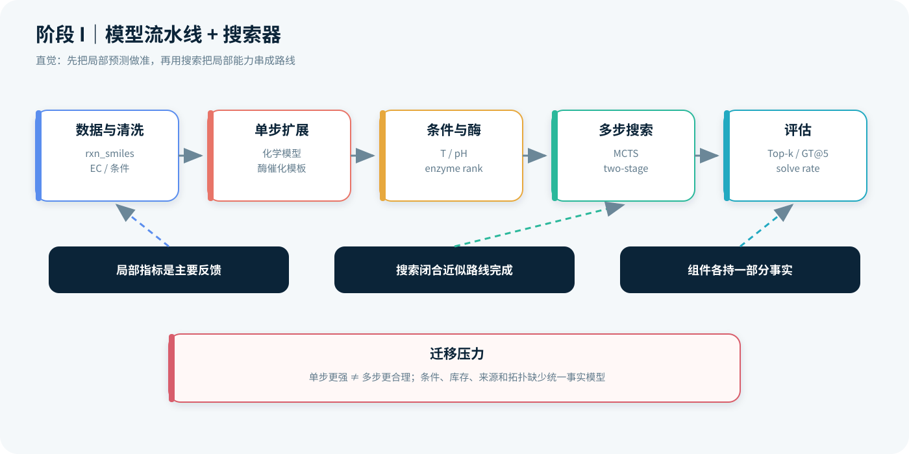
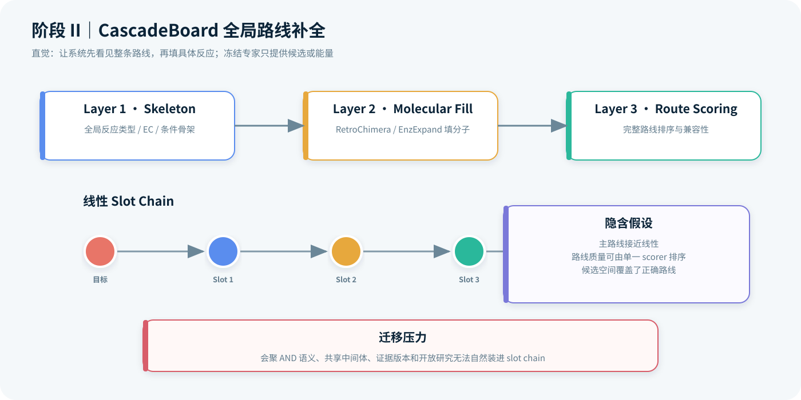
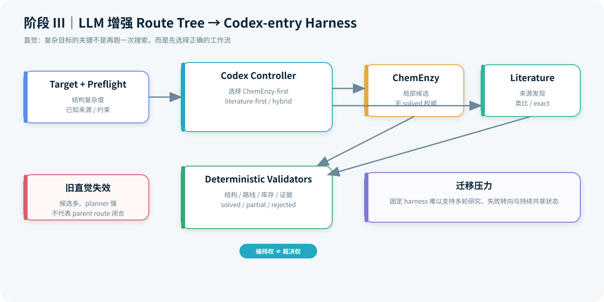
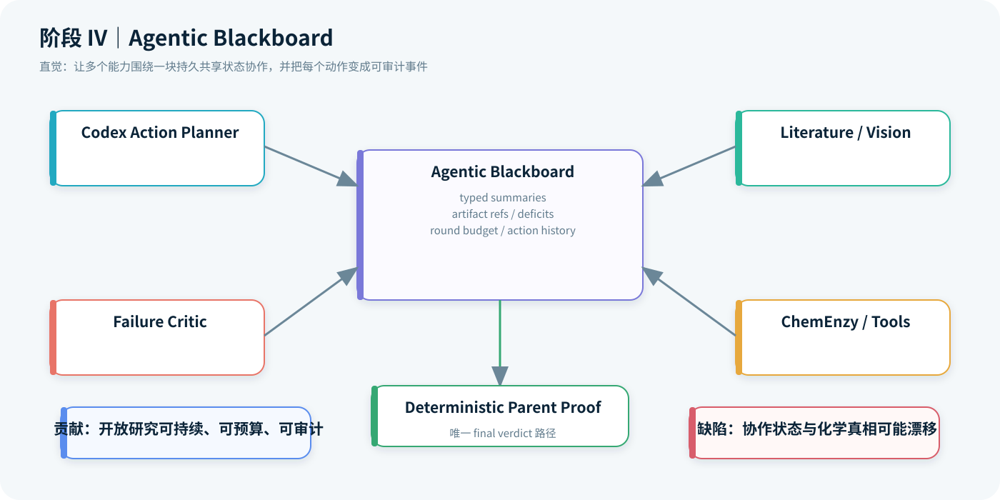
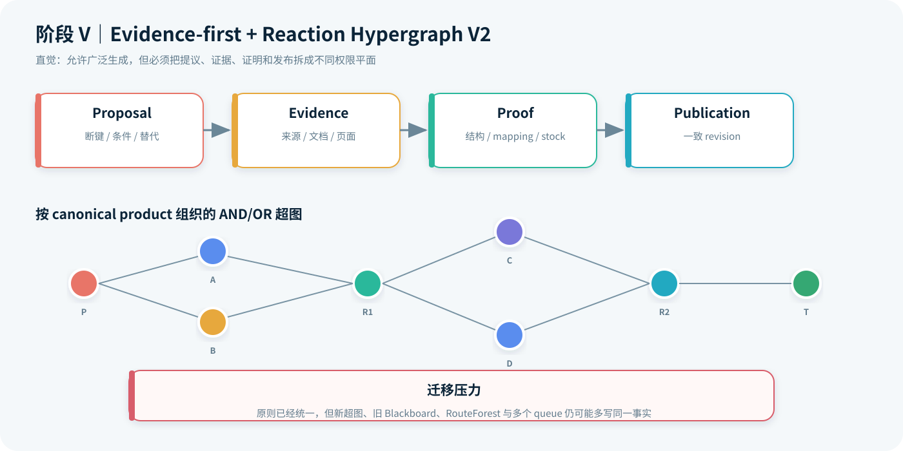
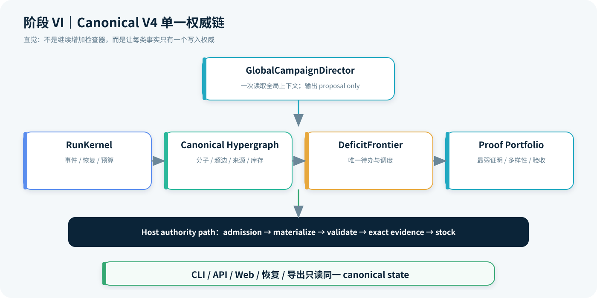
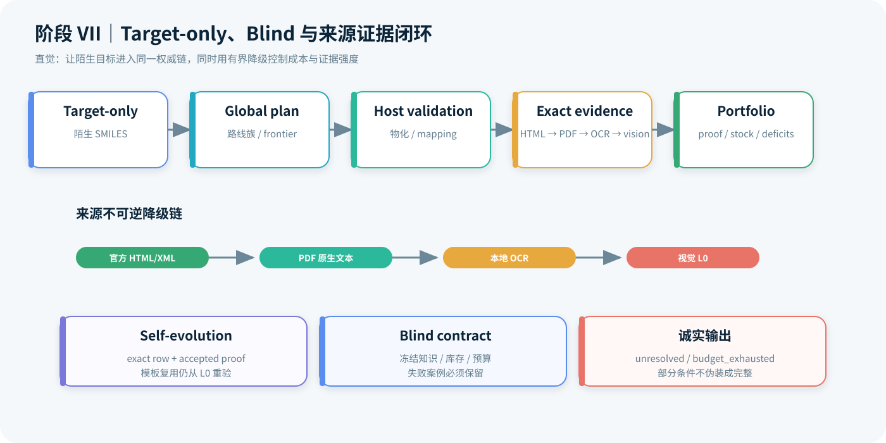

# AutoPlanner 逆合成架构演进时间线

> 历史范围：截至 2026-07-15。本文用于解释架构如何演进，不作为当前实现状态权威。
> 2026-07-16 起请先读[当前架构状态](architecture/CURRENT_ARCHITECTURE_STATUS.md)和
> [GRIA 目标设计](architecture/GENERAL_RETROSYNTHESIS_INNOVATION_ARCHITECTURE.md)。

> 审阅基线：`main@04d9034`（2026-07-15）
> 覆盖范围：2026-04-25 至 2026-07-15，共 90 个 Git 提交
> 报告版本：设计直觉与迁移决策深度复盘版
> 文档目的：按时间梳理架构权威中心、核心抽象、设计直觉与迁移动因，而不是罗列功能清单。

## 1. 结论先行

AutoPlanner 在约 12 周内经历的核心变化，可以概括为五次权威中心迁移：

```text
单步模型与搜索器
  → 全局路线补全器 CascadeBoard
  → Codex 编排的 agentic blackboard
  → 多信源、证据优先的统一 campaign
  → RunKernel + canonical hypergraph + deficit frontier + proof portfolio
```

这条路线不是简单地“模型越来越大”，而是不断缩小谁有资格宣称事实：

- 4 月的重点是提高单步准确率和多步求解率；
- 5 月开始追求路线级全局一致性，让模型从逐步选择走向全局补全和重写；
- 6 月把 Codex 引入顶层工作流，但把最终结论留给确定性验证器；
- 7 月进一步发现，协作黑板不适合作为化学真相源，于是把运行、拓扑、待办和证明拆成四个单一权威；
- 当前系统的完成标准已从“生成了一条看似合理的路线”提升为“在硬预算内形成可重放、逐边有证据、叶节点库存闭合的小型多样路线组合”。

最重要的理念进步有六点：

1. **从模型指标转向系统可信度。** Top-k、solve rate 和路线数量不再等同于可执行性。
2. **从逐步贪心转向 campaign 级全局规划。** Codex 负责路线族、共享中间体和全局转向，而不是逐边猜反应。
3. **从“生成即答案”转向“proposal 与 authority 分离”。** 所有模型、Agent、ChemEnzy、模板和文献候选都只能提议。
4. **从线性路线转向 AND/OR 反应超图。** 会聚路线、完整前体集合和替代边获得了正确的结构表达。
5. **从黑板协作状态转向规范事实状态。** Blackboard 的能力被保留，但其化学状态写权限被取消。
6. **从成功导向转向诚实失败。** `unresolved`、`budget_exhausted`、负证明和部分来源状态成为正式产品输出。

## 2. 口径与证据边界

本文采用三类证据：

- **提交事实**：提交日期、提交信息、增删文件和当时版本中的文档；
- **主线声明**：各时期 `README.md`、`docs/MAINLINE.md` 和架构文档明确写出的权威边界；
- **架构归纳**：根据连续提交之间的模块职责变化作出的总结，统一标为“归纳”或“可视为”。

需要注意三项限制：

- Git 历史始于 2026-04-25，但初始提交已经包含此前迁移和归档材料，因此更早的研发只能作为背景，不能精确还原提交时间线。
- 2026-05-17 的“v4 full training pipeline”与 2026-07-13 之后的“AutoPlanner V4 runtime”不是同一概念。前者是训练/数据流水线版本，后者是当前运行时架构代际。
- 本文以已提交的 `04d9034` 为截止点；工作区中尚未提交的文献访问、PDF 代理和 target solver 修改不计入历史结论。

## 3. 总览时间线

| 阶段 | 时间 | 主导架构 | 权威中心 | 代表提交 | 核心理念变化 |
| --- | --- | --- | --- | --- | --- |
| I | 04-25 | 模型流水线 + MCTS | 单步模型、搜索结果、评估脚本 | [`bcdde7e`](https://github.com/sunyrain/AutoPlanner/commit/bcdde7e) | 先建立诚实基线，承认数据质量比模型复杂度更关键 |
| II | 04-26～05-05 | CascadeBoard / CascadeBoard++ | 全局骨架生成、分子填充、路线评分 | [`d7eb58e`](https://github.com/sunyrain/AutoPlanner/commit/d7eb58e)、[`f1947b4`](https://github.com/sunyrain/AutoPlanner/commit/f1947b4) | 从零件堆砌和逐步搜索转向路线级全局补全与约束搜索 |
| III | 05-17～06-08 | LLM 增强 route tree → Codex-entry harness | LLM 负责选择/编排，确定性验证开始掌握结论 | [`15ed2ca`](https://github.com/sunyrain/AutoPlanner/commit/15ed2ca)、[`f7d99f8`](https://github.com/sunyrain/AutoPlanner/commit/f7d99f8) | LLM 从可选 reranker 升为顶层工作流规划者，但不得自证 solved |
| IV | 06-09～06-24 | Agentic Blackboard | 黑板记录协作状态；parent proof 决定最终结论 | [`1f3a94c`](https://github.com/sunyrain/AutoPlanner/commit/1f3a94c)、[`c1c60a0`](https://github.com/sunyrain/AutoPlanner/commit/c1c60a0) | 用 typed action、预算和审计轨迹支持开放研究；生成与证明正式分权 |
| V | 07-10～07-12 | 多 Agent + Reaction Hypergraph V2 + evidence-first campaign | 逐边确定性 proof 与不可变 closeout | [`38e8569`](https://github.com/sunyrain/AutoPlanner/commit/38e8569)、[`4309788`](https://github.com/sunyrain/AutoPlanner/commit/4309788) | 广泛生成、狭窄授权；证据按反应边绑定，来源独立性显式建模 |
| VI | 07-13 | Canonical V4 runtime | RunKernel、canonical hypergraph、DeficitFrontier、proof portfolio | [`990f20e`](https://github.com/sunyrain/AutoPlanner/commit/990f20e)～[`b55f5e4`](https://github.com/sunyrain/AutoPlanner/commit/b55f5e4) | 取消多套状态真相，建立单一运行内核、单一 frontier 和硬验收合同 |
| VII | 07-14～07-15 | Target-only、blind、证据闭环 V4 | 同一 V4 权威链贯穿发现、验证、库存、展示 | [`3dba045`](https://github.com/sunyrain/AutoPlanner/commit/3dba045)～[`04d9034`](https://github.com/sunyrain/AutoPlanner/commit/04d9034) | 从离线 replay 走向陌生 SMILES；HTML-first、受控降级、自进化也不能越权 |

## 4. 分阶段详述

### 阶段 I：模型与搜索器时代（2026-04-25）

初始提交将项目定义为“化学—酶催化逆合成规划器”，主流程是：

```text
数据清洗
  → 单步化学/酶催化扩展
  → 条件与酶推荐
  → AiZynthFinder MCTS / 两阶段搜索
  → 路线评分与 benchmark
```



#### 当时真正要解决的问题

这一阶段面对的不是“如何建立一个自主科学 Agent”，而是更基础的工程问题：级联数据能否被清洗成可训练样本，化学与酶催化反应能否被同一规划器调用，条件和酶推荐能否达到可量化水平，多步搜索是否至少能在冻结 benchmark 上闭合。把问题拆成数据、单步扩展、条件、搜索和评估，是在数据只有数千步、外部模型能力参差不齐时最务实的做法。

#### 核心设计直觉

其直觉是典型的“局部能力可组合”：如果单步 top-k 提高、条件预测更准、库存检查更完整，再由 MCTS 或两阶段搜索组合，路线质量应随各组件共同上升。模块化也便于单独替换 RetroChimera、EnzExpand、ESM condition heads 或搜索后端，并用独立 KPI 定位瓶颈。

该设计在当时合理，因为多数失败首先表现为可测量的局部失败：模板提取失败、候选召回不足、pH 数据缺失或搜索未闭合。过早引入一个统一的复杂控制器，反而会掩盖这些基础问题。

#### 隐含假设与失效信号

这套架构隐含了三个假设：局部模型分数可以跨步骤比较；搜索闭合大致对应化学上成立；各模块输出的“有效”“库存命中”“条件存在”可以直接拼成路线级事实。4 月的诚实评估已经表明这些假设并不稳固：更强的单步模型可能不提高文献路线 GT@5，route scorer 即使训练完成也未真正进入搜索闭环，不同评估器的 `is_solved` 和 GT 匹配口径也不一致。

#### 为什么迁移到下一阶段

迁移并非因为模型流水线完全无效，而是因为系统出现了一个新的主矛盾：**局部指标改善不能保证整条路线在反应类型、条件、酶、操作模式和上下游接口上全局一致。** 因此下一阶段不再只优化“下一步选什么”，而是先表示和生成整条路线骨架。

当时的包结构清楚体现了模型流水线思维：`data/`、`expand/`、`conditions/`、`multistep/`、`eval/`、`training/`。系统的主要问题被描述为单步覆盖率、GT@5、多步 solve rate、条件 MAE 和酶推荐准确率。

但这一阶段已经出现了贯穿后续演进的“诚实评估”基因。初始的 `HONEST_ASSESSMENT_2026-04-25.md` 主动指出：

- 49.5% 的酶催化单步准确率只覆盖能提取模板的 44% 步骤；
- 化学单步提升主要来自外部 RetroChimera，属于工程集成而非原创模型突破；
- 两套 GT@5 口径不可直接比较；
- 最大收益来自数据 bug 修复，数据工程 ROI 高于继续堆模型。

**架构局限：** 各组件虽然形成流水线，但路线真相仍主要来自搜索器输出和评估器判定；条件、酶、库存、来源与路线拓扑没有统一的事实模型。

**理念进步：** 项目很早就承认“指标必须带评估口径、覆盖率和随机基线”，这为后来“proof 不可由 producer 自报”奠定了方法论基础。

### 阶段 II：从逐步搜索到全局路线补全（2026-04-26～05-05）

4 月 26 日形成的一系列下一代架构草案，集中讨论如何解决“单步引擎、搜索、条件和酶推荐各自独立、没有全局视野”的问题。方案依次探索了：

- 多 Agent orchestrator；
- 端到端 CascadeFormer；
- 冻结感知器 + 可训练 CascadeReasoner；
- CascadeVAE 潜空间全局优化；
- Cascade Latent Blackboard；
- 最终收敛到带硬约束的 CascadeBoard / CascadeBoard++。

这些草案虽未全部进入实现，却完成了一个关键思想转向：**预训练单步模型不应拥有路线决策权，而应退到候选生成器、感知器或能量项的位置。**

5 月 4 日的 [`d7eb58e`](https://github.com/sunyrain/AutoPlanner/commit/d7eb58e) 落地 live CascadeBoard planner。其三层结构为：

1. OA-ARM skeleton generator 生成全局反应类型、EC 和条件骨架；
2. RetroChimera / EnzExpand / Enzyformer 填充具体分子反应；
3. learned route scorer 对完整路线排序。



#### 当时真正要解决的问题

逐步搜索的根本缺陷是早期决策看不到后续结果：第一步选择了某个断键后，第三步才暴露条件不兼容或酶类别冲突，但搜索通常只能继续扩展或回溯，不能把路线作为一个整体重写。CascadeBoard 因而把问题重述为“在带约束的路线板上补全缺失 slot”，而不是连续调用单步模型。

#### 核心设计直觉

它借鉴了 masked modeling 和能量优化的直觉：先生成一个包含反应类型、EC 类别、温度/pH 和操作模式的抽象骨架，再让专业模型填具体分子，最后由路线级 scorer 比较完整方案。冻结专家只负责产生候选或提供能量，不单独决定路线；全局 inpainting 则允许重新遮盖并改写早期 slot。

这也回应了小数据约束。与直接用约 2,000 条路线训练大型端到端生成器相比，抽象骨架减少了输出空间，冻结外部模型减少了需要学习的参数，路线 scorer 可以集中学习级联兼容性。

#### 隐含假设与失效信号

CascadeBoard 假设主路线可以近似为线性 slot chain，抽象骨架足以约束分子填充，而且路线质量最终可以压缩成一个可排序分数。到了天然产物和药物级复杂目标，这些假设开始失效：会聚合成要求一个反应同时依赖完整前体集合；多条路线会共享中间体；来源、保护态和库存边界不是 slot 的静态属性；“最高分路线”也无法表达尚未取得的证据。

#### 为什么迁移到下一阶段

路线级建模解决了全局一致性，却没有解决开放世界中的“下一步应该研究什么”。复杂目标需要在模型搜索、文献发现、视觉结构抽取和人工/外部工具之间动态选择。于是系统开始把 LLM 引入为元规划器：不直接证明反应，而是决定先调用哪类能力。

随后 [`6246105`](https://github.com/sunyrain/AutoPlanner/commit/6246105) 增加 grounded agent layer 和 route critic，[`d353dec`](https://github.com/sunyrain/AutoPlanner/commit/d353dec) 增加 beam search 与 exact recovery，[`f1947b4`](https://github.com/sunyrain/AutoPlanner/commit/f1947b4) 引入 cascade-constrained AO*。

**架构局限：** CascadeBoard 的核心表示仍是线性 slot chain，擅长固定或近线性的级联路线，不足以自然表达会聚路线的 AND 语义、多个完整前体集合、共享中间体和证据版本。

**理念进步：** 规划对象从“下一个反应”升级为“整条路线的全局一致性”；同时开始允许回改既有决策，而不是把自回归早期错误永久固化。

### 阶段 III：LLM 从旁路增强到顶层编排（2026-05-17～06-08）

5 月 17 日新增的 `AUTOPLANNRELLM` 明确是叠加在既有 route-tree runtime 上的独立实验层。DeepSeek 只做两件事：排列开放叶与动作、向候选池补充至多一个候选；底层搜索、库存和成本评分保持不变，而且 LLM 不得凭空宣称库存、产率、酶或条件。

这说明 LLM 最初仍是**受限的选择器和候选补充器**，不是系统总控。

到 6 月 5～8 日，Bufotalin 等复杂案例暴露了更根本的问题：ChemEnzy 可以返回大量 raw routes，但审计后仍可能是 `fake_closed_rejected`。因此主线切换为 Codex-entry harness：

```text
target
  → deterministic preflight
  → Codex 选择 ChemEnzy-first / literature-first / hybrid
  → 本地工具执行
  → deterministic validators 给出 final verdict
```



#### 当时真正要解决的问题

同一个目标并不总适合相同的求解顺序。简单分子可以先运行 ChemEnzy；复杂多环目标可能更需要从已知全合成或战略断键入手；来源明确的药物则可能应优先获取专利。固定的 route-tree 或单一 planner 无法根据目标复杂度、来源可得性和预算选择工作流。

#### 核心设计直觉

这一阶段采用“元规划 + 确定性执行”：Codex 阅读目标和 preflight 上下文，选择 ChemEnzy-first、literature-first 或 hybrid；本地工具完成搜索、解析和结构处理；validator 统一输出 `solved/partial/rejected`。LLM 的优势被放在跨模态、跨工具的策略选择上，而不是放在原子映射或库存事实判断上。

其关键不是“让 LLM 更自由”，而是第一次明确分离编排权和裁决权。Codex 可以改变工作流，却不能通过一段合理解释把 raw candidate 升级为已验证反应。

#### 隐含假设与失效信号

Codex-entry harness 仍假设任务可以沿一条预先规定的 artifact 链完成：preflight 后做若干工具调用，再由一次 final validator 收口。但真实研究会产生新子目标、来源受限、PDF 解析失败、类比证据冲突和反复的库存缺口；这些事件需要跨轮保存，并影响下一批动作。

#### 为什么迁移到下一阶段

当工作流从“一次求解”变成“多轮研究”，系统需要一块持久共享的认知工作区。Agentic Blackboard 由此出现：它不是为了增加 Agent 数量，而是为了让动作、预算、失败、artifact 和未解决问题在多轮之间可见。

[`f7d99f8`](https://github.com/sunyrain/AutoPlanner/commit/f7d99f8) 同时大幅删减旧 `conditions/`、`demo/`、`expand/` 表面，新增 canonical harness、文献 PDF 抽取和 downstream compiler。这不是否定旧模型，而是把它们从“主线架构”降为可调用能力。

**架构局限：** Codex-entry harness 仍偏固定链式流程，开放研究、失败转向和多轮协作需要更持久的共享状态。

**理念进步：** “强模型/强工具不等于顶层权威”第一次成为主线硬边界；Codex 获得流程选择权，但 `solved/partial/rejected` 留给确定性验证器。

### 阶段 IV：Agentic Blackboard（2026-06-09～06-24）

[`1f3a94c`](https://github.com/sunyrain/AutoPlanner/commit/1f3a94c) 引入 agentic blackboard controller、typed action planner、failure critic、analogical retrosynthesis、parent route proof、stitched route 和 visual literature chain。6 月 24 日 [`c1c60a0`](https://github.com/sunyrain/AutoPlanner/commit/c1c60a0) 将其正式确立为主线。

当时的主流程是：

```text
preflight
  → blackboard state
  → Codex 输出短小 typed action batch
  → validator 检查安全、预算、绑定和 proof 边界
  → local tools 执行
  → blackboard 写入 typed summary 与 artifact refs
  → deterministic parent proof 输出 final verdict
```



#### 当时真正要解决的问题

开放研究的难点是状态连续性。文献 Agent 找到一篇论文、视觉 Agent 从方案图中提出结构、ChemEnzy 给出局部候选、failure critic 否定一个共享连接——这些结果必须被后续轮次共同读取，同时还要避免把长篇原文反复塞回模型上下文。

#### 核心设计直觉

Blackboard 的直觉来自协作式 AI：不同专家不需要彼此直接耦合，只需围绕共享板读写 typed summary 和 artifact reference。Codex 每轮只输出短小 action batch，host validator 检查 schema、安全、预算、来源绑定和 proof 边界，本地工具执行后把结果写回。这样既压缩上下文，又保留完整 decision trace。

Blackboard 还承担了一种“外部工作记忆”角色：成功、失败和暂时缺口都成为下一轮规划信号，而不是只保留最终路线。这对文献研究、递归子目标和预算耗尽尤其重要。

#### 隐含假设与失效信号

最初隐含假设是，只要所有模块都遵守 typed contract，黑板中的多个字典、队列和路线投影就能保持同步。但协作状态、扩展状态、证据状态和路线真相的更新节奏不同：一个 evidence task 完成不代表反应边验证完成，一个 child route solved 也不代表 parent route 重连成功。随着状态副本增多，同一边可能在一个模块已关闭、另一个模块仍开放。

另一个失效信号是，继续增加 Agent 调用主要增加 L0 文本和候选，无法自动修复最弱的 exact evidence、reaction proof 或 stock deficit。问题从“还缺什么想法”转变为“哪一条事实链尚未闭合”。

#### 为什么迁移到下一阶段

因此下一阶段不是抛弃 Blackboard 的文献、视觉和失败批评能力，而是撤销它作为化学真相源的地位。系统需要一个能表达完整前体集合、替代反应和共享中间体的 canonical hypergraph，并把 proposal、evidence、proof、publication 的权限分开。

这一阶段解决了固定 harness 的三个不足：

- 支持多轮、按预算的开放研究；
- 把文献、视觉、类比、ChemEnzy 和失败批评纳入统一协作记录；
- 通过 typed action 和 artifact contract 防止模型直接修改生产知识库或自称 solved。

**架构局限：** 黑板同时承载协作、扩展、证据和路线投影。随着功能增长，同一条反应边可能在一个字典中已关闭、另一个队列中仍开放；proof、stock 和 UI 又各自复制状态。Blackboard 擅长记录“大家做过什么”，却不是 AND/OR 化学拓扑的理想事实模型。

**理念进步：** 从单 Agent 文本推理升级为“模型提出有界动作、主机执行并审计”；预算、工具调用、失败原因和最终证明都成为可复查 artifact。

### 阶段 V：证据优先与反应超图（2026-07-10～07-12）

[`38e8569`](https://github.com/sunyrain/AutoPlanner/commit/38e8569) 开始升级 Codex retrosynthesis architecture，新增 provider、routes/domain、frontier scheduler、route portfolio、reaction verifier 和不可变 artifact revision。规范文档将中心规则总结为：**generation is broad, but authority is narrow**。

该阶段建立了四个相互分权的平面：

| 平面 | 职责 | 是否有完成权威 |
| --- | --- | --- |
| Proposal | 提出断键、条件、酶与替代路线 | 否 |
| Evidence | 把 claim 绑定到来源、文档和页面 | 验证前否 |
| Proof | 重放结构、atom map、连通性、库存和先例 | 是，按确定性规则 |
| Publication | 冻结相互一致的 graph/proof/view revision | 只能发布已验证事实 |



#### 当时真正要解决的问题

Blackboard 已能协调研究，却无法回答“某条反应边究竟凭什么成立”。模型提议、DOI 字符串、PDF 页面、原子映射、库存命中和最终展示经常被放在同一对象上，容易让低权威信息借助 UI 或聚合分数越级。更关键的是，线性路线无法正确表达会聚反应的 AND 约束。

#### 核心设计直觉

Evidence-first 架构采用两层直觉。第一层是**权限分层**：proposal 可以很宽，evidence 必须绑定具体文档和位置，proof 必须由 host 重放，publication 只能冻结彼此一致的 revision。第二层是**结构同构**：用 reaction hyperedge 把一个产物与完整前体集合连接，使数据结构真正对应化学反应的 AND 语义。

来源独立性也从数量问题变成相关性问题。多个 Codex child 即使角色不同，仍属于同一 `codex_model` 支持组；一篇论文的正文和 SI 可以是不同文档，但不能伪装成两篇独立科学来源。这个设计防止“多 Agent 共识”被误解为“多来源证据”。

#### 隐含假设与失效信号

此时仍保留了一个过渡假设：可以让新 hypergraph 以 overlay 形式与旧 Blackboard、RouteForest、frontier ledger 和兼容 carrier 并存，再靠 contract 保持一致。短期这降低了迁移风险，长期却重新制造了多写问题——原则上已有唯一 proof，运行时仍可能从多个状态表读取。

#### 为什么迁移到下一阶段

当失效模式从“schema 不够严格”升级为“同一事实有多个写入者”，继续添加 validator 已经无效。需要在运行时层面明确每类状态的唯一 owner：运行归 RunKernel，化学拓扑归 canonical hypergraph，未完成工作归 DeficitFrontier，路线选择和完成判定归 proof portfolio。

路线表示从线性链升级为按 canonical product 组织的二部反应超图：一个 reaction hyperedge 将**完整前体集合**连接到一个产物，因此会聚反应保留 AND 语义；相同产物的不同前体集合成为 alternative set，而不是被扁平化为若干独立边。

[`4309788`](https://github.com/sunyrain/AutoPlanner/commit/4309788) 把 evidence-first campaign、frontier ledger、canonical admission、admission receipts 和多来源证据绑定接入主线。随后一系列提交加强了：

- 每条 reaction edge 独立绑定多信源证据；
- 多个 Codex child 只算一个 `codex_model` 相关组，不能伪装成独立科学来源；
- ChemEnzy 尝试预算由 host context 统一掌握；
- 无效 child candidate 被隔离而不是污染主图；
- source capability 从描述性信息升级为执行约束；
- verifier outcome 覆盖 producer 自报状态。

**架构局限：** 新 hypergraph、旧 blackboard、旧 RouteForest 和若干 queue 同时存在；架构原则已经统一，但运行时事实仍可能多写。

**理念进步：** 可信度从“来源数量”升级为“逐边、去相关、可重放的来源”；路线强度由最弱反应边和未闭合叶决定，而不是平均分或最好的一条边。

### 阶段 VI：Canonical V4 单一权威链（2026-07-13）

7 月 13 日是最密集的架构收敛日，13 个提交依序搭建出当前 V4：

1. [`fd95b49`](https://github.com/sunyrain/AutoPlanner/commit/fd95b49)：明确 evidence-first、bounded run contract、acceptance、route deficit queue；
2. [`d1114d0`](https://github.com/sunyrain/AutoPlanner/commit/d1114d0)：不可变 run storage 与 warm replay cache；
3. [`990f20e`](https://github.com/sunyrain/AutoPlanner/commit/990f20e)：canonical `RunKernel`；
4. [`a111a57`](https://github.com/sunyrain/AutoPlanner/commit/a111a57)：campaign 级 `GlobalCampaignDirector`；
5. [`b30e5fb`](https://github.com/sunyrain/AutoPlanner/commit/b30e5fb)：trusted retrosynthesis workers；
6. [`da97279`](https://github.com/sunyrain/AutoPlanner/commit/da97279)：canonical hypergraph + 单一 `DeficitFrontier`；
7. [`ab8252d`](https://github.com/sunyrain/AutoPlanner/commit/ab8252d)：proof-backed route portfolio；
8. [`c510a94`](https://github.com/sunyrain/AutoPlanner/commit/c510a94)：隔离 V4 orchestration，建立 service 和 legacy adapter；
9. [`acbbd11`](https://github.com/sunyrain/AutoPlanner/commit/acbbd11)：proof-aware route workbench；
10. [`b55f5e4`](https://github.com/sunyrain/AutoPlanner/commit/b55f5e4)：bounded scientific replay acceptance。

当前四个状态权威由此成型：

```text
RunKernel               运行、事件、恢复、任务和预算
Canonical Hypergraph    分子、反应超边、来源、库存和拓扑
DeficitFrontier         唯一待办与下一项工作
Proof Portfolio         选择、最弱证明和 acceptance
```



#### 当时真正要解决的问题

阶段 V 已经定义了正确的科学边界，但系统还需要正确的运行边界：断点恢复后应该继续哪个 campaign，预算由谁扣减，新 evidence 到达后谁重算受影响路线，CLI 与 Web 是否可能展示不同版本事实。只靠文档约定无法消除这些运行时分叉。

#### 核心设计直觉

Canonical V4 的设计接近事件驱动系统和单写者原则。`RunKernel` 保存事件、任务、预算和恢复；canonical hypergraph 保存化学世界状态；`DeficitFrontier` 是唯一未完成工作集合；proof portfolio 从当前图中重新选择小型多样路线并执行 acceptance。每个事实只在一个地方拥有写权限，其余模块通过 adapter 读取或提交 proposal。

Global Director 被刻意提升到 campaign 级、同时限制在 proposal 级。它一次看到路线族、共享中间体、证据/库存、失败、Pareto 组合和剩余预算，因此能做真正的全局调整；但局部物化和验证不再逐边隐式调用 Codex，从而避免模型循环既昂贵又改变事实口径。

#### 隐含假设与失效信号

这一阶段的关键假设已经不再是“某个模型足够强”，而是“所有生产入口都能被收敛到 canonical ingestion”。风险来自兼容层：旧 V3 campaign、Blackboard controller、RouteForest 和历史 queue 若仍有隐蔽写路径，就会重新产生第二份真相。因此 V4 增加 architecture tests、compatibility inventory 和 replay acceptance，而不仅是功能单测。

#### 为什么继续扩展到下一阶段

7 月 13 日完成的是权威架构，不是陌生分子能力的最终证明。下一步必须验证这套架构能否从 target-only 输入冷启动，能否在没有预制 replay pack 时发现并绑定来源，以及失败时是否仍能保持预算、负证明和状态一致性。阶段 VII 因而是**运行边界扩展**，不是推翻 V4 的又一次重写。

CLI、API、Web、恢复和导出被定义为适配器，不再持有化学状态。旧 Blackboard、旧 RouteForest 和 V3 campaign 只可作为兼容投影，不能反向写入主线事实。

Global Director 的位置也被重新校准：它一次读取目标、路线族、共享中间体、证据/库存、失败、Pareto 组合和剩余预算，可以全局替换或合并路线；但它的输出仍然只是 proposal。物化、验证、精确来源、库存审计和 acceptance 全由 host 提升为事实。

**理念进步：** 系统从“有很多严格检查”升级为“每类事实只有一个写入权威”；恢复是同一 campaign 的事件回放，而不是启动第二套 expansion loop。

### 阶段 VII：从 replay 走向陌生目标与证据闭环（2026-07-14～07-15）

[`3dba045`](https://github.com/sunyrain/AutoPlanner/commit/3dba045) 引入 bounded blind campaign、target-only solver、blind acceptance、live stock、evidence import、precursor repair 和 reaction mapping。由此，V4 不再只服务于 Nirmatrelvir 等已知 replay pack，而开始从任意陌生 SMILES 冷启动。

随后两天的重点不是继续增加路线生成器，而是补齐“来源到证明”的闭环：

- [`1d68331`](https://github.com/sunyrain/AutoPlanner/commit/1d68331)：有界 OCR 与视觉恢复；
- [`1b4afb2`](https://github.com/sunyrain/AutoPlanner/commit/1b4afb2)：专利证据 HTML-first；
- [`cc1a48a`](https://github.com/sunyrain/AutoPlanner/commit/cc1a48a)：受 replay gate 约束的专利 self-evolution；
- [`2be8e6c`](https://github.com/sunyrain/AutoPlanner/commit/2be8e6c)：target-only runtime、论文检索/全文/条件/路线抽取和 proof replacement；
- [`220a3b1`](https://github.com/sunyrain/AutoPlanner/commit/220a3b1)：恢复 evidence-driven global campaign loop；
- [`04d9034`](https://github.com/sunyrain/AutoPlanner/commit/04d9034)：展示层区分“部分来源条件”，避免把不完整证据显示成完整工艺。

来源获取形成不可逆的受控降级链：

```text
官方完整 HTML/XML
  → 未闭合边的 PDF 原生文本
  → 低文本页本地 OCR
  → 显式准入、受预算约束的视觉 L0 候选
```



#### 当时真正要解决的问题

Replay case 能证明确定性重建，却不能证明系统面对仓库历史中不存在的新目标仍能工作。Target-only runtime 必须同时解决冷启动路线架构、provider 能力发现、来源获取、结构抽取、host validation、库存审计和失败恢复，而且不能借 benchmark 答案或隐藏模板库获得虚假优势。

#### 核心设计直觉

该阶段采用“先便宜确定、再昂贵不确定”的逐级升级。身份和结构门先拒绝不可能候选；官方 HTML/XML 优先提供可哈希、可定位的正文；只有未闭合边才进入 PDF 原生文本、OCR，最后显式消耗视觉预算。每一级都有独立 receipt，较弱渠道不能覆盖较强渠道已经确认的事实。

Blind contract 则把可复现性前移到运行开始：冻结模型策略、知识库 digest、库存边界和硬预算；保存所有失败 case；把 B0～B5 分开报告。Self-evolution 只记忆已通过 exact row 与 accepted proof 双重门的局部模板，且跨目标应用后重新从 L0 验证，避免学习能力变成答案泄漏。

#### 当前假设与仍待验证之处

当前架构假设一次或极少量全局 Director 调用足以确定路线族，局部 provider 可以在统一 frontier 内补缺口；也假设 HTML-first 能覆盖足够多的专利和开放论文。但真实供应商快照、完整 condition/procedure schema、受限 PDF 的恢复体验和跨化学空间的模板泛化仍未达到最终产品门槛。

#### 为什么下一步不应再次重写架构

现阶段主要缺口已经不是“缺少新的控制中心”，而是 proof vector 的轴不完整和真实 provider 覆盖不足。下一阶段更合理的方向是沿现有 V4 权威链补齐条件、工艺、库存、撤销/过期和更大 blind suite，并用增量降级验证架构，而不是再引入第五套状态模型。

上一级已经闭合的边不再进入更昂贵、更不确定的下一级。搜索摘要、视觉识别和 Codex 转述不能直接授予 exact-source authority。

Self-evolution 也遵守同一边界：只有“可重放的专利 exact row + 当前版本 accepted reaction proof”才能抽取局部模板；模板必须先重放原例，跨目标复用后仍从 L0 重新经历 admission、mapping 和 reaction validation。模板是 proposal memory，不是隐藏的答案库或第二套真相。

**当前仍未完全闭合的方面：** 根据 [Blackboard 能力迁移表](architecture/BLACKBOARD_CAPABILITY_MIGRATION.md)，真实供应商快照、完整 condition/procedure proof vector、guided ChemEnzy 的失败/类比策略迁移、长路线专家 UI 和完整 blind suite 仍在推进。`integrated` 只表示接入 canonical ingestion 并有 focused test，不等于复杂盲测验收已经通过。

## 5. 代表性案例：架构原则如何落到结果上

单看模块和提交，很容易把架构演进误解为“代码越来越复杂”。以下案例分别代表基线审计、复杂目标负例、可重放闭环、受控假设和 blind campaign，能够看到每次架构调整实际解决了什么问题。

### 5.1 2026-04-25：诚实基线——指标必须同时交代覆盖率

初始评估曾给出酶催化单步 top-1 49.5%、化学单步 78.4%、多步求解率 79% 等结果，但同一份报告主动补充了限制：49.5% 只覆盖能提取模板的 44% 酶催化步骤；78.4% 来自外部 RetroChimera；多步 GT@5 使用了更宽松的匹配口径。

这个案例代表项目最早形成的审计原则：

```text
一个指标 ≠ 一个结论
指标 + 覆盖率 + 评估口径 + baseline + 外部依赖 = 可审阅结论
```

它直接预示了后来的 proof 设计：producer 输出的高分或 `is_solved` 只能作为观察，不能自动变成系统事实。

### 5.2 Bufotalin：大量候选不等于路线闭合

2026-06-05～09 的 Bufotalin 重放是主线从“强搜索器”转向 Codex-entry harness 和 agentic blackboard 的关键负例。ChemEnzy 可以生成许多 raw routes，但严格审计仍得到 `fake_closed_rejected` 或 `partial_anchor_only_not_solved`：高层前体并未真正闭合，文献锚点也不能替代完整 parent route proof。

该案例推动了三项改变：

- Codex 必须在目标级先决定 ChemEnzy-first、literature-first 或 hybrid，而不是默认让单一 planner 主导；
- 候选数量、路线图规模和局部文献相似性不再作为 solved 证据；
- 复杂案例即使耗尽预算，也应输出明确 deficit，而不是通过降门槛制造成功。

**代表意义：** 这是项目把“失败结果”升级为架构输入的转折点。失败不再只是一条日志，而会改变调度、证明边界和下一代状态模型。

### 5.3 Nirmatrelvir：零模型重放验证确定性主链

当前 Nirmatrelvir V4 replay pack 可以从空运行目录重建：

| 项目 | 结果 |
| --- | ---: |
| 完整路线 | 2 |
| 规范反应超边 | 12 |
| 精确来源记录 | 15 |
| 库存叶 | 7 |
| 模型/视觉调用 | 0 |

该案例不用于证明系统能从陌生分子自动发现这些路线，而是验证另一项更基础的能力：给定冻结案卷后，`RunKernel → hypergraph → evidence → stock → proof portfolio` 能否确定性重放，并在暂停/恢复后保持相同事实。

**代表意义：** 它把“科学结果”从一次性脚本输出升级为可版本化、可重建、可审计的运行对象；同时明确区分 discovery benchmark 与 replay acceptance。

### 5.4 Artemisinin：精确来源案卷驱动的小型完整组合

Artemisinin case dossier 保留两种不同采购边界：

1. 从青蒿酸开始，经氢化得到二氢青蒿酸，再进行光氧化/酸促级联；
2. 直接采购二氢青蒿酸，从后半段进入路线。

案卷包含确定性结构抽取的 exact rows、操作性条件候选和带时间戳的供应记录。当前 showcase 闭合 2 条路线、2 条验证超边、3 条精确来源记录和 4 个库存叶。

**代表意义：**

- 路线差异可以来自采购边界，而不必伪造两套完全不同的化学；
- 氢气、氧气和高级中间体都作为真实叶节点审计，而不是隐藏在条件文本里；
- 精确来源、反应验证和库存是三个独立轴，必须在 portfolio 中重新汇合。

### 5.5 Paclitaxel：三条战略路线族，但仍诚实停在 L0

Paclitaxel bounded showcase 同时保留三条目标级路线族：

| 路线族 | 战略断键 | 当前证据状态 | 主要缺口 |
| --- | --- | --- | --- |
| Formal C13 ester | C13 侧链酯化 | model only | 活化方式、保护基顺序、核心稳定性 |
| Ojima β-lactam | β-内酰胺开环安装侧链 | analogy | 精确底物保护态、对映体和条件绑定 |
| Biosynthetic tailoring | 生物合成式酰化与后修饰 | analogy | 酶、CoA donor、底物顺序和制备可行性 |

三条路线共享 baccatin III taxane core，但配置明确规定 `hypotheses_are_not_routes=true`、`unresolved_is_expected=true`。系统没有因为出现了 3 个路线族或 96 个历史探索分支，就宣称完整路线已经闭合。

**代表意义：** 该案例展示 Global Director 的真正价值是保留战略多样性、识别共享瓶颈并分配验证任务；它不是用宏观路线图替代逐边证据。

### 5.6 四目标 blind panel：把成功和失败放在同一张表里

2026-07-14 的 blind panel 包含 Enzalutamide、Ibrutinib、Linagliptin 和 Vismodegib。每个目标只进行 1 次全局 campaign 调用，没有逐边模型循环，也没有事件重规划。

| 验收门 | 含义 | 通过数 |
| --- | --- | ---: |
| B0 | blind input 边界成立 | 4/4 |
| B1 | 形成全局多路线骨架 | 4/4 |
| B2 | 至少两条 host-validated 路线 | 2/4 |
| B3 | 多路线、多独立组 exact evidence | 0/4 |
| B4 | 配置的 benchmark stock boundary | 3/4 |
| B5 | 配置的 portfolio acceptance | 2/4 |

资源与真实性结果为：4 次模型调用、72,083 input tokens、25,477 output tokens、151 次 attempts、43 条 accepted expansions、4/4 在资源合同内、0 条 false closure claim。

四个个案的差异比总体通过率更能说明架构价值：

- **Enzalutamide**：两条骨架中仅一条通过当前验证，保留 `unresolved`；
- **Ibrutinib**：共享关键连接被拒，三个所选叶库存未命中，保留 `unresolved`；
- **Linagliptin**：零模型 validation replay 后两条路线通过 B2，但因没有多独立组 exact source，B3 保持 false；
- **Vismodegib**：三条路线通过 host validation，并绑定一条精确专利行，但独立来源组仍不足，因此 B3 同样保持 false。

**代表意义：** 这是“最弱环节验收”的直接证据。B5 是配置策略下的 acceptance，不自动等于 evidence-grade 或 procurement-ready；旧 validator 的假阳性也可以被新版本撤销，而历史 terminal state 无权覆盖当前 proof policy。

### 5.7 案例共同说明的架构规律

```text
Bufotalin / Paclitaxel       证明“多候选、多路线族”不等于闭合
Nirmatrelvir / Artemisinin   证明冻结事实可以零模型重放并形成 proof portfolio
Blind panel                  证明失败、降级和证据缺口可以与成功一起被稳定报告
```

这些案例共同推动项目从“展示最漂亮的路线”转向“展示当前证据允许我们说到哪一步”。

## 6. 核心理念的纵向进步

### 6.1 “智能”的定义：从单点预测到受约束全局决策

| 早期 | 中期 | 当前 |
| --- | --- | --- |
| 更高 top-k、更多 solved target | 全局 skeleton、路线补全、可回改决策 | campaign 级路线族、共享上游、证据策略和预算转向 |

项目逐步认识到，更强的单步模型不一定产生更像文献或更可执行的多步路线。当前把模型优势放在全局架构选择上，把局部事实交给可替换 provider 和确定性 worker。

### 6.2 权威模型：从 producer 自报到最弱环节验收

早期的 `is_solved`、搜索闭合或 GT 命中容易成为结果口径。当前完成权威只来自 acceptance contract，并至少区分：

- L0：断键/路线假设；
- L1：规范结构超边已物化；
- L2：当前 host 的确定性反应验证通过；
- L3：验证与精确可信来源绑定；
- L4：所选路线的边和叶达到配置的证明/库存边界。

路线由最弱边和最弱叶决定。预算耗尽、队列为空、Agent 成功返回、分支很多、mapping 通过或 benchmark stock 命中都不能抬升完成级别。

### 6.3 状态模型：从多个投影到单一事实源

Blackboard 时代把协作记录和化学状态放在一起，容易产生状态漂移。V4 的解决办法不是删掉所有旧能力，而是执行“能力迁移、权威收口”：

- 旧 literature、PDF、视觉、ChemEnzy、failure critic 等能力作为共享服务保留；
- 所有候选只通过 canonical admission 写入；
- 所有待办只由 DeficitFrontier 表达；
- UI 只投影 canonical state，不通过颜色和布局创造事实。

### 6.4 路线表示：从 slot chain 到反应超图和小型 portfolio

线性 slot chain 适合级联路线补全，但不能完整表达会聚化学。当前 hypergraph 以一个产物和完整前体集合定义反应超边，保留 AND/OR 语义，并允许：

- 同一产物的替代前体集合；
- 跨路线共享中间体；
- 对替代模块做验证后重连；
- 选出 2～5 条边集或关键模块真正不同的路线，而不是展示大量近重复路径。

### 6.5 证据观：从“有引用”到逐边来源生命周期

当前来源状态至少区分：发现、下载、抽取、精确行绑定、反应 proof、条件、库存。DOI 字符串、搜索摘要或 Agent 转述不是 exact evidence；同一论文的正文与 SI 也不会虚增独立来源数。该变化把“文献增强路线”升级为“逐边可审计的来源案卷”。

### 6.6 成本观：从搜索参数到一等公民合同

预算现在覆盖模型调用、token、上下文字节、ChemEnzy CPU/GPU 时间、网络、OCR/vision、attempt、accepted expansion 和 wall time。其原则是：

- 昂贵工作前先做身份、元素、原子跳跃、重复和循环拒绝；
- 已发现 exact source 的抽取优先于继续生成新 proposal；
- 失败必须带具名原因和 receipt；
- 预算耗尽只改变停止原因，不改变 proof 门槛。

## 7. 当前架构快照

截至审阅基线，主链可概括为：

```text
Target identity + capability snapshot + acceptance + hard budgets
                              │
                              ▼
                 GlobalCampaignDirector
            initial architecture / event replan
                       proposal only
                              │
                              ▼
          canonical admission + early chemistry gates
                              │
                              ▼
       materialize → validate → exact evidence → stock audit
                              │
                    one DeficitFrontier
                              │
                              ▼
          proof stitcher → diverse portfolio → acceptance
                              │
                              ▼
                 incremental route workbench
```

对应的职责边界为：

| 组件 | 负责 | 不负责 |
| --- | --- | --- |
| GlobalCampaignDirector | 全局路线族、共享中间体、provider 与证据策略 | 反应成立、库存成立、完成宣告 |
| Provider / Worker | 候选生成、来源获取、物化、验证、库存查询 | 私有路线真相、旁路 solved |
| RunKernel | 事件、任务、恢复、预算、不可变记录 | 化学拓扑的第二份副本 |
| Canonical Hypergraph | 分子、完整反应边、证据与拓扑 | UI 特有状态 |
| DeficitFrontier | 唯一未完成工作和调度依据 | 独立 expansion loop |
| Proof Portfolio | 逐边/逐叶最弱证明、路线多样性、验收 | 接受 producer 自报 proof |
| Workbench | 分阶段、可解释、可追溯展示 | 用颜色、数量或拼接修改事实 |

## 8. 对历史进展的审阅判断

### 已经完成的实质性跨越

- **从模型集合变成有清晰权威边界的系统。** 这是整个历史中最大的架构收益。
- **从线性路线与局部搜索升级到 canonical AND/OR hypergraph。** 数据结构开始匹配真实逆合成问题。
- **从“LLM 给答案”升级到“LLM 做全局策略，host 决定事实”。** 既利用大模型的全局组合能力，也控制幻觉和越权。
- **建立可恢复、可重放、带预算的运行内核。** 科学结果不再依赖一次性脚本和固定文件名。
- **把负结果产品化。** 部分来源、未闭合条件、库存缺口和预算耗尽都能被诚实展示。

### 仍需警惕的历史惯性

- **概念迭代快于端到端验收。** 7 月 11～15 日贡献了 53 个提交，架构收敛速度很快，但 `integrated` 与 blind acceptance 仍需严格区分。
- **兼容层仍可能掩盖双写。** Blackboard、V3 campaign、旧 RouteForest 和旧 queue 在完全删除前仍需依赖遥测证明没有权威写入。
- **真实库存和工艺条件仍是最弱轴。** 结构、mapping、文献来源可见不等于采购或 process-ready。
- **Self-evolution 必须持续防答案泄漏。** benchmark knowledge snapshot、原例排除、失败隔离和跨目标重新验证不能弱化。
- **文档中的“V4”存在历史重名。** 后续版本说明应固定使用“training pipeline v4”与“canonical runtime V4”两个完整名称。

## 9. 建议后续用同一模板记录架构进展

为了让下一次历史审阅不再依赖逐提交考古，建议每个架构里程碑同时记录：

1. **变更前的唯一权威与已知失效模式；**
2. **新增/移除的写入权威；**
3. **数据或 schema 迁移；**
4. **真实 end-to-end artifact 与失败样例；**
5. **成本、恢复和 replay 结果；**
6. **focused tests 与 blind acceptance 的区别；**
7. **仍保留的 compatibility path、调用证据和删除条件。**

这会把“架构完成”从代码存在性判断，继续推进为可审计的运行事实。

## 10. 主要史料索引

- 初始诚实评估：Git 历史中的 `HONEST_ASSESSMENT_2026-04-25.md`（见 [`bcdde7e`](https://github.com/sunyrain/AutoPlanner/commit/bcdde7e)）
- 当前主线：[MAINLINE.md](MAINLINE.md)
- V4 实施记录：[RETROSYNTHESIS_V4_IMPLEMENTATION_TODO.md](architecture/RETROSYNTHESIS_V4_IMPLEMENTATION_TODO.md)
- 理想架构与后续差距：[IDEAL_RETROSYNTHESIS_ARCHITECTURE_AND_TODO.md](architecture/IDEAL_RETROSYNTHESIS_ARCHITECTURE_AND_TODO.md)
- Blackboard 能力迁移：[BLACKBOARD_CAPABILITY_MIGRATION.md](architecture/BLACKBOARD_CAPABILITY_MIGRATION.md)
- 模块与兼容边界：[V4_MODULE_AND_COMPATIBILITY_MAP.md](architecture/V4_MODULE_AND_COMPATIBILITY_MAP.md)
- Blind 验收记录：[BLIND_RETROSYNTHESIS_BENCHMARK_TODO.md](architecture/BLIND_RETROSYNTHESIS_BENCHMARK_TODO.md)
- 数据与存储边界：[DATA_AND_STORAGE_POLICY.md](architecture/DATA_AND_STORAGE_POLICY.md)
- 操作与重放：[RUNBOOK.md](RUNBOOK.md)
