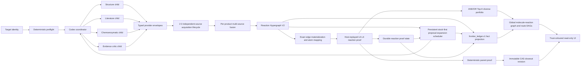

# AutoPlanner Architecture V2

Last update: 2026-07-12.

This document is the normative architecture for the active AutoPlanner
mainline. It explains how Codex-driven exploration, multi-source route fusion,
deterministic reaction proof, durable frontier execution, route selection, and
the global route view fit together. [MAINLINE.md](MAINLINE.md) remains the
operator-facing runbook and records concrete end-to-end results.

The central rule is simple: generation is broad, but authority is narrow.
Codex and other proposal providers may explore aggressively; only replayable,
content-bound deterministic checks may promote a complete parent route.

## Non-negotiable invariants

1. A Codex coordinator must directly spawn observed specialist child agents.
   Role-shaped prose from one process is not a multi-agent run.
2. Every provider returns a typed, content-hashed envelope and has no solved
   authority.
3. Fusion is scoped to each canonical product intermediate, not only to the
   root target and not to a run-wide evidence pool.
4. Evidence diversity is counted by trusted correlation group. Four Codex
   roles are one model support group, not four independent scientific sources.
5. A route is no stronger than its weakest reaction step and unresolved
   terminal frontier.
6. Queue exhaustion, agent-task success, child-target success, literature
   similarity, consensus score, and a plausible diagram are never substitutes
   for reaction proof or parent-route closure. Execution success and
   `proof_closed` are separate fields.
7. A replacement keeps the exact product identity, may introduce a different
   precursor set, and is valid only after the complete AND/OR route re-solves
   connectivity, stock, and reaction proof. A UI splice cannot alter truth.
8. Closeout truth is an immutable content-addressed revision. Fixed filenames
   are compatibility views, not sufficient provenance.
9. Missing proof is emitted as a machine-readable negative proof; it is never
   converted into a success by presentation logic.
10. Campaign queue state, graph proposals, stock boundaries, reaction proof,
    and hypergraph dependencies remain orthogonal authorities. Their only
    unified completion view is the deterministic, content-hashed
    `frontier_ledger.v1` projection; no second mutable expansion state may
    infer closure from a bounded route list.

## System map and authority flow



The arrows do not imply equal authority. The proposal, evidence, proof, and
publication planes have deliberately different permissions:

| Plane | May do | Must not do | Authority |
| --- | --- | --- | --- |
| Proposal | Suggest disconnections, conditions, enzymes, and alternatives | Claim reaction validity or solved status | Advisory |
| Evidence | Bind claims to source/document/page records and expose conflicts | Turn a citation string into proof | Advisory until validated |
| Proof | Replay structures, atom maps, connectivity, stock, precedent, and procurement | Trust producer booleans | Deterministic verifier |
| Publication | Freeze mutually consistent graph, proof, and view artifacts | Publish mixed revisions as current truth | Validated CAS manifest |

The persistent scheduler still owns proposal-expansion jobs only; reaction
proof and CAS publication are not disguised as successful queue jobs. Between
useful evidence rounds, however, the controller materializes the current
consensus edges, replays mapping and host transform checks, writes durable
proof state, and resumes the same campaign queue with those proof results and
newly acquired evidence. This is a feedback loop between distinct authorities,
not a collapse of proposal success into proof success.

## 1. Codex coordinator and direct child agents

The active orchestration entry is
`cascade_planner/orchestration/codex_retrosynthesis.py`. One coordinator is
responsible for calling `spawn_agent` for each required specialist role. The
default roles are:

- `target_structure_strategist`;
- `literature_route_scout`;
- `chemoenzymatic_route_specialist`;
- `route_evidence_critic`.

An accepted child report requires all of the following:

- an observed root-thread spawn event;
- an explicit role binding in the spawn contract;
- a matching terminal wait event;
- a completed child with a unique agent ID and role;
- exact `retrosynthesis_proposal_report.v1` JSON shape;
- matching case, role, and stereochemistry-preserving target identity;
- candidate-level `no_solved_claim=true` and
  `not_parent_route_proof=true`.

The trusted orchestrator assigns each accepted report's source channel. Child
text cannot impersonate literature, a different agent, or a deterministic
verifier. Oversized, malformed, duplicate, role-mismatched, or unobserved
reports are retained as rejected observations with stable reason codes.

Strict all-child acceptance remains the default. A new campaign may instead
bind `child_acceptance_mode=valid_subset_l0` into its immutable policy. That
mode still requires the host to observe an explicit spawn for every required
role, rejects coordinator/runtime/tool/identity failures, and requires a
host-derived quorum of `max(2, ceil(required_roles / 2))` valid final reports.
Only the valid child finals are fused; coordinator-restated candidates are
ignored. The mode grants permission to fall back; it does not pre-emptively
downgrade a complete team. A 4/4 valid run records `acceptance_tier=strict_all`
and follows the normal consensus path. Only when the valid-subset fallback is
actually used is every recovered proposal forcibly capped at
`L0/model_only/low`, made non-authority-bound, and prevented from closing a
route or making a solved claim. `autoplanner.child_acceptance.v2` binds this
tier distinction into immutable campaign policy, so a campaign created under
the earlier v1 behavior must restart in a fresh run directory. This recovers
useful hypotheses from one incomplete sibling without converting partial
model agreement into scientific evidence.

The same direct-team contract applies recursively to unresolved molecule
frontiers. Depth, cumulative accepted expansions, per-invocation accepted
expansions, attempts, batch size, tool calls, bytes, and time are bounded
separately. A failed child attempt does not consume the accepted-expansion
budget, and a later invocation resumes pending work from the same durable run
directory. The standard launcher profile is six action rounds, depth six,
24 cumulative accepted expansions, one bootstrap expansion, at most two
accepted expansions and four total attempts per invocation. Recursion expands
the proposal graph; it does not prove the route. When the mainline fails, the
case stops unresolved rather than silently handing scientific ownership to a
deterministic fallback planner.

### Campaign durability, attempt accounting, and prepared-result recovery

One run directory owns one fenced campaign. `campaign_identity.json` binds the
case and canonical root target; `campaign_policy.json` additionally binds
maximum depth, reaction-proof floor, verifier version, and the effective stock
provider/catalog authority. Changing one of those authority-bearing policy
fields requires a new campaign. Accepted-expansion and Agent-attempt limits are
stored separately in an append-only `campaign_budget_events/` chain. Budget
events may extend either limit monotonically, but cannot shrink or silently
replace an earlier envelope. When `max_attempt_runs` is not set through the
Python configuration, it defaults to the greater of three times the cumulative
accepted-expansion budget and the per-invocation attempt cap; the standard
24-expansion profile therefore has a 72-attempt campaign ceiling in addition
to its four-attempt invocation ceiling.

The campaign entry point and proof reconciliation also share a non-stealable
OS advisory lock for the complete run-directory transaction. The lock is held
across the model call, commit preparation, queue adoption, and reconciliation;
it has a configurable wait timeout but no stale-file takeover. This closes the
window in which two controller processes could both observe the final accepted
slot and overspend it.

Every actual Agent call consumes one durable campaign-wide attempt before the
call begins. Under the campaign attempt lock, the queue lease and
`campaign_attempts/<attempt-id>/started.json` event are created before model
work. A separate immutable `terminal.json` records the operational outcome.
The attempt ID binds campaign identity, job ID, queue attempt, and a digest of
the lease token. On restart, the ledger is replayed from these events; an
unterminated start still consumes attempt budget. `campaign_state.json` and its
run summaries are disposable projections and cannot restore or erase calls.

An accepted team report is copied into the campaign object store and an
immutable, campaign/job/attempt/lease-fenced expansion commit is prepared
before the queue is marked succeeded. Those two filesystem writes are not a
cross-file atomic transaction. Recovery instead uses a prepared-result outbox
pattern: startup validates the report object and commit, then the queue adopts
that exact prepared result under its own lock. A different attempt, lease,
campaign, target, failed/cancelled terminal job, or invalid commit is rejected.
Only a successfully adopted queue result becomes proposal authority; an
attempt event by itself never becomes an expansion. Content hashes detect
canonical-content drift but are not signatures and do not defend against an
attacker who can rewrite every trusted local authority input.

The orchestration-owned `codex_retrosynthesis_team/team_report.json` is never a
controller scratch file. Controller refreshes write `controller_projection.json`
instead. The durable expansion set is reconstructed from succeeded, fenced
campaign commits and placed first in a monotonic union with evidence/ChemEnzy/
legacy graph projections. A failed reconciliation may add a failure projection,
but it cannot replace an earlier accepted team report, erase a committed
expansion, or turn the fused graph into a second mutable campaign state.

Proof-only reconciliation reports two kinds of accounting explicitly.
`expansion_budget_consumed` is the delta for that reconciliation call and is
therefore zero when no proposal worker ran. The cumulative fields
`durable_accepted_expansion_count` and
`admitted_external_expansion_count` describe the two event sources;
`canonical_input_expansion_event_count` is their sum, while
`canonical_reaction_edge_count` is the reaction-signature-deduplicated graph
count. `canonical_expansion_count` is retained only as a deprecated alias of
the input-event count. Audit and closeout consumers must not infer an empty
campaign from a zero call delta or confuse duplicate input events with unique
reaction edges. They also bind the frontier ledger and scheduler facts to the
queue carried by the current content-addressed
`codex_campaign_proof_reconciliation` artifact. In CAS mode, a missing or
invalid reconciliation fails closed; the older queue projection inside
`team_report.json` and mutable compatibility files cannot fill the gap.

### Controller recovery and canonical graph authority

`blackboard_events/events.jsonl` is a controller recovery journal, not a
scientific trust root. One run-wide process lock serializes controller
invocations; every checkpoint uses expected-head CAS and explicit tombstones,
so a stale sparse projection cannot resurrect a removed field. External actions
follow `started -> result_prepared -> committed`: the attempt budget is reserved
before execution, a prepared result can be replayed without another tool call,
and a started action with no prepared result becomes indeterminate instead of
being retried automatically. Recovery removes Codex graph, proof, stock,
solved, and closeout authority and requires their current-host providers to
replay them. Journal SHA-256 values detect drift; they are not signatures.

The JSONL reader uses strict duplicate-key and finite-number parsing. A crash
may leave one invalid final fragment without a newline; while holding the
journal lock, the host preserves its raw bytes and digest in a non-authoritative
forensic sidecar, fsyncs the evidence, and truncates only that tail. A valid
event without a final newline is retained. Any terminated corrupt record or
identity, sequence, chain, digest, parent, or binding ambiguity remains
fail-closed.

The controller intentionally publishes two graph views:

- `route_consensus_graph` is the caller-advisory fusion used for L0
  disconnection suggestions, analogies, portfolios, and display;
- `canonical_route_consensus_graph` is rebuilt only from fenced Codex commits
  and campaign-bound, current-host-replayed external-admission events.

Only the canonical graph feeds reaction-proof state, frontier jobs, the
frontier ledger, completion, RouteForest authority stages, and closeout
dependencies. Unsupported advisory edges remain visible but cannot affect
budget, proof, stock, or completion. The external-admission journal persists
the complete replay material and an authority-free receipt for each exact
edge; restart replays both and downgrades the reconstructed candidate to
`model_only` L0 before any verifier runs.

An accepted Codex team is not required for this replay path. If exact
literature or ChemEnzy material produces a host-replayable admission receipt,
the controller opens or resumes the same identity- and policy-bound campaign
with an empty Codex commit set and reconciles that external edge directly.
Rejected or missing Codex output therefore cannot veto an independent source.
Invalid material is quarantined; reconciliation failure publishes an empty
identity-bound authority graph and never falls back to the caller-advisory
graph for ledger completion.

There are two distinct literature gates. A source-bound materialized PDF claim
may receive `materialized_literature_search_admission.v1`, which grants search
admission only and still requires mapping/reaction verification for L2. It does
not grant literature precedent, stock, or solved status. L3 remains restricted
to a current-host match in the out-of-band trusted literature-step registry.
This separation lets newly extracted sources enter verification without
letting model-translated structures certify themselves.

## 2. Provider SPI

`cascade_planner/providers/` is the replaceability boundary. A provider exposes
a `provider_descriptor.v1` and implements one typed invocation contract. The
host-effective descriptor pins:

- provider ID, kind, and semantic version;
- accepted input and output schemas;
- trusted correlation group;
- capabilities and deterministic/network flags;
- optional cost estimate.

Every invocation returns `provider_result_envelope.v1` with provider identity,
declared output schema, correlation group, accepted/rejected status, reasons,
source/evidence references, payload, and a deterministic content hash. The
registry rejects undeclared schemas, duplicate provider IDs, identity or
version drift, bad hashes, and any envelope without `no_solved_claim=true`.
Correlation group, deterministic status, and privileged provider kind are host
policy, never third-party self-assertions. An unlisted third-party provider is
downgraded to a correlated, nondeterministic proposal provider; stock,
evidence, verifier, agent-backend, and artifact authority require an explicit
host trust record.

The SPI kinds are:

| Kind | Responsibility | Typical output |
| --- | --- | --- |
| `proposal` | Generate reaction candidates | Candidate envelopes |
| `evidence` | Acquire and bind evidence | Source/document/claim records |
| `stock` | Resolve a dated stock boundary | Catalog binding or supplier offers |
| `verifier` | Deterministically replay a claim | Reaction or route validation |
| `agent_backend` | Execute observed agent work | Runtime events and typed drafts |
| `artifact_store` | Persist immutable artifacts | Object and revision references |
| `renderer` | Project canonical records | Read-only JSON/HTML views |

Built-in adapters include the Codex retrosynthesis backend, deterministic
reaction-route verifier, snapshot stock provider, ChemEnzy proposal envelope,
and literature-evidence envelope. Each is registered through the host builtin
allowlist; the ChemEnzy and literature adapters require an injected runner and
remain advisory.

To replace a provider safely:

1. implement the relevant protocol;
2. declare compatible input/output schemas and a stable correlation group;
3. register it with `ProviderRegistry`;
4. pass contract, content-hash, replay, and failure-path tests;
5. compare output in shadow mode before changing selection policy.

Provider replacement never changes the final-proof predicate. A faster model,
another stock service, or a different renderer can improve coverage without
gaining solved authority.

## 3. Per-intermediate multi-source Reaction Hypergraph V2

The graph is a bipartite reaction hypergraph, not a linear list. Molecule nodes
are stereochemistry-preserving canonical identities. One reaction hyperedge
connects all required precursors to one product, so convergent chemistry keeps
its AND semantics.

Fusion proceeds by canonical product neighborhood:

1. adapt Codex, ChemEnzy, exact-literature, analogy, template, stock, and human
   records into typed candidates;
2. canonicalize the candidate product with isomeric SMILES;
3. place the candidate in that product's neighborhood bucket;
4. canonicalize and sort the complete precursor set;
5. fuse only candidates with the same product and precursor-set identity;
6. preserve source records, claims, conditions, conflicts, and rejections;
7. connect product neighborhoods through shared molecule identities.

This fixes the historical root-target fusion error: an exact row or legacy
provider proposal for intermediate `A` is fused with the recursive Codex
neighborhood for `A`; it is not rejected merely because `A` differs from the
campaign root.

The typed V2 records in `cascade_planner/routes/domain.py` are:

| Schema | Meaning |
| --- | --- |
| `molecule_identity.v2` | Canonical isomeric molecule identity |
| `evidence_claim.v2` | One source claim with explicit support group |
| `reaction_candidate_envelope.v2` | One source-bound reaction candidate |
| `reaction_hyperedge.v2` | Canonical product-to-precursor-set disconnection |
| `alternative_set.v2` | Competing hyperedges for the same product |
| `route_variant.v2` | One advisory selection through the graph |
| `route_neighborhood.v2` | All fused choices for one product |
| `route_hypergraph_overlay.v2` | Content-addressed overlay for a complete graph |

IDs derive only from canonical identity-defining values. Content hashes also
include evidence and display-relevant payload. Equivalent serialization order
therefore converges to one ID, while stereoisomers and different complete
precursor sets remain distinct.

V2 is currently emitted as `v2_overlay` on `route_consensus_graph.v1`, alongside
`route_neighborhoods`. The V1 graph remains a compatibility carrier; neither
V1 nor V2 consensus may claim stock closure, executability, or parent proof.

Cycles, unresolved frontiers, depth limits, conflicts, rejected records, and
alternative sets are first-class output. They must not be omitted to make a
route appear complete.

All proposal sources pass the same structure-derived admission gate before
ranking or queue publication. It rejects invalid structures, self/ancestor
cycles, elemental deficits, and implausible heavy-atom jumps while preserving
precursor multiplicity. The gate is shared by consensus and both guided and
unguided ChemEnzy execution. An admitted Codex precursor is also emitted as an
explicit recursive child-target task and ranking bias; it is not left as prompt
text. That task still requires an exact current-host L2 inbound parent edge
before the durable campaign may expand it.

## 4. Evidence correlation groups

Source channels describe how a claim arrived. Correlation groups describe how
many independent supports it actually represents. Ranking and UI width use
the latter.

| Claim origin | Correlation treatment |
| --- | --- |
| Any Codex role in the campaign | `codex_model` |
| ChemEnzy computational output | `computational:chem_enzy` |
| Exact bound literature record | Source-derived literature group |
| Article and SI for one scholarly source | Same source identity; distinct document identities |
| Unattributed legacy/model record | Correlated with model hypotheses, not independent |
| Stock snapshot | `stock_snapshot`; a terminal boundary, not reaction evidence |
| Deterministic verifier | Verifier result, not an additional literature source |

A DOI mentioned by a Codex child remains a model claim. It becomes independent
literature support only after a trusted source-detail adapter binds the exact
chemistry to an actual document/page record. Multiple roles repeating the same
statement improve review coverage but do not create a source-diversity bonus.
DOI URLs, normalized DOI strings, PMID/PMC aliases, article/SI references, and
local copies joined by explicit provenance are collapsed to one scholarly
source identity. A generic `accepted=true` row with a DOI-shaped string is only
literature analogy and cannot manufacture independent support.

For an unresolved evidence requirement, the action planner may pursue two or
three independent source groups in one lifecycle. Metadata discovery alone is
not completion: the lifecycle continues through acquisition, PDF/HTML binding,
rendering, visual or deterministic extraction, structure resolution, and exact
reaction rows where available. An article and its supporting information are
distinct documents but one scholarly source group; they cannot satisfy a
two-source requirement by themselves. Subsequent rounds exclude already-seen
source groups and seek genuinely independent support.

An exact-row blackboard record is compact but reaction-complete: it retains the
full precursor set, product, mapped reaction when present, conditions, exact
source locator, validation binding, and evidence references. Dropping the
reactants or mapping would turn a discovered source into an unusable summary,
so the evidence-first controller regression requires a late exact row itself to
materialize and unlock the matching frontier without a test-only mapper.

Source identity is explicitly three-layered:

| Layer | Host-derived identity | What it counts |
| --- | --- | --- |
| Independent source group | Patent family, canonical publication identifier such as DOI/patent/PMID/PMC/PII, or normalized title fallback | Correlated scientific support; article and SI count once |
| Logical document | Explicit document ID, otherwise source group plus content scope such as article or supporting information | Acquisition/extraction progress; article and SI remain distinct |
| Representation | Canonical DOI/URL/database locator or local-PDF locator | Concrete copies of one logical document; it never adds independence |

For a single extracted source payload, compound numbers are source-local
labels rather than molecule identities. The visual structure validator records
`source_compound_label_binding_audit.v1` and requires each normalized label to
bind one canonical structure. If the same label, such as `C16`, resolves to two
different canonical SMILES in that payload, every affected step is rejected
with `compound_label_structure_conflict`. The audit carries the independent
source group and document ID, but it does not claim that identical labels in
different publications refer to the same compound; cross-document identity
still requires structure-based reconciliation.

Consensus ranking is host-derived. Producer `evidence_level` and `confidence`
tokens are retained as advisory provenance, while all scorers consume the
separate `authority_evidence_level` and `authority_confidence`. Every unbound
producer is forced to `model_only`/`low` even when it self-reports a trusted
channel, `validated`, `literature_exact`, or `high`. The producer claim remains
visible for acquisition and audit, while a self-validated non-Codex claim is
rejected. Only a host adapter that binds an exact source-detail step, a
deterministic provider envelope, or reaction validation may raise authority.

## 5. Reaction proof L0-L4

`cascade_planner/harness/reaction_step_verifier.py` emits
`reaction_step_proof.v1` and route-level `reaction_route_validation.v1`.
Levels are monotonic and computed, never accepted from candidate booleans.

| Level | Canonical name | Required claim | Meaning |
| --- | --- | --- | --- |
| L0 | `L0_materialized` | Valid product and all reactant structures | The edge is structurally stated, not validated |
| L1 | `L1_graph_and_stock_closed` | L0 plus route connectivity and terminal stock closure | The route graph closes, but reaction chemistry is not yet proven |
| L2-M | `L2_mapping_consistent` | Product-complete mapped reaction passes deterministic structural audit | Identity, unique product provenance, bounded departing reactant atoms, elements, component contribution, scaffold continuity, bounded edits, and stereochemistry pass; portfolio proof level is zero and this remains advisory |
| L2-R | `L2_reaction_validated` | A trusted deterministic transform is reapplied and its reaction centre matches | This may satisfy the portfolio edge floor; a producer label, mapping-only proof, or self-hashed payload cannot create it |
| L3 | `L3_precedent_supported` | Mapping consistency plus trusted out-of-band exact precedent binding | The reaction is eligible for current parent-route authority |
| L4 | `L4_procurement_ready` | L3 plus complete conditions and procurement binding | The step is operationally bound to conditions and materials |

The route-forest compatibility view spells L1 as
`L1_graph_stock_closed`; readers must map it to the canonical verifier level
above. No other level may be renamed or inferred from a colour.

L2 explicitly checks the materialized mapped reaction against the separately
declared product and complete reactant set. Every product heavy atom must have
a unique, element-preserving reactant provenance map. Reactant atoms absent
from the recorded major product may remain unmapped only within the explicit
departing-atom budget; this permits normal dehydration, substitution, and
deprotection without permitting an unlimited atom jump. It also requires a
real bond change and a stereochemically matching product, and rejects mapped
components that contribute nothing, atom-balanced fragment piles without a
continuous precursor scaffold, more than twelve departing reactant heavy
atoms, more than two net new rings, or more than eight bond edits in one step.
Self-reported validation or convergence booleans have
no authority; the validator recomputes every listed check from structures.
Mapping consistency alone cannot establish a meaningful transformation, so an
`L2_mapping_consistent` edge is explicitly mapped to portfolio proof level zero
and cannot enter the proof-eligible portfolio. `L2_reaction_validated` is a
separate named level reserved for trusted deterministic transform reapplication
and reaction-centre matching. The current verifier must not infer it from atom
mapping, candidate booleans, or a digest the candidate can recompute.

At each closeout refresh, every exact consensus product/precursor hyperedge is
materialized as a reaction candidate. Existing atom-mapped reactions are
preferred; an optional batch mapper may fill missing maps, and missing mapper
support remains an explicit negative reason. The host then recomputes mapping
consistency and conservatively reapplies supported transform families. Only a
matching host transform may reach `L2_reaction_validated`; generic cut/glue or
mapping-only candidates remain advisory. Digest-valid proof records are stored
in `reaction_proof_state.json` and fed back into later campaign resumes, so a
new source or proof can unlock pending frontiers without restarting the run.

Default-mapper work is persisted per exact edge under the run's private work
directory. The cache key binds the complete materialized candidate, canonical
product/precursors, each precursor's current stock state, mapper contract, and
reaction-verifier version. Every hit is replayed by the current host verifier;
corruption, self-consistent tampering, input drift, or version drift produces a
miss for that edge only. Injected/opaque mappers bypass persistence. Cache
records are resumable work products, never reaction or parent-route authority.

L3 requires a digest-bound registry entry whose authority is
`human_curator` or `deterministic_structure_parser`. The production registry is
empty by default. The populated registry in `tests/fixtures/` is test data and
must never be copied into production.
The verifier recomputes the current canonical product/reactant digest and
replays the materialized PDF/page evidence against the configured registry;
request-supplied precedent bindings cannot elevate a step. L4 additionally
requires complete conditions and digest-valid stock-provider envelopes that
cover every reactant.

Route proof uses weakest-link aggregation. Portfolio analysis can admit a
route only when every selected reaction has exact, replay-derived
`L2_reaction_validated` or stronger binding and every leaf has exact stock
binding. Under the current safe parent policy, `solved` still requires every
selected reaction to reach L3 or L4. A higher level on one step cannot
compensate for a lower level elsewhere. A stock terminal is a valid graph leaf;
it is not an L4 reaction.

`route_proof_bank.v1` prevents a multi-route verifier result from collapsing to
only its best route. Every accepted route becomes a content-bound entry carrying
the materialized route, route audit, reaction validation, exact stock-terminal
evidence, target, and verification policy. Each entry is replayed before use.
When several verifier results are supplied, the controller keeps them as a
multi-verifier bundle: banks and authorities remain separate, and only exact
product/reactant signatures are combined after replay. If a proof bank is
present but invalid, portfolio binding fails closed instead of falling back to
legacy best-route fields.

`parent_route_proof_attempt.v1` records missing clauses and open frontiers for
both positive and negative attempts. Final `solved` requires a valid
`stitched_parent_route_proof.v1`, exact target equivalence, graph and stock
closure, every reaction at least L3, no unexplained large atom jump, connected
child/literature segments when stitched, and analogy used only as rationale.
Reaction validation and precedent support are independent clauses. A stitched
literature segment may combine with stock-closed L2 subgoal routes as a visible
`reaction_validated_l2_candidate`, but each literature and subgoal segment is
replayed from embedded proof inputs and must independently reach L3 before the
stitch or parent proof can be `solved`.

## 6. Persistent stock-first frontier scheduler

`cascade_planner/application/frontier_scheduler.py` owns durable frontier work.
Before any agent expansion is enqueued, the scheduler canonicalizes the
frontier and asks the stock provider for an immutable boundary. A matching
accepted stock snapshot closes the molecule as a terminal; otherwise a durable
job is created.

`frontier_job.v1` has the states `pending`, `leased`, `retry_wait`, `succeeded`,
`failed`, and `cancelled`. Its stable job ID and caller idempotency key prevent
duplicate semantic work. Leases carry owner, token, expiry, and heartbeat.
Expired leases recover into bounded exponential retry or terminal failure.
Queue snapshots are atomically replaced and content hashed.

Ready work is prioritized by:

```text
4 * proof_deficit
+ 3 * closure_probability
+ 2 * diversity_gain
- min(log1p(estimated_cost_units), 5)
```

Dependencies must succeed before a job can be claimed. `FrontierExecutor`
provides bounded asynchronous execution; durable lease state, rather than an
in-memory task list, is the recovery authority.

Campaign proposal-graph exhaustion is independent of queue occupancy. The
frontier scheduler persists `proposal_expansion` jobs: stock lookup happens
before expansion, and an accepted team contributes typed candidate hyperedges.
A successful job is deliberately proof level zero. Empty queue, depth, budget,
or retry exhaustion therefore reports proposal-expansion state only and never
means reaction proof, route closure, or `solved`. Depth and cycle boundary
leaves are stock-audited before they are closed as non-expandable.

Expansion is evidence-first. The root job is explicitly eligible, but a newly
discovered precursor job is created with `proposal_expansion_allowed=false`
after its stock audit unless at least one exact inbound parent step has reached
`L2_reaction_validated` under the current host verifier. A later proof refresh
may monotonically enable a pending or retry-wait job only when the proof's step
ID intersects that job's recorded parent-step IDs and the campaign identity and
root target fences match. Thus an unmaterialized or self-reported parent edge
cannot spend recursive Agent budget. L2 unlocks proposal exploration only; it
does not grant L3 parent-route or L4 procurement authority.

Reaction-step replay and durable proof-state updates run between campaign
invocations; `route_proof_bank.v1` construction and entry replay, exact
portfolio binding, AND/OR solving, replacement validation, parent proof, and
CAS publication remain deterministic downstream stages. None of them becomes
a successful proposal job. Their results may guide a later resume, but only
the appropriate proof artifact carries proof authority.

Commercial stock is represented by `stock_boundary.v1` and timestamped
`stock_offer.v1` records. Supplier, catalog number, canonical structure,
snapshot SHA-256, checked time, availability, purity, pack, price, region, and
lead time remain distinguishable. Benchmark stock, commercial availability,
in-house material, common commodity, and unavailable are separate boundary
types.
The SHA-256 is recomputed over canonical snapshot content, timestamps must be
timezone-qualified ISO-8601, and availability must be a real boolean. Only
snapshots or snapshot artifacts loaded when the provider is constructed are
trusted; an invoke request that invents or flips `available=true` cannot close
a stock boundary even if it hashes its own forged payload.

The standard launcher loads `config/trusted_stock_catalogs.json`, resolves the
pinned PaRoutes n1 CSV, and verifies its SHA-256 before starting expensive
work. This provider means exact membership in a reproducible benchmark catalog
only. It explicitly sets `commercial_orderability_claimed=false` and must not
be displayed as supplier availability, price, lead time, or procurement
readiness. Real commercial claims require timestamped supplier snapshots. The
CLI accepts repeatable operator-selected `--trusted-stock-snapshot` artifacts;
each observation must carry the SHA-256 of its canonical snapshot content, and
`procurement` campaigns fail before model execution when none are configured.
Selecting the artifact is the operator trust decision. Its digest detects
mutation but is not a supplier signature and does not make an old observation
live.

Benchmark membership may close a leaf for a reproducible benchmark/search
fixed point, but its frontier job remains `achieved_proof_level=0` with
`benchmark_membership_only` authority. The ledger marks that stock projection
`benchmark_only=true` and never upgrades it to procurement. Only validated
`commercially_orderable`, `in_house_available`, or `common_commodity`
boundaries may carry stock-boundary level 4. Stock closure is accepted only
after the current host re-invokes the construction-time trusted provider and
matches its provider result, replay request, descriptor/version, canonical
molecule, and boundary level; merely validating an embedded envelope hash is
insufficient. A full L4 route still requires every reaction edge to have
trusted precedent, complete conditions, and a validated procurement binding.

### Unified frontier fact projection

`cascade_planner/application/frontier_ledger.py` eliminates the former
ambiguity between campaign expansion state, blackboard summaries, bounded
route hypotheses, and proof closeout. It exposes one deterministic operation:

```python
project_frontier_ledger(
    route_consensus_graph,
    frontier_queue,
    reaction_proof_state,
    required_reaction_proof_level=2,
)
```

The controller writes the result as `frontier_ledger.json`. The ledger is a
read-only fact projection, not another scheduler. For every target-reachable
molecule and exact reaction edge it keeps five concerns separate:

| Concern | Authoritative input | Meaning |
| --- | --- | --- |
| Proposal | Complete `route_consensus_graph.v1` steps | Which alternatives exist |
| Work | Digest-valid `frontier_queue.v1` jobs | What is pending, leased, retried, or terminal |
| Stock | Host-validated stock-provider envelope on a stock job | Which molecule is an independently closed boundary |
| Reaction proof | Exact-edge, current-host-replayed proof record | Which proposed reaction passed the configured L2/L3/L4 floor |
| Dependencies | Complete target-reachable AND/OR hypergraph | Which precursors every alternative requires |

Closure is a least fixed point over the complete reachable hypergraph. It does
not read `route_hypotheses`, Top-K display limits, branch counts, or queue
occupancy. The ledger computes two provider-replayed stock planes, each with an
existential and a universal fixed point:

| Field | Leaf authority | Fixed-point meaning |
| --- | --- | --- |
| `any_benchmark_route_closed` | Any accepted search boundary, including pinned benchmark membership or a stronger stock boundary | At least one proven alternative recursively closes |
| `all_explored_benchmark_closed` | Same search-boundary plane | Every reachable alternative edge and every precursor branch recursively closes |
| `any_procurement_route_closed` | Only replayed commercial, in-house, or common-commodity boundaries at stock level 4 | At least one proven alternative closes with procurement-capable leaves |
| `all_explored_procurement_closed` | Same procurement-boundary plane | Every reachable alternative and leaf closes on the procurement plane |

`any_route_closed` and `all_explored_graph_closed` are compatibility aliases
for the first pair and are never procurement claims. All four use the ledger's
configured reaction-proof floor; a procurement-leaf fixed point at an L2 edge
floor is still not a fully L4 reaction route. A cycle cannot prove itself
without an independent replayed stock or verified terminal boundary.

The summary exposes orthogonal backlog counters instead of one overloaded
"branch" number: `proposal_pending_molecule_count`,
`proposal_expansion_eligible_molecule_count`, `work_pending_molecule_count`,
`stock_pending_leaf_count`, `reaction_proof_pending_edge_count`, and
`dependency_pending_edge_count`. For example, a depth-limited leaf may remain
proposal-pending for graph completeness while being ineligible for another
Codex expansion; those are intentionally different facts.

`content_sha256` binds the canonical JSON projection but is an integrity
commitment, not an authorization signature. `validate_frontier_ledger`
reconstructs exact-edge topology and all four fixed points rather than trusting
re-hashed closure booleans. The graph, queue, and reaction-proof envelopes are
validated independently and their results remain visible under
`input_validation`. Invalid schema, digest, exact-edge binding, stock
authority, or proof authority forces effective closure false. A consumer must
call the validator and gate positive summary fields on all three
input-validation results; merely re-hashing an invalid upstream record does
not grant authority.

### Guided ChemEnzy feedback

Production launch first requires an isolated-interpreter capability probe
bound to the request-effective model, stock, stock-mode, and ONMT overrides.
The probe imports the vendor API and checks concrete inputs but constructs no
planner, loads no checkpoint/model, and performs no search. A short-lived cache
is reusable only when the environment/interpreter, vendor/runtime files,
configuration, launcher, timeout, and request-selection digests all match;
concurrent identical probes coalesce. Filesystem discovery alone cannot grant
launch authority. Windows keeps normal import/cwd paths and applies device
prefixes only to concrete overlong I/O paths.

Codex or evidence-derived precursor hints are compiled into a typed guidance
contract and consumed by the native one-step model wrapper. They affect actual
candidate cost and ranking, rather than appearing only in prompt text. The
bounded guidance batch is selected before truncation from the canonical graph
and current frontier ledger. Open, non-stock, expansion-eligible targets are
layered by canonical depth, with deterministic structure diversity and stable
proposal identity as tie-breakers. Model-authored confidence, evidence,
validation, and authority flags are explicitly ignored. The selection audit
records ledger binding, selected/dropped proposal IDs, rank reasons, and every
ignored self-reported field, so the first 12 serialized proposals no longer
monopolize ChemEnzy work.

The wrapper also rejects self-loops, canonical ancestor cycles, obvious element
deficits, implausible heavy-atom jumps, and terminal-blacklist candidates while
preserving trusted stock terminals. Runtime call counts, accepted/rejected
rows, cost adjustments, and rejection reasons are emitted in a guidance
consumption audit. Guidance remains proposal authority: it cannot inject an
unverified raw reaction or bypass reaction and route verification.

## 7. AND/OR closure and Top-K route portfolio

`cascade_planner/application/route_portfolio.py` solves the V2 overlay as an
AND/OR graph:

- OR: choose one eligible hyperedge for a product;
- AND: close every precursor of the chosen hyperedge;
- leaf: bind the molecule to explicit stock;
- edge gate: meet the configured portfolio proof threshold, normally trusted
  deterministic `L2_reaction_validated` or stronger.

`route_portfolio_bindings.v1` is a sibling of the immutable portfolio report,
not an unhashed field appended after report hashing. For each selected edge,
`exact_edge_proof_binding.v1` binds hyperedge ID, exact product and precursor
IDs, structure signature, named level, replay authority, and proof digests.
For each leaf, `exact_stock_binding.v1` binds molecule identity, catalog and
evidence hashes, lookup basis, and replay authority. The bindings object,
portfolio report, and every route item have independently recomputable hashes.
Mapping-only proof is recorded for diagnostics but receives portfolio proof
level zero. Parent-route authority remains stricter and currently requires
every selected edge to reach L3 or L4.

Cycles, depth limits, missing disconnections, missing stock bindings, and fixed
replacement mismatches remain unresolved. Only fully closed and
reaction-validated candidates enter the portfolio.

Every serialized portfolio item is audited independently: `complete=true`,
`reaction_validated=true`, selected hyperedges must resolve to the overlay,
each selected exact edge/stock binding must match and recompute, and every
schema-provided content SHA-256 must recompute exactly. Candidates are
ranked by route quality and then selected with maximal marginal
relevance so Top-K favors both quality and structural diversity. Shared
intermediates stay shared; output routes are DAG selections, not duplicated
linear strings. If fewer than K valid routes exist, the system returns the
honest smaller set and a reason. It never pads the portfolio with advisory
routes. Portfolio eligibility itself remains advisory: it does not create a
`stitched_parent_route_proof.v1`, `solved=true`, or executable authority.

Replacing one disconnection fixes that product's selected hyperedge and
re-solves the full AND/OR route. Exact product identity is preserved, but the
replacement is allowed to introduce a different precursor set; every new leaf
and reaction must close under the same stock and proof bindings.
`route_replacement_catalog.v1` retains both accepted and rejected candidates,
including reasons and the complete re-solved route for accepted rows. The route
forest projects that route as a complete `listed=false` replacement branch and
previews the branch as a whole. It never substitutes one reaction tile into the
old route. Rejected rows remain visible and disabled.

## 8. Immutable closeout revisions

`cascade_planner/runtime/artifact_revision.py` publishes route closeout data as
`closeout_revision_manifest.v1`. Compatibility files keep their historical
names, but the controller snapshots their exact bytes into:

```text
RUN_DIR/.autoplanner/closeout/
  objects/sha256/<prefix>/<digest>/<artifact-name>
  staging/<revision-digest>.json
  revisions/<revision-digest>.json
  latest.json
```

Publication is transactional at the pointer boundary:

1. hash producer-captured compatibility bytes;
2. reject any change between capture and commit;
3. write immutable CAS objects;
4. bind every artifact dependency by artifact ID and SHA-256;
5. write and validate a staging manifest;
6. write and validate the immutable committed manifest;
7. atomically replace `latest.json` only after all checks pass.

The dependency chain includes consensus, consensus graph, a deterministic
parent-proof snapshot, a validated final-verdict core, the explored route
forest, and rendered HTML where present. The consensus graph carries the
separately hashed portfolio, exact bindings, and replacement catalog; the proof
snapshot retains its deterministic verifier
and proof-bank authority when present. CAS publication preserves and cross-binds
those downstream results but does not create reaction proof merely by hashing
an advisory proposal. The verdict core deliberately omits
post-publication path and digest-reference fields, so the scientific decision
is content-addressable without a circular self-reference. The forest depends
on both proof and verdict core, preventing a route view from being paired with
a different decision. Validation rejects missing objects, content drift, CAS
corruption, stale dependency hashes, cycles, path escape, schema mismatch, or
a pointer to an uncommitted manifest. Republishing identical bytes is
idempotent; a failed revision leaves the previous latest pointer untouched.

Readers validate `closeout_latest_pointer.v1` before trusting a route
projection. If a new run has an invalid closeout, the fixed-name view is
quarantined. Old runs without a pointer remain readable in explicit
compatibility mode but do not gain new proof retrospectively.

## 9. Global DAG and multidimensional trust UI

The route forest emits `molecule_reaction_dependency_graph.v1`, a global
bipartite graph with explicit molecule-to-reaction and reaction-to-molecule
edges. A closed selected route is a DAG; the complete explored overlay may
still contain proposal cycles, which are surfaced rather than discarded.
Layout is derived only from explicit dependencies; adjacency in an array never
creates chemistry.

A molecule without canonical isomeric SMILES (or another exact structure
identity such as an InChIKey) is never merged repository-wide by its display
name. Its node ID is scoped by branch, source, and evidence-row namespace.
Thus two unrelated figures may both contain “Intermediate 3” without creating
a shared molecule node or a false producer/consumer dependency.

Every selected Top-K portfolio route is projected as its own
`proof_eligible_portfolio_route` branch and branch view. Reaction nodes are
branch-specific; exact canonical molecule nodes, including shared
intermediates, remain shared. Each branch records exact stock leaves, target
alias, weakest proof, correlated support groups, diversity score, and solver or
projection truncation. The architecture audit checks every selected route as
its own DAG. Cycles in a selected route fail acceptance; cycles in the complete
explored overlay are reported as exploration diagnostics and are allowed.

Each reaction carries `route_trust_vector.v1` dimensions:

- identity;
- connectivity;
- source independence;
- stock closure;
- conditions;
- forward feasibility;
- proof tier and bottleneck score.

The dimensions are not collapsed into authority. A high mean score cannot
upgrade a missing identity, stock, or reaction-proof dimension. Branch trust
uses weakest-link aggregation.

Visual encoding is deterministic:

| Proof tier | Colour | Pattern meaning |
| --- | --- | --- |
| Rejected L0 | rose | Crosshatched |
| Advisory L0 | orange | Dotted |
| Materialized L0 | violet | Dotted; structure exists but chemistry is not proved |
| Graph-and-stock L1 | amber | Dashed |
| Mapping-consistent L2 (advisory) | blue-grey | Broken stripe |
| Deterministically replayed `L2_reaction_validated` | blue | Striped; never upgraded from mapping-only L2 |
| Precedent-supported L3 | teal | Solid |
| Procurement-ready L4 | green | Double/strong |

Colour means proof tier, line width means independent support-group count,
opacity means mean trust dimension, and dash/texture exposes uncertainty. The
JSON legend is authoritative; consumers should not hard-code a semantic from
colour alone.

Rendering is a separate, non-authoritative projection. The complete
`explored_route_forest.v1` is canonical-JSON hashed into
`route_forest_delivery.v1`. The compact delivery removes duplicate dependency-
graph structure SVGs and individual diagnostics-only interface-comparison
records, but preserves their summary plus every authoritative replacement
record. `delivery_sha256` protects the browser payload; `source_forest_sha256`
binds it back to the complete forest. A consumer with the source forest must
validate both digests and the source schema before accepting the view.
The standalone UI also recomputes the raw embedded-JSON digest with WebCrypto.
The `/agent` shell accepts the sandboxed child ready message only when that check
is `verified`; unavailable, pending, unknown, and invalid integrity states fail
closed instead of being presented as a loaded route.

Logical layout is deterministic and permutation-invariant: explicit edges are
condensed into strongly connected components, disconnected components remain
separate, longest-path layers establish direction, and fixed barycentric sweeps
stabilize within-layer order. Each branch also receives an explicit-edge-only
local lane. No array order or display adjacency can create chemistry. The UI
packs lanes into a two-dimensional route-cluster overview and also exposes the
canonical shared graph and a selected branch DAG. All filters, layout presets,
pane sizes, zoom, and selection state are presentation-only.

The default workbench prioritizes a compact Top-K of high-value, structurally
distinct branches and groups or collapses the remainder. This is presentation
state only: the full explored forest stays available through expansion and
filters. `route_forest_display_policy.v1` records the initial Top-K/grouping
policy, while `route_forest_projection_coverage.v1` continues to record
available, rendered, omitted, limit, and producer-truncation counts. Trust
colour always means proof tier; task completion, L0 materialization,
`L2_reaction_validated`, stock closure, portfolio eligibility, and parent-route
completion are shown as separate semantics rather than one generic success
badge.

The four route-stage views are likewise evidence projections, not colour
aliases. `route_forest_stage_authority.v1` is emitted only after the complete
ledger, current graph/queue/policy identities, reaction replay, and supplied
stock providers validate. A branch is a break suggestion only when it is a
non-rejected L0 proposal; fully expanded only when every nonempty route step
has a matched, current, succeeded proposal-expansion queue binding. A route
with only some matched steps is reported separately as non-authoritative
`partial_expanded` progress and never enters the fully-expanded filter.
Reaction-validated requires every nonempty step to bind uniquely to
current-host L2-R or stronger; and stock-closed
only when every nonempty synthesis leaf has current provider replay plus
observation and closure-job IDs. Benchmark/search closure and procurement
closure remain separately labelled. Old or incomplete deliveries fail closed
for stages they cannot prove, and filtering to zero branches produces an
explicit empty state rather than a stale canvas or inspector selection.

Safe alternatives are backend full-route validation records. Invalid candidates
remain visible with rejection reasons but are not selectable. An accepted row
references a complete revalidated replacement branch; selecting it switches the
read-only view to that entire DAG. Pairwise input/output comparison is retained
only as diagnostics, never as replacement authority. A preview never mutates
the blackboard, graph, proof, or closeout revision and never upgrades a
portfolio branch to parent-solved status.

## 10. Schema and run migration

Migration uses a strangler pattern: preserve existing producers and consumers,
add typed overlays and strict readers, then switch authority only after replay
comparison.

| Existing contract | V2 relationship | Reader rule |
| --- | --- | --- |
| `route_consensus.v1` | One-product compatibility consensus | Readable, advisory |
| `route_consensus_graph.v1` | Compatibility graph carrying `v2_overlay` | Prefer validated V2 overlay for identity/portfolio |
| `route_proof_bank.v1` and verifier bundles | All accepted materialized verifier routes with separate replay authority | Replay every selected bank entry; never flatten producer booleans |
| `route_portfolio_bindings.v1` | Exact edge and stock bindings stored beside the hashed portfolio | Require exact identities, trusted authority, and recomputable hashes |
| `route_replacement_catalog.v1` | Accepted and rejected backend full-route re-solves | Preview only a complete accepted branch; never splice one step |
| Legacy blackboard proposal records | Adapted into per-product candidate buckets | Never trust legacy solved/validated flags |
| `explored_route_forest.v1` | Read-only global dependency projection | Trust only with valid closeout on new runs |
| `route_forest_delivery.v1` | Compact UI projection bound to a complete forest digest | Validate delivery, source digest, and source schema; never treat as proof authority |
| Fixed artifact filenames | Compatibility paths into a committed revision | Validate CAS digest/dependencies first |
| Old route verifier reports | Structural compatibility evidence | Parent solved now requires replayed L3 trusted-precedent reaction proof |

Rollout phases are:

1. **Dual write:** emit existing V1 artifacts plus V2 overlay, provider
   envelopes, proof records, and CAS manifest.
2. **Shadow replay:** compare molecule IDs, hyperedge IDs, source groups,
   closure, portfolio, and verdict without changing V1 consumers.
3. **V2 read preference:** portfolio, global DAG, and closeout readers prefer a
   valid V2/CAS record and fail closed on drift.
4. **Consumer migration:** move integrations from raw blackboard dictionaries
   to the Provider SPI and typed domains.
5. **V1 retirement:** remove a V1 surface only after stored-run replay and all
   registered consumers no longer require it.

Migration is intentionally non-promotional. An old structurally closed route
without complete mapped reactions remains L1 at best. Old Codex role counts are
re-correlated to `codex_model`. Missing CAS manifests mean compatibility mode,
not fabricated immutable provenance.

## 11. Failure and recovery semantics

| Failure | Required result |
| --- | --- |
| Child spawn/report contract fails | Reject team or role; preserve observation and reason |
| Provider envelope/schema/hash fails | Reject invocation; do not mutate blackboard |
| No source-independent support | Keep model hypothesis; no diversity promotion |
| Invalid/missing atom map | L0/L1 only; parent reaction proof fails |
| Mapping-only proof is relabelled or self-rehashed as reaction-validated | Reject exact edge binding; portfolio route is not projected |
| Proof-bank entry or exact edge/stock binding drifts | Fail closed; do not fall back to an unbound best route |
| One convergent precursor is unresolved | Entire AND branch remains unresolved |
| Agent worker crashes | Lease expiry, durable retry/backoff, then explicit failure |
| Queue is empty but proof frontier remains | `complete=false` |
| Route enumeration hits bound | Mark portfolio truncated; do not assert exhaustive Top-K |
| Replacement full-route replay cannot close new precursors | Visible catalog rejection; not selectable |
| Artifact or dependency digest drifts | Do not activate revision; quarantine new projection |
| Child route closes but parent bridge does not | `child_solved_parent_unresolved` |
| Agent task succeeds but its edge is unproved | Record task success and keep `proof_closed=false` with the open proof reason |

## 12. Paclitaxel acceptance contract

Paclitaxel is the main natural-product acceptance case because it combines a
large stereochemically dense taxane core, a convergent side-chain coupling,
literature extraction, stock boundaries, and multiple plausible alternatives.
Its exact identity is the isomeric structure corresponding to InChIKey
`RCINICONZNJXQF-MZXODVADSA-N`; names or compound numbers alone are not target
identity.

The known semisynthesis neighborhood is a benchmark to recover and verify, not
a hard-coded rescue table:

```text
side-chain stock -> 6 -> 7/8 -> 10 -> acid 11
taxane-core source -> 7-triethylsilylbaccatin III (5)
acid 11 + taxane 5 -> taxane ester 12 -> paclitaxel
```

Every numbered intermediate must be bound to an exact structure before it can
participate in proof. The labels `5`, `6`, `10`, `11`, or `12` are not chemical
identities and may not trigger fuzzy target shortcuts.

The acceptance gates are:

| Area | Passing criterion |
| --- | --- |
| Identity | Exact canonical stereochemical paclitaxel target; no fuzzy alias shortcut |
| Agents | Required coordinator spawns and accepted typed child observations are present |
| Fusion | Every explored intermediate has its own neighborhood; exact and computational/model sources fuse only at that product |
| Correlation | Codex roles count once; article/SI and repeated citations are not double-counted |
| Connectivity | At least one complete stock-to-paclitaxel AND/OR route; all convergent reactants close |
| Reaction proof | Every selected edge reaches L3 trusted-precedent support (or L4); mapping-only L2 remains advisory |
| Literature | Exact structures/reactions bind to real source, document, page/image, and trusted registry digest |
| Stock | Every terminal has an exact catalog/supplier or explicit in-house/common boundary with snapshot binding |
| Alternatives | Return all valid routes up to configured K, diversity-selected; never pad with advisory options |
| Replacement | Exact product is retained; alternate side-chain/core/coupling precursors pass backend full-route connectivity, stock, and proof replay |
| UI | Complete global molecule-reaction graph and route DAGs, trust vectors, legend, conflicts, rejections, and no hidden truncation |
| Closeout | Consensus, graph/portfolio, frontier ledger, parent-proof snapshot, final-verdict core, forest, and HTML belong to one validated committed CAS revision |
| Verdict | `solved=true` only when deterministic parent proof replays successfully; otherwise retain exact missing clauses |

Four ledger fixed points and two stronger route authorities must remain
separate:

| Statement | Exact predicate | What it does not imply |
| --- | --- | --- |
| Any benchmark/search route closed | `any_benchmark_route_closed` is true at the target under the configured reaction-proof floor and provider-replayed search leaves | All alternatives close; procurement-capable leaves; L3 parent authority |
| All explored benchmark/search graph closed | `all_explored_benchmark_closed` is true for every target-reachable edge and leaf | Procurement-capable leaves; L3 parent authority |
| Any procurement-boundary route closed | `any_procurement_route_closed` is true with provider-replayed level-4 stock leaves | All alternatives close; all reaction edges are L4 |
| All explored procurement-boundary graph closed | `all_explored_procurement_closed` is true across the reachable graph | Every reaction has complete L4 conditions/precedent; parent proof exists |
| L3 parent route solved | Deterministic parent proof replays one exact-target, connected, stock-closed route and every selected reaction is L3 or L4 | Every explored alternative closes; operational procurement readiness |
| L4 procurement route ready | At least one contract-valid complete route has every selected reaction at L4 and every leaf has a validated non-benchmark procurement-capable boundary | Exhaustive closure of unrelated alternatives |

Exploration *projection coverage* is a fifth, presentation-oriented statement:
all generated alternatives, conflicts, rejected edges, and explicit limits are
represented. It can be complete while every chemistry-closure statement above
is false.

If only the side-chain route to compound 6 or 10 closes, if compound 5 lacks an
upstream boundary, if the 11 + 5 -> 12 -> paclitaxel bridge is not exact and
mapped, or if any co-reactant frontier is missing, the honest status is
`child_solved_parent_unresolved` or `unresolved`. A polished full-path drawing
does not change that result.

The 2026-07-10 replay documented in [MAINLINE.md](MAINLINE.md#paclitaxel-end-to-end-run-2026-07-10)
is the negative regression baseline: it improved exploration but did not pass
this acceptance contract. A fresh V2 replay must record its configuration,
source set, provider versions, support groups, frontier completeness, proof
levels, portfolio, projection coverage, CAS revision, and final deterministic
verdict together.

`scripts/audit_architecture_v2.py` deliberately reports three different
surfaces: a file-presence `capability_surface`, materialized executable-contract
evidence, and run-specific chemistry acceptance. A 100% capability surface is
not an engineering-completion claim. For committed runs, the audit reads the
proof, verdict, graph, frontier ledger, and forest from the validated CAS
revision first; fixed-name blackboard/verdict/ledger/forest drift is reported
separately and never overrides the CAS decision. Portfolio acceptance rechecks
every route's complete/reaction-validated flags, schema-provided content hash,
selected-edge binding, and DAG acyclicity. The audit separately validates
`frontier_ledger.v1` schema, canonical content digest, root binding, input
authority, semantic consistency, and fail-closed behavior. Its
current compatibility `completion_truth` object and `--human` output report
benchmark/search any-route, benchmark/search all-explored, L3-parent, and
all-L4 procurement readiness independently. The ledger and route forest retain
the additional two procurement-boundary fixed points; those leaf-plane results
must not be confused with the stricter all-L4 route audit. L4 readiness is
recomputed from exact edge levels and commercial/in-house/common leaf bindings;
benchmark-only leaves explicitly fail that stronger predicate.

## 13. Verification surface

The minimum V2 regression surface is:

```powershell
$env:AUTOPLANNER_TRUSTED_LITERATURE_STEP_REGISTRY = `
  'tests/fixtures/trusted_literature_step_registry.json'

python -m pytest -q `
  tests/test_provider_registry.py `
  tests/test_builtin_providers.py `
  tests/test_stock_provider.py `
  tests/test_route_consensus.py `
  tests/test_route_source_adapters.py `
  tests/test_route_consensus_graph.py `
  tests/test_reaction_step_verifier.py `
  tests/test_route_verifier.py `
  tests/test_parent_route_proof.py `
  tests/test_frontier_scheduler.py `
  tests/test_frontier_ledger.py `
  tests/test_route_portfolio.py `
  tests/test_artifact_revision.py `
  tests/test_route_forest.py `
  tests/test_route_forest_delivery.py `
  tests/test_route_forest_layout.py `
  tests/test_route_forest_history_smoke.py `
  tests/test_web_app.py `
  tests/test_audit_architecture_v2.py

Remove-Item Env:AUTOPLANNER_TRUSTED_LITERATURE_STEP_REGISTRY
```

The fixture registry is test-only. Production acceptance must use an
out-of-band curated registry and real stock/source snapshots. Finish with the
full suite and `git diff --check`; live retrieval remains a separate opt-in
smoke test because external availability is not deterministic.

This repository intentionally has no GitHub Actions workflow. These checks,
credential scans, and the final diff review are local release gates before a
direct push; the absence of CI does not relax any proof or replay contract.

## Related documents

- [AutoPlanner mainline and runbook](MAINLINE.md)
- [Documentation index](README.md)
- [Agentic blackboard mainline](AGENTIC_BLACKBOARD_MAINLINE_2026-06-24.md)
- [Repository surface and hygiene](REPOSITORY_HYGIENE.md)
