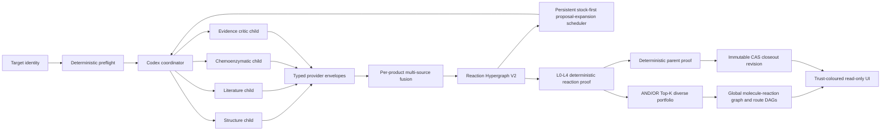

# AutoPlanner Architecture V2

Last update: 2026-07-10.

This document is the normative architecture for the active AutoPlanner
mainline. It explains how Codex-driven exploration, multi-source route fusion,
deterministic reaction proof, durable frontier execution, route selection, and
the global route view fit together. [MAINLINE.md](MAINLINE.md) remains the
operator-facing runbook and records concrete end-to-end results.

The central rule is simple: generation is broad, but authority is narrow.
Codex and other proposal providers may explore aggressively; only replayable,
content-bound deterministic checks may promote a complete parent route.

## Non-negotiable invariants

1. A Codex coordinator must directly spawn observed specialist child agents.
   Role-shaped prose from one process is not a multi-agent run.
2. Every provider returns a typed, content-hashed envelope and has no solved
   authority.
3. Fusion is scoped to each canonical product intermediate, not only to the
   root target and not to a run-wide evidence pool.
4. Evidence diversity is counted by trusted correlation group. Four Codex
   roles are one model support group, not four independent scientific sources.
5. A route is no stronger than its weakest reaction step and unresolved
   terminal frontier.
6. Queue exhaustion, child-target success, literature similarity, consensus
   score, and a plausible diagram are never substitutes for parent-route proof.
7. A replacement keeps the exact product identity, may introduce a different
   precursor set, and is valid only after the complete AND/OR route re-solves
   connectivity, stock, and reaction proof. A UI splice cannot alter truth.
8. Closeout truth is an immutable content-addressed revision. Fixed filenames
   are compatibility views, not sufficient provenance.
9. Missing proof is emitted as a machine-readable negative proof; it is never
   converted into a success by presentation logic.

## System map and authority flow



The arrows do not imply equal authority. The proposal, evidence, proof, and
publication planes have deliberately different permissions:

| Plane | May do | Must not do | Authority |
| --- | --- | --- | --- |
| Proposal | Suggest disconnections, conditions, enzymes, and alternatives | Claim reaction validity or solved status | Advisory |
| Evidence | Bind claims to source/document/page records and expose conflicts | Turn a citation string into proof | Advisory until validated |
| Proof | Replay structures, atom maps, connectivity, stock, precedent, and procurement | Trust producer booleans | Deterministic verifier |
| Publication | Freeze mutually consistent graph, proof, and view artifacts | Publish mixed revisions as current truth | Validated CAS manifest |

The loop through `S` and Codex persists proposal expansion only. It does not
enqueue reaction-proof or CAS-publication jobs. Reaction replay, proof-bank
construction, portfolio binding/solving, replacement replay, parent proof, and
closeout are downstream deterministic stages with their own artifacts and
authority checks.

## 1. Codex coordinator and direct child agents

The active orchestration entry is
`cascade_planner/orchestration/codex_retrosynthesis.py`. One coordinator is
responsible for calling `spawn_agent` for each required specialist role. The
default roles are:

- `target_structure_strategist`;
- `literature_route_scout`;
- `chemoenzymatic_route_specialist`;
- `route_evidence_critic`.

An accepted child report requires all of the following:

- an observed root-thread spawn event;
- an explicit role binding in the spawn contract;
- a matching terminal wait event;
- a completed child with a unique agent ID and role;
- exact `retrosynthesis_proposal_report.v1` JSON shape;
- matching case, role, and stereochemistry-preserving target identity;
- candidate-level `no_solved_claim=true` and
  `not_parent_route_proof=true`.

The trusted orchestrator assigns each accepted report's source channel. Child
text cannot impersonate literature, a different agent, or a deterministic
verifier. Oversized, malformed, duplicate, role-mismatched, or unobserved
reports are retained as rejected observations with stable reason codes.

The same direct-team contract applies recursively to unresolved molecule
frontiers. Depth, expansion count, batch size, tool calls, bytes, and time are
bounded. Recursion expands the proposal graph; it does not prove the route.
When the mainline fails, the case stops unresolved rather than silently handing
scientific ownership to a deterministic fallback planner.

## 2. Provider SPI

`cascade_planner/providers/` is the replaceability boundary. A provider exposes
a `provider_descriptor.v1` and implements one typed invocation contract. The
host-effective descriptor pins:

- provider ID, kind, and semantic version;
- accepted input and output schemas;
- trusted correlation group;
- capabilities and deterministic/network flags;
- optional cost estimate.

Every invocation returns `provider_result_envelope.v1` with provider identity,
declared output schema, correlation group, accepted/rejected status, reasons,
source/evidence references, payload, and a deterministic content hash. The
registry rejects undeclared schemas, duplicate provider IDs, identity or
version drift, bad hashes, and any envelope without `no_solved_claim=true`.
Correlation group, deterministic status, and privileged provider kind are host
policy, never third-party self-assertions. An unlisted third-party provider is
downgraded to a correlated, nondeterministic proposal provider; stock,
evidence, verifier, agent-backend, and artifact authority require an explicit
host trust record.

The SPI kinds are:

| Kind | Responsibility | Typical output |
| --- | --- | --- |
| `proposal` | Generate reaction candidates | Candidate envelopes |
| `evidence` | Acquire and bind evidence | Source/document/claim records |
| `stock` | Resolve a dated stock boundary | Catalog binding or supplier offers |
| `verifier` | Deterministically replay a claim | Reaction or route validation |
| `agent_backend` | Execute observed agent work | Runtime events and typed drafts |
| `artifact_store` | Persist immutable artifacts | Object and revision references |
| `renderer` | Project canonical records | Read-only JSON/HTML views |

Built-in adapters include the Codex retrosynthesis backend, deterministic
reaction-route verifier, snapshot stock provider, ChemEnzy proposal envelope,
and literature-evidence envelope. Each is registered through the host builtin
allowlist; the ChemEnzy and literature adapters require an injected runner and
remain advisory.

To replace a provider safely:

1. implement the relevant protocol;
2. declare compatible input/output schemas and a stable correlation group;
3. register it with `ProviderRegistry`;
4. pass contract, content-hash, replay, and failure-path tests;
5. compare output in shadow mode before changing selection policy.

Provider replacement never changes the final-proof predicate. A faster model,
another stock service, or a different renderer can improve coverage without
gaining solved authority.

## 3. Per-intermediate multi-source Reaction Hypergraph V2

The graph is a bipartite reaction hypergraph, not a linear list. Molecule nodes
are stereochemistry-preserving canonical identities. One reaction hyperedge
connects all required precursors to one product, so convergent chemistry keeps
its AND semantics.

Fusion proceeds by canonical product neighborhood:

1. adapt Codex, ChemEnzy, exact-literature, analogy, template, stock, and human
   records into typed candidates;
2. canonicalize the candidate product with isomeric SMILES;
3. place the candidate in that product's neighborhood bucket;
4. canonicalize and sort the complete precursor set;
5. fuse only candidates with the same product and precursor-set identity;
6. preserve source records, claims, conditions, conflicts, and rejections;
7. connect product neighborhoods through shared molecule identities.

This fixes the historical root-target fusion error: an exact row or legacy
provider proposal for intermediate `A` is fused with the recursive Codex
neighborhood for `A`; it is not rejected merely because `A` differs from the
campaign root.

The typed V2 records in `cascade_planner/routes/domain.py` are:

| Schema | Meaning |
| --- | --- |
| `molecule_identity.v2` | Canonical isomeric molecule identity |
| `evidence_claim.v2` | One source claim with explicit support group |
| `reaction_candidate_envelope.v2` | One source-bound reaction candidate |
| `reaction_hyperedge.v2` | Canonical product-to-precursor-set disconnection |
| `alternative_set.v2` | Competing hyperedges for the same product |
| `route_variant.v2` | One advisory selection through the graph |
| `route_neighborhood.v2` | All fused choices for one product |
| `route_hypergraph_overlay.v2` | Content-addressed overlay for a complete graph |

IDs derive only from canonical identity-defining values. Content hashes also
include evidence and display-relevant payload. Equivalent serialization order
therefore converges to one ID, while stereoisomers and different complete
precursor sets remain distinct.

V2 is currently emitted as `v2_overlay` on `route_consensus_graph.v1`, alongside
`route_neighborhoods`. The V1 graph remains a compatibility carrier; neither
V1 nor V2 consensus may claim stock closure, executability, or parent proof.

Cycles, unresolved frontiers, depth limits, conflicts, rejected records, and
alternative sets are first-class output. They must not be omitted to make a
route appear complete.

## 4. Evidence correlation groups

Source channels describe how a claim arrived. Correlation groups describe how
many independent supports it actually represents. Ranking and UI width use
the latter.

| Claim origin | Correlation treatment |
| --- | --- |
| Any Codex role in the campaign | `codex_model` |
| ChemEnzy computational output | `computational:chem_enzy` |
| Exact bound literature record | Source-derived literature group |
| Article and SI for one scholarly source | Same source identity; distinct document identities |
| Unattributed legacy/model record | Correlated with model hypotheses, not independent |
| Stock snapshot | `stock_snapshot`; a terminal boundary, not reaction evidence |
| Deterministic verifier | Verifier result, not an additional literature source |

A DOI mentioned by a Codex child remains a model claim. It becomes independent
literature support only after a trusted source-detail adapter binds the exact
chemistry to an actual document/page record. Multiple roles repeating the same
statement improve review coverage but do not create a source-diversity bonus.
DOI URLs, normalized DOI strings, PMID/PMC aliases, article/SI references, and
local copies joined by explicit provenance are collapsed to one scholarly
source identity. A generic `accepted=true` row with a DOI-shaped string is only
literature analogy and cannot manufacture independent support.

## 5. Reaction proof L0-L4

`cascade_planner/harness/reaction_step_verifier.py` emits
`reaction_step_proof.v1` and route-level `reaction_route_validation.v1`.
Levels are monotonic and computed, never accepted from candidate booleans.

| Level | Canonical name | Required claim | Meaning |
| --- | --- | --- | --- |
| L0 | `L0_materialized` | Valid product and all reactant structures | The edge is structurally stated, not validated |
| L1 | `L1_graph_and_stock_closed` | L0 plus route connectivity and terminal stock closure | The route graph closes, but reaction chemistry is not yet proven |
| L2-M | `L2_mapping_consistent` | Complete mapped reaction passes deterministic structural audit | Identity, unique maps, provenance, elements, component contribution, scaffold continuity, bounded edits, and stereochemistry pass; portfolio proof level is zero and this remains advisory |
| L2-R | `L2_reaction_validated` | A trusted deterministic transform is reapplied and its reaction centre matches | This may satisfy the portfolio edge floor; a producer label, mapping-only proof, or self-hashed payload cannot create it |
| L3 | `L3_precedent_supported` | Mapping consistency plus trusted out-of-band exact precedent binding | The reaction is eligible for current parent-route authority |
| L4 | `L4_procurement_ready` | L3 plus complete conditions and procurement binding | The step is operationally bound to conditions and materials |

The route-forest compatibility view spells L1 as
`L1_graph_stock_closed`; readers must map it to the canonical verifier level
above. No other level may be renamed or inferred from a colour.

L2 explicitly checks the materialized mapped reaction against the separately
declared product and complete reactant set. It requires complete and unique
atom maps, product-atom provenance from reactants, element preservation, a real
bond change, and a stereochemically matching product. It also rejects mapped
components that contribute nothing, atom-balanced fragment piles without a
continuous precursor scaffold, more than two net new rings, or more than eight
bond edits in one step. Self-reported validation or convergence booleans have
no authority; the validator recomputes every listed check from structures.
Mapping consistency alone cannot establish a meaningful transformation, so an
`L2_mapping_consistent` edge is explicitly mapped to portfolio proof level zero
and cannot enter the proof-eligible portfolio. `L2_reaction_validated` is a
separate named level reserved for trusted deterministic transform reapplication
and reaction-centre matching. The current verifier must not infer it from atom
mapping, candidate booleans, or a digest the candidate can recompute.

L3 requires a digest-bound registry entry whose authority is
`human_curator` or `deterministic_structure_parser`. The production registry is
empty by default. The populated registry in `tests/fixtures/` is test data and
must never be copied into production.
The verifier recomputes the current canonical product/reactant digest and
replays the materialized PDF/page evidence against the configured registry;
request-supplied precedent bindings cannot elevate a step. L4 additionally
requires complete conditions and digest-valid stock-provider envelopes that
cover every reactant.

Route proof uses weakest-link aggregation. Portfolio analysis can admit a
route only when every selected reaction has exact, replay-derived
`L2_reaction_validated` or stronger binding and every leaf has exact stock
binding. Under the current safe parent policy, `solved` still requires every
selected reaction to reach L3 or L4. A higher level on one step cannot
compensate for a lower level elsewhere. A stock terminal is a valid graph leaf;
it is not an L4 reaction.

`route_proof_bank.v1` prevents a multi-route verifier result from collapsing to
only its best route. Every accepted route becomes a content-bound entry carrying
the materialized route, route audit, reaction validation, exact stock-terminal
evidence, target, and verification policy. Each entry is replayed before use.
When several verifier results are supplied, the controller keeps them as a
multi-verifier bundle: banks and authorities remain separate, and only exact
product/reactant signatures are combined after replay. If a proof bank is
present but invalid, portfolio binding fails closed instead of falling back to
legacy best-route fields.

`parent_route_proof_attempt.v1` records missing clauses and open frontiers for
both positive and negative attempts. Final `solved` requires a valid
`stitched_parent_route_proof.v1`, exact target equivalence, graph and stock
closure, every reaction at least L3, no unexplained large atom jump, connected
child/literature segments when stitched, and analogy used only as rationale.

## 6. Persistent stock-first frontier scheduler

`cascade_planner/application/frontier_scheduler.py` owns durable frontier work.
Before any agent expansion is enqueued, the scheduler canonicalizes the
frontier and asks the stock provider for an immutable boundary. A matching
accepted stock snapshot closes the molecule as a terminal; otherwise a durable
job is created.

`frontier_job.v1` has the states `pending`, `leased`, `retry_wait`, `succeeded`,
`failed`, and `cancelled`. Its stable job ID and caller idempotency key prevent
duplicate semantic work. Leases carry owner, token, expiry, and heartbeat.
Expired leases recover into bounded exponential retry or terminal failure.
Queue snapshots are atomically replaced and content hashed.

Ready work is prioritized by:

```text
4 * proof_deficit
+ 3 * closure_probability
+ 2 * diversity_gain
- min(log1p(estimated_cost_units), 5)
```

Dependencies must succeed before a job can be claimed. `FrontierExecutor`
provides bounded asynchronous execution; durable lease state, rather than an
in-memory task list, is the recovery authority.

Campaign proposal-graph exhaustion is independent of queue occupancy. The
frontier scheduler persists `proposal_expansion` jobs: stock lookup happens
before expansion, and an accepted team contributes typed candidate hyperedges.
A successful job is deliberately proof level zero. Empty queue, depth, budget,
or retry exhaustion therefore reports proposal-expansion state only and never
means reaction proof, route closure, or `solved`.

Reaction-step replay, `route_proof_bank.v1` construction and entry replay,
exact portfolio binding, AND/OR solving, replacement validation, parent proof,
and CAS publication run downstream of the Codex campaign. They have
content-bound artifacts and explicit failure reasons, but they are not proof
job states in the same persistent frontier queue.

Commercial stock is represented by `stock_boundary.v1` and timestamped
`stock_offer.v1` records. Supplier, catalog number, canonical structure,
snapshot SHA-256, checked time, availability, purity, pack, price, region, and
lead time remain distinguishable. Benchmark stock, commercial availability,
in-house material, common commodity, and unavailable are separate boundary
types.
The SHA-256 is recomputed over canonical snapshot content, timestamps must be
timezone-qualified ISO-8601, and availability must be a real boolean. Only
snapshots or snapshot artifacts loaded when the provider is constructed are
trusted; an invoke request that invents or flips `available=true` cannot close
a stock boundary even if it hashes its own forged payload.

## 7. AND/OR closure and Top-K route portfolio

`cascade_planner/application/route_portfolio.py` solves the V2 overlay as an
AND/OR graph:

- OR: choose one eligible hyperedge for a product;
- AND: close every precursor of the chosen hyperedge;
- leaf: bind the molecule to explicit stock;
- edge gate: meet the configured portfolio proof threshold, normally trusted
  deterministic `L2_reaction_validated` or stronger.

`route_portfolio_bindings.v1` is a sibling of the immutable portfolio report,
not an unhashed field appended after report hashing. For each selected edge,
`exact_edge_proof_binding.v1` binds hyperedge ID, exact product and precursor
IDs, structure signature, named level, replay authority, and proof digests.
For each leaf, `exact_stock_binding.v1` binds molecule identity, catalog and
evidence hashes, lookup basis, and replay authority. The bindings object,
portfolio report, and every route item have independently recomputable hashes.
Mapping-only proof is recorded for diagnostics but receives portfolio proof
level zero. Parent-route authority remains stricter and currently requires
every selected edge to reach L3 or L4.

Cycles, depth limits, missing disconnections, missing stock bindings, and fixed
replacement mismatches remain unresolved. Only fully closed and
reaction-validated candidates enter the portfolio.

Every serialized portfolio item is audited independently: `complete=true`,
`reaction_validated=true`, selected hyperedges must resolve to the overlay,
each selected exact edge/stock binding must match and recompute, and every
schema-provided content SHA-256 must recompute exactly. Candidates are
ranked by route quality and then selected with maximal marginal
relevance so Top-K favors both quality and structural diversity. Shared
intermediates stay shared; output routes are DAG selections, not duplicated
linear strings. If fewer than K valid routes exist, the system returns the
honest smaller set and a reason. It never pads the portfolio with advisory
routes. Portfolio eligibility itself remains advisory: it does not create a
`stitched_parent_route_proof.v1`, `solved=true`, or executable authority.

Replacing one disconnection fixes that product's selected hyperedge and
re-solves the full AND/OR route. Exact product identity is preserved, but the
replacement is allowed to introduce a different precursor set; every new leaf
and reaction must close under the same stock and proof bindings.
`route_replacement_catalog.v1` retains both accepted and rejected candidates,
including reasons and the complete re-solved route for accepted rows. The route
forest projects that route as a complete `listed=false` replacement branch and
previews the branch as a whole. It never substitutes one reaction tile into the
old route. Rejected rows remain visible and disabled.

## 8. Immutable closeout revisions

`cascade_planner/runtime/artifact_revision.py` publishes route closeout data as
`closeout_revision_manifest.v1`. Compatibility files keep their historical
names, but the controller snapshots their exact bytes into:

```text
RUN_DIR/.autoplanner/closeout/
  objects/sha256/<prefix>/<digest>/<artifact-name>
  staging/<revision-digest>.json
  revisions/<revision-digest>.json
  latest.json
```

Publication is transactional at the pointer boundary:

1. hash producer-captured compatibility bytes;
2. reject any change between capture and commit;
3. write immutable CAS objects;
4. bind every artifact dependency by artifact ID and SHA-256;
5. write and validate a staging manifest;
6. write and validate the immutable committed manifest;
7. atomically replace `latest.json` only after all checks pass.

The dependency chain includes consensus, consensus graph, a deterministic
parent-proof snapshot, a validated final-verdict core, the explored route
forest, and rendered HTML where present. The consensus graph carries the
separately hashed portfolio, exact bindings, and replacement catalog; the proof
snapshot retains its deterministic verifier
and proof-bank authority when present. CAS publication preserves and cross-binds
those downstream results but does not create reaction proof merely by hashing
an advisory proposal. The verdict core deliberately omits
post-publication path and digest-reference fields, so the scientific decision
is content-addressable without a circular self-reference. The forest depends
on both proof and verdict core, preventing a route view from being paired with
a different decision. Validation rejects missing objects, content drift, CAS
corruption, stale dependency hashes, cycles, path escape, schema mismatch, or
a pointer to an uncommitted manifest. Republishing identical bytes is
idempotent; a failed revision leaves the previous latest pointer untouched.

Readers validate `closeout_latest_pointer.v1` before trusting a route
projection. If a new run has an invalid closeout, the fixed-name view is
quarantined. Old runs without a pointer remain readable in explicit
compatibility mode but do not gain new proof retrospectively.

## 9. Global DAG and multidimensional trust UI

The route forest emits `molecule_reaction_dependency_graph.v1`, a global
bipartite graph with explicit molecule-to-reaction and reaction-to-molecule
edges. A closed selected route is a DAG; the complete explored overlay may
still contain proposal cycles, which are surfaced rather than discarded.
Layout is derived only from explicit dependencies; adjacency in an array never
creates chemistry.

A molecule without canonical isomeric SMILES (or another exact structure
identity such as an InChIKey) is never merged repository-wide by its display
name. Its node ID is scoped by branch, source, and evidence-row namespace.
Thus two unrelated figures may both contain “Intermediate 3” without creating
a shared molecule node or a false producer/consumer dependency.

Every selected Top-K portfolio route is projected as its own
`proof_eligible_portfolio_route` branch and branch view. Reaction nodes are
branch-specific; exact canonical molecule nodes, including shared
intermediates, remain shared. Each branch records exact stock leaves, target
alias, weakest proof, correlated support groups, diversity score, and solver or
projection truncation. The architecture audit checks every selected route as
its own DAG. Cycles in a selected route fail acceptance; cycles in the complete
explored overlay are reported as exploration diagnostics and are allowed.

Each reaction carries `route_trust_vector.v1` dimensions:

- identity;
- connectivity;
- source independence;
- stock closure;
- conditions;
- forward feasibility;
- proof tier and bottleneck score.

The dimensions are not collapsed into authority. A high mean score cannot
upgrade a missing identity, stock, or reaction-proof dimension. Branch trust
uses weakest-link aggregation.

Visual encoding is deterministic:

| Proof tier | Colour | Pattern meaning |
| --- | --- | --- |
| Rejected L0 | rose | Crosshatched |
| Advisory/materialized L0 | orange | Dotted |
| Graph-and-stock L1 | amber | Dashed |
| Mapping-consistent L2 (advisory) | blue-grey | Broken stripe |
| Deterministically replayed `L2_reaction_validated` | blue | Striped; never upgraded from mapping-only L2 |
| Precedent-supported L3 | teal | Solid |
| Procurement-ready L4 | green | Double/strong |

Colour means proof tier, line width means independent support-group count,
opacity means mean trust dimension, and dash/texture exposes uncertainty. The
JSON legend is authoritative; consumers should not hard-code a semantic from
colour alone.

The default projection lists every available branch and candidate. If an
explicit caller limit is used, `route_forest_projection_coverage.v1` records
available, rendered, omitted, limit, and truncated counts per category, and the
UI shows a prominent truncation warning.

Safe alternatives are backend full-route validation records. Invalid candidates
remain visible with rejection reasons but are not selectable. An accepted row
references a complete revalidated replacement branch; selecting it switches the
read-only view to that entire DAG. Pairwise input/output comparison is retained
only as diagnostics, never as replacement authority. A preview never mutates
the blackboard, graph, proof, or closeout revision and never upgrades a
portfolio branch to parent-solved status.

## 10. Schema and run migration

Migration uses a strangler pattern: preserve existing producers and consumers,
add typed overlays and strict readers, then switch authority only after replay
comparison.

| Existing contract | V2 relationship | Reader rule |
| --- | --- | --- |
| `route_consensus.v1` | One-product compatibility consensus | Readable, advisory |
| `route_consensus_graph.v1` | Compatibility graph carrying `v2_overlay` | Prefer validated V2 overlay for identity/portfolio |
| `route_proof_bank.v1` and verifier bundles | All accepted materialized verifier routes with separate replay authority | Replay every selected bank entry; never flatten producer booleans |
| `route_portfolio_bindings.v1` | Exact edge and stock bindings stored beside the hashed portfolio | Require exact identities, trusted authority, and recomputable hashes |
| `route_replacement_catalog.v1` | Accepted and rejected backend full-route re-solves | Preview only a complete accepted branch; never splice one step |
| Legacy blackboard proposal records | Adapted into per-product candidate buckets | Never trust legacy solved/validated flags |
| `explored_route_forest.v1` | Read-only global dependency projection | Trust only with valid closeout on new runs |
| Fixed artifact filenames | Compatibility paths into a committed revision | Validate CAS digest/dependencies first |
| Old route verifier reports | Structural compatibility evidence | Parent solved now requires replayed L3 trusted-precedent reaction proof |

Rollout phases are:

1. **Dual write:** emit existing V1 artifacts plus V2 overlay, provider
   envelopes, proof records, and CAS manifest.
2. **Shadow replay:** compare molecule IDs, hyperedge IDs, source groups,
   closure, portfolio, and verdict without changing V1 consumers.
3. **V2 read preference:** portfolio, global DAG, and closeout readers prefer a
   valid V2/CAS record and fail closed on drift.
4. **Consumer migration:** move integrations from raw blackboard dictionaries
   to the Provider SPI and typed domains.
5. **V1 retirement:** remove a V1 surface only after stored-run replay and all
   registered consumers no longer require it.

Migration is intentionally non-promotional. An old structurally closed route
without complete mapped reactions remains L1 at best. Old Codex role counts are
re-correlated to `codex_model`. Missing CAS manifests mean compatibility mode,
not fabricated immutable provenance.

## 11. Failure and recovery semantics

| Failure | Required result |
| --- | --- |
| Child spawn/report contract fails | Reject team or role; preserve observation and reason |
| Provider envelope/schema/hash fails | Reject invocation; do not mutate blackboard |
| No source-independent support | Keep model hypothesis; no diversity promotion |
| Invalid/missing atom map | L0/L1 only; parent reaction proof fails |
| Mapping-only proof is relabelled or self-rehashed as reaction-validated | Reject exact edge binding; portfolio route is not projected |
| Proof-bank entry or exact edge/stock binding drifts | Fail closed; do not fall back to an unbound best route |
| One convergent precursor is unresolved | Entire AND branch remains unresolved |
| Agent worker crashes | Lease expiry, durable retry/backoff, then explicit failure |
| Queue is empty but proof frontier remains | `complete=false` |
| Route enumeration hits bound | Mark portfolio truncated; do not assert exhaustive Top-K |
| Replacement full-route replay cannot close new precursors | Visible catalog rejection; not selectable |
| Artifact or dependency digest drifts | Do not activate revision; quarantine new projection |
| Child route closes but parent bridge does not | `child_solved_parent_unresolved` |

## 12. Paclitaxel acceptance contract

Paclitaxel is the main natural-product acceptance case because it combines a
large stereochemically dense taxane core, a convergent side-chain coupling,
literature extraction, stock boundaries, and multiple plausible alternatives.
Its exact identity is the isomeric structure corresponding to InChIKey
`RCINICONZNJXQF-MZXODVADSA-N`; names or compound numbers alone are not target
identity.

The known semisynthesis neighborhood is a benchmark to recover and verify, not
a hard-coded rescue table:

```text
side-chain stock -> 6 -> 7/8 -> 10 -> acid 11
taxane-core source -> 7-triethylsilylbaccatin III (5)
acid 11 + taxane 5 -> taxane ester 12 -> paclitaxel
```

Every numbered intermediate must be bound to an exact structure before it can
participate in proof. The labels `5`, `6`, `10`, `11`, or `12` are not chemical
identities and may not trigger fuzzy target shortcuts.

The acceptance gates are:

| Area | Passing criterion |
| --- | --- |
| Identity | Exact canonical stereochemical paclitaxel target; no fuzzy alias shortcut |
| Agents | Required coordinator spawns and accepted typed child observations are present |
| Fusion | Every explored intermediate has its own neighborhood; exact and computational/model sources fuse only at that product |
| Correlation | Codex roles count once; article/SI and repeated citations are not double-counted |
| Connectivity | At least one complete stock-to-paclitaxel AND/OR route; all convergent reactants close |
| Reaction proof | Every selected edge reaches L3 trusted-precedent support (or L4); mapping-only L2 remains advisory |
| Literature | Exact structures/reactions bind to real source, document, page/image, and trusted registry digest |
| Stock | Every terminal has an exact catalog/supplier or explicit in-house/common boundary with snapshot binding |
| Alternatives | Return all valid routes up to configured K, diversity-selected; never pad with advisory options |
| Replacement | Exact product is retained; alternate side-chain/core/coupling precursors pass backend full-route connectivity, stock, and proof replay |
| UI | Complete global molecule-reaction graph and route DAGs, trust vectors, legend, conflicts, rejections, and no hidden truncation |
| Closeout | Consensus, graph/portfolio, parent-proof snapshot, final-verdict core, forest, and HTML belong to one validated committed CAS revision |
| Verdict | `solved=true` only when deterministic parent proof replays successfully; otherwise retain exact missing clauses |

Two different completion statements must remain separate:

- **Scientific route completion:** at least one exact-target route is fully
  connected, terminal-closed, and L3-or-better at every reaction under the
  current safe policy.
- **Exploration coverage:** all generated alternatives, conflicts, rejected
  edges, and limits are represented. This can be complete even when no
  scientific route is solved.

If only the side-chain route to compound 6 or 10 closes, if compound 5 lacks an
upstream boundary, if the 11 + 5 -> 12 -> paclitaxel bridge is not exact and
mapped, or if any co-reactant frontier is missing, the honest status is
`child_solved_parent_unresolved` or `unresolved`. A polished full-path drawing
does not change that result.

The 2026-07-10 replay documented in [MAINLINE.md](MAINLINE.md#paclitaxel-end-to-end-run-2026-07-10)
is the negative regression baseline: it improved exploration but did not pass
this acceptance contract. A fresh V2 replay must record its configuration,
source set, provider versions, support groups, frontier completeness, proof
levels, portfolio, projection coverage, CAS revision, and final deterministic
verdict together.

`scripts/audit_architecture_v2.py` deliberately reports three different
surfaces: a file-presence `capability_surface`, materialized executable-contract
evidence, and run-specific chemistry acceptance. A 100% capability surface is
not an engineering-completion claim. For committed runs, the audit reads the
proof, verdict, graph, and forest from the validated CAS revision first;
fixed-name blackboard/verdict/forest drift is reported separately and never
overrides the CAS decision. Portfolio acceptance rechecks every route's
complete/reaction-validated flags, schema-provided content hash, selected-edge
binding, and DAG acyclicity.

## 13. Verification surface

The minimum V2 regression surface is:

```powershell
$env:AUTOPLANNER_TRUSTED_LITERATURE_STEP_REGISTRY = `
  'tests/fixtures/trusted_literature_step_registry.json'

python -m pytest -q `
  tests/test_provider_registry.py `
  tests/test_builtin_providers.py `
  tests/test_stock_provider.py `
  tests/test_route_consensus.py `
  tests/test_route_source_adapters.py `
  tests/test_route_consensus_graph.py `
  tests/test_reaction_step_verifier.py `
  tests/test_route_verifier.py `
  tests/test_parent_route_proof.py `
  tests/test_frontier_scheduler.py `
  tests/test_route_portfolio.py `
  tests/test_artifact_revision.py `
  tests/test_route_forest.py `
  tests/test_web_app.py

Remove-Item Env:AUTOPLANNER_TRUSTED_LITERATURE_STEP_REGISTRY
```

The fixture registry is test-only. Production acceptance must use an
out-of-band curated registry and real stock/source snapshots. Finish with the
full suite and `git diff --check`; live retrieval remains a separate opt-in
smoke test because external availability is not deterministic.

## Related documents

- [AutoPlanner mainline and runbook](MAINLINE.md)
- [Documentation index](README.md)
- [Agentic blackboard mainline](AGENTIC_BLACKBOARD_MAINLINE_2026-06-24.md)
- [Repository surface and hygiene](REPOSITORY_HYGIENE.md)
