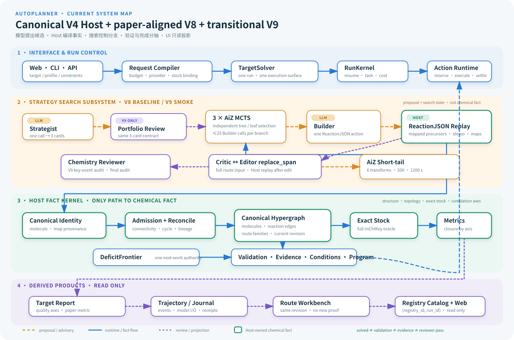

# AutoPlanner 架构总览

更新：2026-08-27

状态：本文是当前架构的总入口。它只汇总已经存在的运行路径和明确标注的过渡/目标能力，
不替代各组件合同，也不从设计文档反推实现完成。



## 1. 一句话架构

AutoPlanner 是一个由 **Canonical V4 Host** 承载的 anytime 逆合成系统：模型和搜索器只提出
候选，Host 负责编译真实结构、维护运行与预算、发布 canonical reaction graph、查询精确库存，
再把结构闭合、化学验证、证据、条件和审查意见作为互不替代的轴输出。

三个经常混淆的名字实际是嵌套关系：

- **Canonical V4**：当前唯一生产宿主、事实平面和统一 Action loop；
- **paper-aligned V8**：V4 内的一套冻结 Strategy → Builder/AiZ → Critic/Editor 搜索 profile；
- **`v9_smoke`**：沿用同一 Host kernel，在 V8 热路径上增加一次 Strategy review 和稀疏关键事件
  audit 的过渡研究 profile；不是第二个运行平台；
- **GRIA / target V9**：未来 Program/事务式 Path Repair 目标，不是当前完成声明。

## 2. 一次请求怎样穿过系统

1. Web、CLI 或 API 只接收目标和操作参数；`solve_target_request()` 将其编译成 target、约束、
   profile、预算、模型/provider 与冻结 stock binding。
2. `solve_target()` 创建唯一 `RunKernel` 和唯一 `CampaignActionRuntime`，恢复、取消、任务、
   execution receipt 与资源消耗都归该 run 管理。
3. paper/V9 profile 进入 `SequentialStrategyDirectorRunner`：一次 Strategy 调用产生三张卡；每张卡
   驱动一个独立 AiZ MCTS 分支。
4. AiZ 选择当前 leaf；Builder 只返回一个当前 ReactionJSON 动作。它可以在内部做路线级推演，
   但不能输出 precursor 事实、库存、停止或 solved。
5. `RouteJSONCompiler` 在当前 mapped boundary 上回放动作，派生真实 mapped/unmapped precursors、
   stereo 和 provenance。失败留在当前 leaf；成功动作才进入搜索树。
6. 完整战略段经过 Critic/Editor 审查；Editor 当前输出 dependency-closed `replace_span`，Host 合并后
   全量回放。合格开放叶可交给绑定的 AiZ short-tail；provider solution 仍需目标根拼接与 Host 复核。
7. 所有可接纳结果通过一个 canonical ingestion 进入同一 AND/OR hypergraph。`DeficitFrontier`
   从当前 revision 派生下一项 materialize、validate、stock、evidence、condition、Program 或 replan
   Action；不存在第二个 scheduler 或 Blackboard 权威。
8. proof portfolio、paper-equivalent metric、target report、Workbench 和 live UI 都从同一事实链
   派生。展示与模型日志可以解释运行，但不能创造结构、proof、库存或 solved。
9. Web/CLI 主运行和隔离 panel 可拥有不同 `run_index.sqlite3`。需要展示的 registry 由 launcher
   显式注册到 `RunRegistryCatalog`；网站按 `(registry_id, run_id)` 联合身份分页聚合，再回到所属
   `RunIndex`/`RunKernel` 读取真实状态。Catalog 不扫描 `results/**`，也不复制 run status。

## 3. 分层组件图

| 层 | 责任 | 主要实现 | 是否拥有事实 |
| --- | --- | --- | --- |
| 接口层 | Web/CLI/API、任务创建、取消、只读查询 | `web/v4_*`、`interfaces/target_cli.py` | 否 |
| 请求编译层 | 解析 profile、预算、provider、stock 与约束 | `interfaces/target_solve_request.py`、`target_runtime_dependencies.py` | 只拥有已解析运行输入 |
| 运行控制层 | run、恢复、预算、Action reservation/settlement、停止 | `application/run_kernel.py`、`orchestration/unified_campaign_runtime.py` | 是，运行事实 |
| 策略搜索层 | Strategy portfolio、三分支 MCTS、Builder policy、稀疏审查 | `orchestration/sequential_strategy_director.py`、AiZ sidecars | 搜索状态；不拥有化学事实 |
| Host 编译层 | ReactionJSON 规范化、回放、maps、stereo、provenance、拓扑 | `reactionjson_primitives.py`、`reactionjson_replay.py`、`routejson_compiler.py` | 是，结构事实 |
| Canonical 科学层 | identity、reaction edges、route families、admission、reconciliation | `canonical_identity.py`、`canonical_hypergraph.py`、`routes/*` | 是，canonical 化学事实 |
| 决策层 | deficit frontier、proof portfolio、stock closure、各轴质量状态 | `deficit_frontier.py`、`proof_portfolio.py`、`paper_equivalent_metric.py` | 是，派生决策事实 |
| 验证与创新层 | reaction validation、证据、条件、Program、实验 Claim | workers/connectors、Program/Claim stores | 只在各自验证边界拥有观察；不能越权闭合路线 |
| 投影层 | registry discovery、分页任务列表、report、trajectory、Workbench、live model I/O | `runtime/run_registry_catalog.py`、`web/v4_run_catalog.py`、`target_delivery.py`、`target_job_projection.py`、`application/route_workbench*` | 否，只读派生；每个 registry 仍拥有自己的运行状态 |

## 4. Proposal 到事实的唯一通路

```text
Strategy / Builder / Critic / Editor / provider output
                         │
                         │ proposal or advisory
                         ▼
schema + typed runtime checks
                         │
                         ▼
Host graph replay / identity / topology / provenance
                         │
                         ▼
canonical admission + one hypergraph revision
                         │
             ┌───────────┼───────────┐
             ▼           ▼           ▼
       exact stock   validation   evidence/conditions
             │           │           │
             └───────────┼───────────┘
                         ▼
       portfolio / metrics / reports / UI projections
```

任何模型字段、provider 的 `solved=true`、合法 JSON、Critic pass 或 UI 状态都不能跳过这条通路。

## 5. 模型组件的最小职责

| 组件 | 看到什么 | 只输出什么 | 明确不负责 |
| --- | --- | --- | --- |
| Strategist | target | 三张紧凑 StrategyCard | 前体、完整路线、库存、停止、solved |
| Strategy review（V9） | target + 三张卡 | 同一三卡合同的精简修订 | admission、第二套评分/ledger、循环审查 |
| Builder | Strategy、当前 mapped leaf、已回放路径、split context、最近 typed failure | 一个 ReactionJSON expansion + 简洁条件/意图 metadata | precursor SMILES、map 分配、handoff/fail/stop、Strategy 认证 |
| Chemistry Reviewer / Critic | Strategy + Host-replayed 路径 + 触发原因 | pass/uncertain/reject 与最早 blocker | 改结构、库存、solved、实验可行性证明 |
| Editor（当前） | 完整 RouteJSON + Critic annotations + 真实 mapped frontier | dependency-closed `replace_span` | 直接发布 precursor、降低 replay/admission 标准 |
| Host | 所有结构化候选、运行输入和当前事实 | replay、canonical revision、stock/closure 与 typed diagnostics | 用命名反应或模型信心替代化学验证 |

## 6. 四个当前权威

系统只允许四类运行决定拥有独立权威：

1. **RunKernel**：run、task、attempt、恢复、取消、资源和 execution receipt；
2. **Canonical hypergraph**：分子 identity、mapped provenance、reaction edge、路线拓扑；
3. **DeficitFrontier + CampaignActionRuntime**：当前还应做什么，以及下一项 Action；
4. **Proof/stock/quality compilers**：在当前 revision 上计算路线闭合、最弱边/叶、库存和产品状态。

模型日志、Run Registry Catalog、Web job projection、trajectory、review bundle、Workbench、历史 baseline 和 GRIA shadow store
都是观察、历史或迁移表面，不能成为第五个事实权威。

隔离运行的展示通路固定为：

```text
panel launcher / CLI --publish-registry
                 │ explicit location binding
                 ▼
        Run Registry Catalog
                 │ (registry_id, run_id)
                 ▼
      owning RunIndex + RunKernel
                 │ status / model I/O / artifacts
                 ▼
        paginated Web projection
```

## 7. 完成状态必须分轴

| 轴 | 回答的问题 | 权威 |
| --- | --- | --- |
| structural | RouteJSON 是否可回放且目标根连通？ | Host compiler + canonical graph |
| stock | 所有 terminal leaves 是否命中绑定库存？ | exact stock oracle + Host stitching |
| paper-equivalent | 是否满足 SynthEx 的目标根库存闭合口径？ | `paper_equivalent_metric` |
| reaction validation | 每条反应是否有独立机理/映射/来源验证？ | validation workers + canonical proof |
| evidence/conditions | 来源和操作条件是否闭合？ | evidence/procedure stores |
| reviewer verdict | 当前模型审查是否发现 blocker？ | Critic diagnostic，独立保存 |
| configured acceptance | 是否达到用户声明的产品质量合同？ | acceptance/quality projection |

`paper_equivalent_solved=true` 不等于 reaction-validated、evidence-closed、process-ready 或实验可行。

## 8. Profile 与架构边界

| Profile/架构 | 当前定位 | 与宿主关系 |
| --- | --- | --- |
| `standard` / `proof` | 通用 anytime campaign | 直接使用 V4 Host、Action loop 与多类 worker |
| `paper_synthex` | 历史兼容的正式论文 profile 名称 | V8 合同；三策略、每分支最多 25 policy calls、六轮 Critic/Editor |
| `paper_matched_reach` | 隔离的论文 reach/缩短 smoke profile | 与 V8 同骨架，可显式降低 Builder call ceiling 做 canary |
| `v9_smoke` | 过渡研究实现 | 同一 V4/V8 runtime，增加一次 Strategy review、关键事件 audit 和 final audit |
| target V9 | 设计目标 | 待实现搜索异常 audit、ReactionWitness、事务式 Path Repair |
| GRIA | Program-first 长期目标 | 当前只有 shadow projection/store，尚未接管生产路线语义 |

## 9. 当前主要架构债

- `target_solver.py` 与 `sequential_strategy_director.py` 仍承载过多 prompt、状态机、兼容投影和搜索
  适配逻辑；下一步应按现有权威边界拆包，而不是增加新的 gate。
- `v9_smoke` 的跨步修复仍使用 V8 full-route Editor 状态机；事务式 Path Repair 尚未落地。
- 论文 Analyst 尚未实现；现有 Critic、scoring 或 UI 摘要不能冒充 Analyst。
- 三分子 smoke 已证明 materialization 与 paper-equivalent closure，但 reaction-validated route 仍为 0；
  化学质量是当前首要科学缺口，不应再用结构 gate 数量代替。
- Program/实验能力仍是 shadow/read-only 或独立观察权威，尚未成为 canonical route 的一等
  `program_ids[]` 语义。

## 10. 修改架构时的五条规则

1. 每个新字段先声明唯一 writer、reader、authority 与生命周期；
2. LLM 输出默认是 proposal，只有 Host replay/admission 能升级结构事实；
3. 新审查只有在保护不同不变量时才可阻断，否则只能作为 diagnostic；
4. runtime、canonical graph、frontier、completion 各保留一个 owner，投影不得反向控制执行；
5. V8 复现、V9 研究和 GRIA 目标分别标注，不能用同一个“已实现”覆盖三种状态。

## 11. 进一步阅读

- 当前实现状态与迁移门：[`CURRENT_ARCHITECTURE_STATUS.md`](CURRENT_ARCHITECTURE_STATUS.md)
- V8/SynthEx 组件合同：[`SYNTHEX_COMPONENT_CONTRACT.md`](SYNTHEX_COMPONENT_CONTRACT.md)
- V9 当前状态与目标设计：[`V9_CAUSAL_TRANSACTIONAL_RETROSYNTHESIS.md`](V9_CAUSAL_TRANSACTIONAL_RETROSYNTHESIS.md)
- 当前统一 Action 主线：[`../MAINLINE.md`](../MAINLINE.md)
- V8 冻结证据：[`archive/paper-aligned-v8-20260826/BASELINE.md`](archive/paper-aligned-v8-20260826/BASELINE.md)
