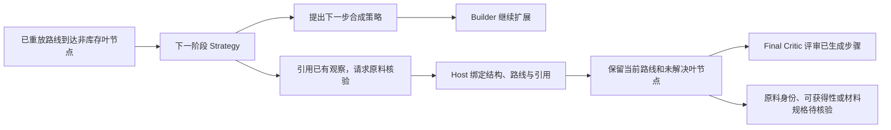

# 有限查询与 Critic 的证据边界

2026-09-09。适用于 `self_correcting_sequential`。冻结的 `paper_synthex` 和 `paper_matched_reach` 不启用此能力；外部信息条件不同的运行不能直接声称是同输入的消融比较。

**真实运行验证补充：** 2026-09-09 下午重跑中，Host 查询模块正常记账，但两个模型调用在 `web_search="disabled"` 下仍收到原生搜索事件，绕过了本模块的额度。两次输出被现有工具白名单拒绝，助手随后停止本轮。离线 CLI 请求检查确认禁用配置移除了搜索工具，但真实服务响应的不一致尚未定位解决。因此，下述硬上限目前只对 Host 查询通道成立，不能宣称所有真实搜索都已受控。详见 [本轮记录](../../results/discussion/macrocyclic-carbohydrate-bounded-evidence-astra25-20260909-142317/RESULTS.md)。

**执行层止损修复：** worker 现在实时读取 CLI JSONL，工具白名单及调用次数使用同一个任务规则。原生搜索在 `item.started` 时检查，其他工具在完成事件检查，以保留“命令尚未执行就被沙箱拒绝、之后正常完成”的合法恢复。首次观察到越权或超额后停止当前 worker，原始事件保留在现有日志，`tool_policy_stop` 记录触发工具和原因。该行为属于运行故障，复用现有 `provider_error` 暂停/恢复机制，不当作化学拒绝触发 Editor，也不自动重试。中断且没有已报告 token 时仍保留用量预留。

这属于收到事件后的止损，不能撤销服务端已经启动的搜索，也不能承诺并发中的工具尚未执行。没有放宽白名单、增加新的化学关卡或重置查询额度；同输入的已完成任务继续可复用。离线验证包含真实 worker 子进程正反例，以及 Director 保留已完成任务、仅恢复缺失任务的测试。原生工具暴露的上游根因仍待验证。

## 已实现的操作

模型通过现有 chemistry MCP 的 `query_planning_evidence` 请求 Host 执行只读查询。Strategy、Builder、Editor 和 Critic 共用同一个运行级预算与缓存，没有增加研究代理、第二套路线状态或新的化学否决器。

| 操作 | 默认整轮上限 | 返回内容及边界 |
|---|---:|---|
| `stock(smiles)` | 24 个不同结构 | 绑定的冻结库存，保留指定立体信息的精确匹配；不是供应商实时库存 |
| `compound(query, smiles?)` | 4 次 | PubChem 名称解析；提供参考 SMILES 时区分精确匹配、仅连接关系一致、结构不同 |
| `search(query)` | 8 次，每次最多 3 条 | Europe PMC 标题、DOI、摘要和可读取来源标识；摘要最多 1,200 字符 |
| `read(source_id)` | 4 篇 | 只读取本轮检索已返回的 PMC 正文，验证 DOI 一致；最多 12,000 字符，优先包含反应/制备的正文段落，保留原段落编号 |
| `list()` | 不占新查询额度 | 已发现来源的简表及最近 8 条库存/名称观察；详情可用相同查询读取缓存 |

每个模型任务最多处理 6 次查询请求，包括缓存和非法请求。额度在 provider 调用前持久化预留，三个分支并发也不能超发。失败消耗额度且缓存失败结果；进程中断后，未完成的请求保持 `interrupted`，不会通过恢复自动重试。达到限制后不再调用 provider；模型仍应完成当前结构化响应。已有模型 token/超时预算继续生效。

只允许固定的公共数据库入口；没有任意 URL 打开、自动换 provider 重试、自动下载 SI 或图片。HTTP 使用连接/读取超时、流式 4 MB 上限且不跟随重定向。查询传输是任务期间存在的本机能力，复用父进程的库存回调；模型的普通命令网络仍关闭。缓存不跨独立实验共享。

图转 SMILES 未接入这个规划工具。当前网页配置不自动图转 SMILES；其他流程原有的视觉证据能力仍由显式 `max_visual_invocations` 控制，默认 0，不因检索命中而自动开启。

## 化学判断保持原有归属

- `not_in_bound_stock` 仅表示该库存未命中；缺少库存回调或调用失败返回 `unavailable`，不能解释成化合物买不到。
- 名称结果不能补齐用户没有指定的立体构型，也不能直接替换目标。没有提供参考结构时明确返回 `not_compared`。
- 检索摘要与正文摘录均为发现线索，不是已验证的反应证据。来源内容作为不可信数据处理，不能成为对模型的指令。
- 查询工具不能修改路线、关闭叶节点、写入反应证明或提升 solved 状态。Host 原有的库存与结构提交流程继续负责这些动作。
- Critic 增加对起始原料边界、保护/脱保护负担、重复准备、汇聚路线与有依据的生物转化的检查。具体的更直接方案及未解决要求写入已有的 rationale/risk 字段；缺文献、路线长或存在替代路线本身均不能导致 `reject`。
- 原有的条件、底物、区域/立体选择性和序列矛盾仍适用。新增检查是提示层改进，尚未通过独立化学质量对照证明有效性。

## 配置、日志与恢复

### Strategy 可以选择先核实起始原料

增强顺序流程的上游 Strategy 交接点现在有两个动作：继续提出化学 Strategy，或提出 `material_boundary` 原料核验请求。初始三策略协议和冻结 paper 配置保持原样；新动作仅在有限查询启用、进入真实上游叶节点时开放。

请求包含原料名称/类型、已返回的 `query_key` 或 `source_id`、理由和未解决要求。Host 校验引用确实来自本轮已保存的成功观察，再把请求绑定到精确的 mapped 叶节点和已重放路线。模型不能通过名称结果替换结构，也不能自行宣布库存闭合。失败查询、零命中或库存未命中本身不能支撑该请求；检索命中只是核验线索，并未升级为反应证据。

- 搜索树收到的是停止当前分支继续展开的请求，不是将分子设成 stock。其他分支继续独立运行。
- 使用既有 Strategy 调用预算，不增加代理或专门的模型循环。最终 Critic 正常评审已生成步骤，同时看到待核验的原料边界；采购/文献缺失本身不能成为化学拒绝理由。
- Host 保留该请求发生时的确切路线，避免树停止后投影到其他分支而丢失短路线。
- `material_boundary_review` 随路线族持久化。全局调度不再因为同一叶节点的库存未命中而立即唤起该路线的 Builder；共用同一结构的其他路线仍可继续。原料仍保留未解决缺口，可信库存命中后走原有闭合逻辑；显式更新为空可清除已被替代的核验请求。
- `model-io.jsonl` 新增 Host 事件 `material_boundary_review_requested`，保存引用、精确前缀和待核验事项。网页和重放显示“起始原料待核验”，不会用模型的空 Strategy 覆盖初始策略。路线修订后，已不对应当前叶节点的请求不会继续展示为有效边界。

库存闭合、可采购和化学评审原本已在验收层分开；本次补的是规划动作与调度衔接。新状态不增加 stock-closed 路线计数，也不意味着整条路线已经可执行。它让系统能保留有意义的候选路线，把下一项工作从继续编写反应转为原料核验。

目前仍未接通供应商实时库存；已有的可信库存快照入口可用于后续落地采购观察。聚合物、混合物和生物材料可以提出核验请求，但仍必须保留当前精确叶节点并标记材料规格缺口，不能用有限糖链冒充淀粉。链环平衡、互变异构等合法转换尚未自动判定；结构不同仍标记为待核实，不能凭分子式合并身份。

实现集中在 `application/material_boundary.py`；查询日志仍是引用观察的唯一来源。真实 AiZ 子进程测试已验证保留前缀、停止后续 Builder、仍执行最终 Critic，以及库存不闭合；另验证了跨路线调度和网页重放。针对原糖类交接点的一次 Astra medium 小验证，模型主动选择了原料核验并通过 Host 绑定，未执行新的外部查询。该验证复用已有观察，不是独立的质量对照实验；详见本轮记录的原料边界补充。

API 参数：`enable_planning_evidence`（默认 true）、`planning_stock_query_limit`（24）、`planning_compound_query_limit`（4）、`planning_literature_search_limit`（8）、`planning_literature_read_limit`（4）、`planning_queries_per_worker`（6）。每类整轮上限接受 0–128；每任务 1–16。只有增强的顺序运行使用这些参数，冻结 paper 配置强制关闭。

新网页运行会提交上述默认值，并显示主要额度。要做无检索对照，显式提交 `enable_planning_evidence=false`。旧运行的成功 IO 不会被改写成新能力的结果。

2026-09-15 补充：如需保留本地库存查询，仅关闭外部信息查询，使用已有配置将 `planning_compound_query_limit`、`planning_literature_search_limit`、`planning_literature_read_limit` 均设为 0。正式 CLI 对应 `--planning-compound-query-limit 0 --planning-literature-search-limit 0 --planning-literature-read-limit 0`，并使用 `--no-web-search` 禁用原生搜索。单独 `--no-web-search` 不会关闭 MCP 中的 PubChem/Europe PMC 查询。

可用操作直接从现有额度派生；任务提示、worker 工具说明和 MCP 参数枚举同步仅保留 `stock`、`list`，本地 `inspect_mapped_smiles` 不受影响。MCP 在请求 Host 前拒绝已禁用的操作，Host 的零额度仍阻止外部 provider 调用。没有增加化学输出字段或独立配置状态。网页全局默认值不变；关闭整个 `enable_planning_evidence` 也会移除模型主动库存查询工具，但不关闭 Host 自动库存匹配。

本地验证覆盖实际 stdio MCP 子进程：库存和 RDKit 正常、三个外部操作不可调用、直接 Host 请求不触发 provider，以及 CLI 参数确实传入有效运行配置。此次验证不调用模型；原生服务端搜索暴露的历史限制仍按上文记录。

运行目录中的 `.autoplanner/director-workspace/planning-evidence.jsonl` 同时保存查询参数、task ID、执行前预留、缓存命中和返回结果。`model-io.jsonl` 的每次输出包含 `planning_evidence` 累计额度摘要，便于和原有 token 统计关联；查询次数不是 token 数。计数是运行累计值，并发时不应拿相邻摘要之差当作某个 worker 的独占消耗。

恢复使用原查询日志，不重置额度。最终 Critic 只有在路线输入、模型、配置及可见证据快照均相同时才能复用；跨独立运行不复用带工具的评审记录。改变已使用运行的查询预算/绑定库存不会悄悄重置额度。

## 验证与尚未解决的限制

已覆盖并发预扣、跨分支缓存、失败和中断恢复、立体异构体区分、未知库存、非法来源、冻结基线、评审复用，以及实际 stdio MCP 子进程通过 Host 查询的完整链路。该链路测试使用确定性的库存回调，不调用模型。

针对当前糖类目标，另以独立的小额度执行了 1 次 PubChem、1 次 Europe PMC 检索和 1 次正文读取，均成功；没有付费模型调用。PubChem 返回 CID 444913，并正确标记仅连接关系相同。原运行的事件副本也成功完成了此前报错的资源汇总。

真实检索前三条包括安全评价和应用综述，说明“能访问”不等于“找到可用的反应先例”。下一项效果验证应比较查询是否改变了错误的原料边界、是否获得具体底物/条件支持，以及新增 token 成本；不能用搜索次数衡量化学质量。当前没有连接 Reaxys/SciFinder、供应商实时库存或付费全文授权；仅有学校访问权限并不等于已有可调用的接口。

对应实现：`application/planning_evidence.py`、`interfaces/planning_evidence.py`；真实检查记录见 `results/discussion/macrocyclic-carbohydrate-conditionfix-astra25-20260909/bounded-evidence-verification.json`。
