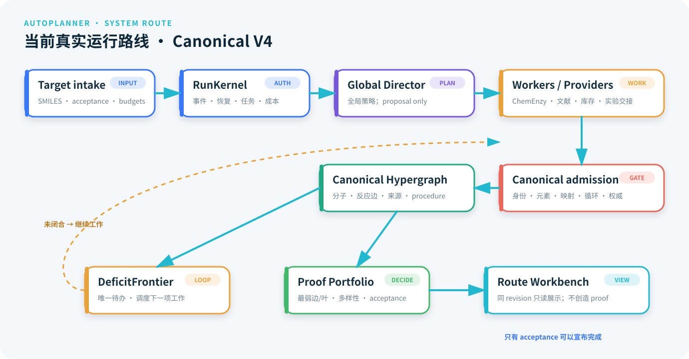
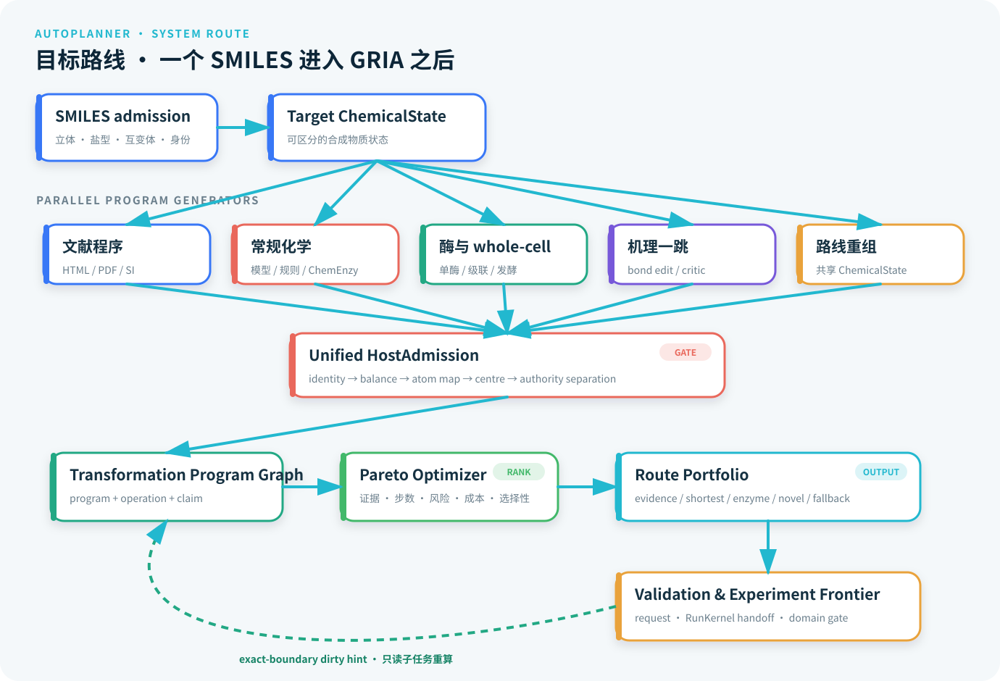
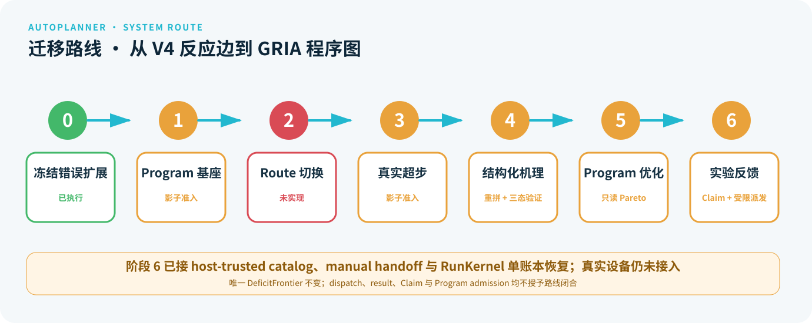

# AutoPlanner 当前架构状态与迁移路线

> 2026-07-16 增量：一跳机理 Program 的独立耐久影子准入，以及基于可重放实验 Claim 的跨任务自进化记忆已经实现。详见
> [Program 创新与自进化完成切片](PROGRAM_INNOVATION_SELF_EVOLUTION_STATUS_20260716.md)。这里的“完成”指代码架构与耐久边界完成，
> 不代表尚未执行的真实底物实验已经成功，也不改变生产路线的 `edge_ids[]` 权威。

状态基线：2026-08-11
适用范围：仓库当前工作区；用于回答“现在已经完成到哪里”和“一个 SMILES 当前如何被处理”。
下一代目标：[通用逆合成创新架构（GRIA）](GENERAL_RETROSYNTHESIS_INNOVATION_ARCHITECTURE.md)

> 2026-08-06 统一控制面增量：已删除 benchmark B4 专用提前结束、objective gate 和按 benchmark
> 禁用 identity/evidence/conditions/self-evolution/replan 的分支。旧 objective 仅作为兼容展示字段。
> ChemEnzy 现生成 raw→normalized→host selection→canonical→B4 的 digest-bound lineage；RetroStar-190
> 目标 001 以旧成功高级配置重跑，规范化路线 multiset 完全一致，仍得到 3 条 B4。统一 Action
> opportunity、target-blind deterministic scheduler decision 和 anytime trajectory 已接入 target report。
> 当前控制面已完成单一生产循环收束：`target_solver` 的手写阶段保留为兼容报告投影，但不再拥有能力执行时序。
> 这不等于整个架构已经完成；入口/resume 兼容层和全量评测仍待推进。现场证据见 [UNIFIED_ANYTIME_BASELINE_20260806.md](UNIFIED_ANYTIME_BASELINE_20260806.md)。

> 2026-08-06 后续增量：P0/P1 现已通过 `CampaignActionRuntime` 接管 materialization、reaction
> validation、stock、conditions、evidence acquisition/binding、target/guided ChemEnzy、Codex
> initial/replan 和 Program discovery/review/admission。生产路径现在只调用一次
> `CampaignActionRuntime.run_anytime()`；`target_solver` 原有 phase-level 位置只从统一循环产生的
> trajectory/backlog 投影兼容 stage，不再二次运行 scheduler。Program enzyme/whole-cell/hybrid 候选保持 proposal-only，mechanism hypotheses 才可经
> canonical ingestion 进入 host validation；默认不写 shadow Program store。

> 2026-08-06 W1/W2 增量：ChemEnzy target-native 与 guided-frontier 已拆成独立资源类，RunKernel
> 现在强制 target 最低服务、native 硬总上限、显式 reserve release 与可重放 borrow 审计；模型、文献、
> validation 和 Program 不再隐式消耗 native-search 配额。`CampaignActionRuntime.run_anytime()` 已提供
> 最新 revision 重编译、no-action 和连续低收益有限收敛。Program discovery/review/admission 与 Codex
> event replan 不再由 `target_solver` 临时拼 supplemental work set，而是先写成不授予科学权威的 canonical
> `action_signals`，由唯一 `deficit_frontier` 投影并在执行后 resolve。W2 生产迁移已经完成：
> `target_solver.py` 只有一个生产 `run_anytime()` 调用，原 29 个 phase-level `execute_action_slice()`
> 已全部改为 `project_action_results()` 兼容投影。Codex event replan 的 retention 与 gain/cost 审计也直接
> 绑定统一循环中的同一次执行。W3 进一步让 target ChemEnzy 与 Codex initial architecture 先在 RunKernel
> 中以同一 graph revision 完成 durable reservation，再并发执行；Codex 使用启动前冻结的 canonical context，
> 不会因线程快慢偶然读取 ChemEnzy 半成品。任一 handler 失败不取消 peer，完成结果按稳定 action 顺序观察，
> cache replay 复用同一 cohort/action identity 且不重复结算。W4 现已注册 `PROGRAM_VALIDATE` 与
> `EXPERIMENT_FEEDBACK_INGEST`：专项验证 Action 只形成绑定现有 experimental work item 的待执行请求，
> 不授予 Claim；反馈 Action 复用既有三域 validation gate、experiment dispatch/settlement 和 experimental
> Claim store，默认不写 shadow，任何结果都不直接创建 canonical reaction edge。终态 checkpoint 收到
> 新 action signal/实验反馈时会重开同一 loop；CLI/API/Web 已统一消费该 trajectory 投影。

> 2026-08-09 W5/入口收束增量：生产 `target_solver` 已只保留一个 `run_anytime()`；CLI、API 与 Web
> 通过同一 Gateway 装配该 runtime。Canonical Web 新任务不再发送 `objective_mode`；旧 CLI/API 字段
> 仅作为兼容元数据，分别发出 `FutureWarning` 或 `Deprecation`/HTTP 299 收据，并计划于
> 2026-10-01 从新请求契约移除。W8 manifest-prefix 前 20/190 四臂 pilot 已完成，但 full-190
> publication-scale 门按当前范围决策延期，不能把 pilot 外推为 benchmark-wide 结论。

> 2026-08-09 科学层回归增量：initial architecture 的 depth/topology replan 信号已在 Action 结算时进入
> 唯一 anytime loop，修复了旧投影层“门通过但未真实调度”的空 replan。集成回归确认 B4 首次为真后，
> 同一 run 仍执行 replan、condition 与 Program review；discovery-only evidence 不会被升级成 B3/B5。
> 三个官方 EPO procedure 案卷已迁移到 parser authority v14，并再次通过严格离线 replay；酶阳性仍只指
> 结构适用候选，真实 exact-substrate 实验继续开放。详见
> [统一 anytime 科学层回归门](SCIENTIFIC_LAYER_REGRESSION_20260809.md)。

> 2026-08-10 trajectory v2 增量：每个生产 Action snapshot 已绑定累计 RunKernel wall time、完整资源
> 向量、Action/route counts、当前 Pareto archive、B0–B5/Program milestones，以及控制面源码、配置、
> UnifiedCampaignSpec、stock oracle 和 provider/model 身份。trajectory 直接给出 first-route、B1、
> first-host-valid-route、B2–B5 和 Program 首达时间、资源曲线与 binding epochs；terminal resume 保留
> 原 trajectory digest，新工作 resume 继续同一 event/time 基线。旧 v1 只兼容读取，不补造未知时间。

> 2026-08-10 审稿导出增量：Gateway export 已把同一 target report 拆成独立内容寻址的 Action trace、
> 失败 trace、provider/canonical route lineage 与 trajectory 资源曲线。Target report 与 trajectory 均先做
> 摘要验证，损坏输入失败关闭；开放科学门不被伪装成运行失败。生产集成门已验证导出资源曲线与
> Workbench/target report 使用同一个 trajectory digest。

> 2026-08-10 Web Action 时间线增量：运行中心现把 ChemEnzy、Codex、证据、reaction validation、
> conditions、stock 和 Program/experiment Action 放在同一个实时列表。已完成项来自 checkpoint，执行中
> 项来自 RunKernel wrapper reservation；子任务不会重复显示，页面轮询不拥有队列或科学写入权威。

> 2026-08-10 saved-run 兼容增量：恢复时会生成 `saved_run_objective_compatibility.v1`，把旧
> checkpoint/report 中的 objective 值保留为只读来源；未知值或字段完全缺失均不会改变当前统一
> Action 调度。恢复后的 Action/snapshot stage 从历史最大序号继续，避免旧 execution 被投影去重覆盖。
> 同一保存状态双克隆回归已验证旧字段存在/缺失时 Action binding 前缀与恢复后缀完全一致。

> 2026-08-10 canonical identity 增量：Director proposal 不再用绑定 run/context 的 task ID 作为科学
> 来源身份，而改用剔除运行绑定字段的 `director_plan:<digest>`。三种旧 objective fresh run、交换
> ChemEnzy/Codex 完成顺序、replay 与保存态双克隆 resume 已验证 exact Action binding 和 canonical
> scientific digest 一致；实际 transformation 内容变化仍会改变 plan provenance digest。历史产物不改写。

> 2026-08-11 离线性与收敛增量：证据 Action 现在严格遵守 `enable_target_identity`，禁用时不会在
> evidence guard 中旁路访问 PubChem；validation fork 优先复用源运行已经绑定的结构身份。目标求解
> 集成测试使用确定性结构身份，真实 PubChem transport/exact-InChIKey 语义继续由独立 requester fixture
> 覆盖。另修复空条件预测被反复写入 canonical graph 的问题：失败诊断保留在 Action outcome，但不推进
> graph revision，同一个 `condition_enrich` 不会在单次 campaign 中重复到 action limit。完整离线套件
> 在同一环境由 500.38 秒降至 178.18 秒，结果为 2699 passed、3 skipped、1 个已批准延期门 deselected。

> 2026-08-11 visual evidence 职责拆分增量：原 1250 行 facade 已拆为 595 行的 provider/预算/回放
> facade、491 行的 hash-bound request compilation/来源相关性模块，以及 190 行的 canonical host
> materialization 模块。`interfaces.visual_evidence` 的公共导入保持不变；视觉模型输出仍只具 proposal
> authority，必须经过 host normalization/admission，不能授予 exact evidence。相关集成回归 115 passed，
> 新聚焦模块超行数预算项由 17 个降至 16 个。拆分后的完整离线套件为 2699 passed、3 skipped、
> 1 个既定行数预算门 deselected、2 subtests passed，用时 173.10 秒。

> 2026-08-11 ChemEnzy probe 职责拆分增量：原 1216 行 facade 已拆为 758 行的 provider/stage/
> canonical ingestion facade、102 行的请求与确定性内容契约模块，以及 398 行的路线归一化、指纹、
> 组合筛选和 provider metadata 模块。`interfaces.chemenzy_probe` 的公共导入保持不变；provider route、
> solved 和 stock 字段仍只作 proposal/ranking 输入，host admission、reaction proof 与 stock authority
> 没有下放。相关集成回归 108 passed，超行数预算项由 16 个降至 15 个；完整离线套件为
> 2699 passed、3 skipped、1 deselected、2 subtests passed，用时 172.02 秒。

> 2026-08-11 retrosynthesis service 职责拆分增量：原 671 行服务已拆为 264 行的公开生命周期/
> read-model facade、234 行的 Director/context/创新审查与显式实验 Claim 准入模块，以及 207 行的
> worker dispatch、预算终态、canonical batch 和 action signals 模块。公开类仍单独持有 RunKernel、
> canonical graph store 和 WorkerRuntime；内部 mixin 不创建服务实例、第二 graph store 或旁路写入。
> 聚焦回归 80 passed，相关 Gateway/target solver/evidence 集成 114 passed，超行数预算项由 15 个
> 降至 14 个；完整离线套件为 2699 passed、3 skipped、1 deselected、2 subtests passed，用时
> 172.93 秒。

> 2026-08-11 target Web runtime 职责拆分增量：原 704 行模块已拆为 386 行的后台 job/continuation/
> 实时进度与历史投影 runtime，以及 interfaces 层 331 行的 payload 校验、约束/预算编译和可选 evidence
> provider 装配模块。请求编译没有放入 `cascade_planner.web`，因此 Web 适配器仍只依赖 interfaces，
> 没有突破 V4 冻结所有权门；HTTP 行为、Gateway 调用和 `solve_target_request` facade 导出保持不变。
> Web/架构聚焦回归 30 passed，相关 Gateway/target solver/CLI 集成 85 passed，超行数预算项由 14 个
> 降至 13 个；完整离线套件为 2699 passed、3 skipped、1 deselected、2 subtests passed，用时
> 173.53 秒。

> 2026-08-11 V4 API 路由拆分增量：原 520 行 Blueprint 模块已拆为 333 行的总装配、错误处理、
> run lifecycle、Program/Workbench/PDF facade，以及 230 行的 target solve/background job/兼容警告/
> workspace queue visibility 路由注册模块。注册器通过参数接收原模块的 solver、job runner 与 payload
> reader，保留 monkeypatch/运行时注入点；HTTP 路径、响应码和 Gateway 调用不变。Web/架构聚焦
> 回归 30 passed，相关 Web/Workspace/Gateway 集成 69 passed，超行数预算项由 13 个降至 12 个；
> 完整离线套件为 2699 passed、3 skipped、1 deselected、2 subtests passed，用时 190.90 秒。

> 2026-08-11 literature evidence 职责拆分增量：原 607 行 connector facade 已拆为 156 行的配置/
> resolver cache/依赖注入 facade、466 行的并行检索、来源物化、授权浏览器重试、route binding 与
> discovery/receipt 执行器，以及 58 行的确定性摘要/压缩/binding eligibility contract。facade 在每次
> 调用时传入当前 materializer，保留 monkeypatch 与自定义实现；授权下载仍只形成 hash-bound source，
> route binding 和 exact evidence 继续经过既有 host gate。文献/Web/架构聚焦回归 56 passed，相关
> literature/target solver/CLI/source-route/visual 集成 122 passed，超行数预算项由 12 个降至 11 个；
> 完整离线套件为 2699 passed、3 skipped、1 deselected、2 subtests passed，用时 177.17 秒。

> 2026-08-11 literature PDF materialization 职责拆分增量：原 266 行模块已拆为 157 行的 PDF
> 校验、focus/extraction、全文/procedure 和最终来源记录编排，以及 159 行的 manifest 原子发布、视觉
> 页面选择、source-evidence 与 target-focus replay projection。PDF bytes/page limits、文件摘要、全文
> UTF-8/摘要检查和获取/解析顺序保持不变。文献/source-route/visual/架构聚焦回归 60 passed，相关
> target solver/CLI/Web/OCR/HTML 集成 106 passed，超行数预算项由 11 个降至 10 个；完整离线套件为
> 2699 passed、3 skipped、1 deselected、2 subtests passed，用时 175.43 秒。

## 1. 结论

新架构**尚未完整实现**。当前处于“Canonical V4 可运行主干 + 统一 Action runtime 迁移层 + 路线创新过渡层 + GRIA
目标设计”三层并存阶段：

- Canonical V4 的运行内核、规范反应超图、统一 frontier、proof portfolio、来源/条件/库存证据链、
  生命周期和 Workbench 投影已进入实际代码路径；
- 长区间机会扫描现在会把酶窗口编译为直连区间边界的低证据 `TransformationProgram` 候选，
  被替代的逐边 Program 仍作为显式 fallback；专项且摘要绑定的验证可以使替代方案达到影子准入
  就绪，并可显式写入独立 append-only shadow store，但不能据此闭合生产路线。未验证候选会自动
  生成精确边界、酶/辅因子矩阵和必做检测的只读验证前沿。文献外一跳机理候选现在可在前体/产物
  精确接回同一路线上下游状态时重拼为完整 Program 路线；接不回的仍只留在 discovery。严格绑定
  Program、创新、边界与机理签名的成功验证可使候选进入只读 shadow，但净转化成立与机理证实分开
  表示；失败和不确定结果继续作为 exact-boundary feedback；
- whole-cell 与 hybrid 不再复用旧搜索代码中的“hybrid”标签，而是由版本化执行能力记录声明
  organism/enzyme/catalyst、顺序 operation、辅因子/载体和专项验证要求；匹配连续路线区间后生成
  完整重拼 Program 路线。培养、后处理和分离都计入物理操作，负净节省候选仍在 exploration 可见；
  严格绑定精确边界与完整操作序列的成功验证可使候选进入只读 shadow；失败与不确定结果保留为
  exact-boundary 能力反馈。当前已有执行器中立 request/result、原始工件摘要绑定、current-frontier
  审计，以及宿主信任的人工交接 executor 与 RunKernel 单账本 dispatch/recovery；尚无真实设备或网络实验
  provider。三个验证域已统一投影为正/负/不确定 Claim，并可在
  显式开关后写入独立 append-only 实验 Claim store，但任何结果都不能进入 completion 或生产权威；
- `ChemicalState`、`TransformationProgram`、`OperationNode` 已有从 V4 edge 生成的只读兼容投影、
  append-only shadow admission/store 和双读 oracle；Program 级候选集合与四资格域 Pareto optimizer
  已作为摘要绑定只读影子层接入同一 Gateway/CLI/HTTP 审查入口；当前适配 baseline、酶替代、
  whole-cell/hybrid execution Program、digest-bound reported Candidate Program 完整路线和已完整重拼的机理一跳，
  尚未成为生产路线主语义。实验结果的统一 Claim 投影、精确边界校准、dirty-domain 提示和独立持久
  重放已接入；dirty hint 已按 exact boundary + subject 映射进只读实验工作投影，但跨相似边界的能力目录
  学习和真实设备执行尚未成为生产运行时；
  另有只读 Candidate Program 投影保留连通但有反应物缺口的路线，
  不会放宽 canonical edge admission；Candidate Workbench 现可批量去重审计，并能在临时筛选图上
  运行同一数据驱动酶能力扫描，正向和零匹配都不产生科学写入。
- 当前 Workbench `route:*` 到 Program 的只读覆盖层和等价 oracle 已接入 CLI/Gateway/HTTP；
  Nirmatrelvir、Artemisinin、Fluvastatin 三类 current replay 已通过同一双读门。真实超步另走
  显式非等价候选契约，尚未切换 UI 或生产路线主语义。
- 10 个剩余 statin 已在隔离 blind panel 中完成重跑并汇总为 50 条 target-rooted 主路线；低可信
  路线、host 验证、exact 来源、库存和配置验收现在分层展示。恢复重跑证明部分旧 `unresolved`
  实际来自“瞬态传输错误后已有有效终态仍被丢弃”，而不是化学规划为空。proof profile 的单骨架
  上限已从 8 步提高到 24 步；共享最终反应或下游后缀不再使真正上游分歧的长路线整族被拒绝。
  Simvastatin V6 fresh run 已产生并物化 12 步 target-rooted skeleton；最终 Workbench 将两条完整
  12 步规划路线与 5 条较短 proof portfolio 路线分层保留。该 run 达到配置验收，但 B3 exact-source、
  条件完整和 process-ready 均未通过，展示不会把规划深度冒充文献闭合。

因此目前可以诚实展示“系统怎样生成、验证和展示路线，以及怎样保留酶法/机理创新候选”，
不能宣称“任意 SMILES 已经由 GRIA 在 Transformation Program Graph 上完成全局优化”。

2026-07-25 的旧代码隔离增量把冻结 V3 公共面收拢到显式
`cascade_planner.legacy` 命名空间：V4 包根默认只暴露 V4 符号，combined Web、V3 架构审计和对应
回归测试分别进入 legacy Web、`scripts/legacy/` 和 `tests/legacy/` 边界。仍未迁移的历史能力在
saved-run 与 golden replay 完成 canonical V4 迁移前，只允许兼容修复、审计和删除性改动。
2026-07-26 进一步删除了 application/orchestration/providers/harness 包根旧别名，并把 V3 Codex provider
从 mainline builtins 迁入 legacy；主 CLI 的 combined surface 同时删除，历史 UI 只保留独立 legacy 启动器。
同日继续将 recursive Codex campaign、frontier scheduler/ledger、route deficit/portfolio 和旧 acceptance
实现物理迁出主线目录，统一落入 `cascade_planner.legacy.application_runtime` 与
`cascade_planner.legacy.orchestration_runtime`；旧模块路径不再保留 shim。
随后 blackboard controller、action planners、blackboard event state、旧工具分发、runner 与 RouteForest
compiler 也迁入 `cascade_planner.legacy.harness_runtime`。V4 仅继续复用无状态的 RouteForest
delivery/layout renderer，不加载旧 controller 或旧工具运行时。
combined Flask 应用随后迁出 `cascade_planner.web`，V3 operator/replay/RouteForest/golden 脚本也全部改为
`scripts/legacy/` 显式入口；主脚本目录不再保留兼容包装器。
blackboard route rebuild、旧 admission receipts 与 admitted-hyperedge journal 也已迁出 canonical
`routes` 和主线 orchestration，统一进入 legacy runtime；`cascade_planner.routes` 不再默认加载旧图适配器。
旧 proposal bus、Codex edge verification、parent-route proof、route-objective classifier 与
target-side strategy 随后也迁入 `cascade_planner.legacy.harness_runtime`；相关测试和 saved-run
评估/timeline 脚本同步进入 legacy 分区，V4 fresh import 不加载该簇。
旧 workflow plan/preflight/progress、analogical/process/recursive helpers、failure critic、
hypothesis closeout reports 与 controller adapter 也已从主线 harness 物理迁出；共享 schemas、
route verifier、source compilers 和 V4 renderer 继续留在主线。
旧 selfEVO replay/memory 和 tool registry/execution policy 随后迁入 legacy runtime；主线
evolution manager、patent self-evolution 与 canonical worker runtime 不通过这些旧 helper 执行。
selected-route parent proof、旧 route edge signature 与 closeout artifact revision 也完成物理迁出；
`cascade_planner.runtime` 包根现在只加载当前 agent/runtime contracts 与 canonical run storage。
Codex-entry schemas 与 advisory route-consensus graph assembler 也已迁入 legacy；主线 routes
包根只保留 V4 仍使用的 admission、consensus、domain 与 overlay 合同。
旧 visual structure-chain validator 与其 compound-label 测试已进入 legacy；当前视觉候选仍由
`interfaces.visual_evidence`、host normalization 和 RunKernel budget 负责。
冻结的 CCTS v0-v3 训练、审计、回放和报告谱系已迁入
`cascade_planner.legacy.eval_runtime`；两个 route-tree checkpoint scorer 迁入
`cascade_planner.legacy.route_tree_runtime`。旧路径删除，相关环境开关必须先通过显式
legacy-research guard。
旧 route-pool ranker/LambdaRank 与 block-coherence/block-hard pack、训练、回放和审计模块
也已迁入 `cascade_planner.legacy.eval_runtime`；仍保留的 active research selector 必须通过
显式 legacy 路径读取这些冻结 helper，不能把它们提升为 V4 runtime authority。
route-block value、strict disagreement review、no-human probe 与 strengthening summary
模块也已迁入同一 runtime，并统一要求 legacy-research opt-in。
reservoir/controller-v2 calibration、comparison、distillation、acceptance、publication
与 statistical report 也已迁入同一 runtime；仍被当前 benchmark preparation 复用的 external
target-cache parser 暂留主线。
CBA v0 训练/审计与 expert CSV/LLM route-pool review fallback workflow 也已迁入
legacy eval runtime；旧 eval 路径删除，所有入口统一要求显式 research opt-in。
adjacent-step cascade-pair pack、训练、回放、runtime scorer 与特征契约均已迁入
`cascade_planner.legacy.cascade_search_runtime` 与 legacy eval runtime；主线仅保留通用注入协议。
已关闭的 V4 product-value route encoder、checkpoint loader 与 learned reranker
契约也已迁入 `cascade_planner.legacy.cascade_search_runtime.v4_product_value`；主线不再提供懒兼容导出。
历史 `LearnedCascadeValueModel` checkpoint adapter 也已迁入
`cascade_planner.legacy.cascade_search_runtime.value`；主线 `cascade_search.value` 仅保留启发式与 verifier-augmented 模型。
未被当前调用链使用的 chemical-anchor 与 semisynthesis stock wrapper 已迁入
`cascade_planner.legacy.cascadeboard_runtime`；当前执行直接使用 rescue provider 与
common/vendor/ZINC stock 链。
当前 open-research contract/experience/retrieval、seed consumables、source-detail resolution 与
material locator 已从泛化 harness 收拢到 `cascade_planner.research`。该包只由显式研究 worker
加载，不进入 canonical V4 启动路径。
research downstream compiler、source-detail chain builder、failure feedback 与真实专利
procedure gate 也已迁入同一包；相关 replay 脚本显式导入该命名空间。
根级 `AUTOPLANNRELLM` 实验包也已迁入 `cascade_planner.research.autoplannrellm`，旧根路径
删除；它只在显式环境开关下参与 route-tree 研究运行，不进入 V4 启动路径。

## 2. 当前真实可运行路线



四个当前权威保持分离：`RunKernel` 管运行，canonical hypergraph 管化学拓扑，
`DeficitFrontier` 管下一项工作，proof portfolio/acceptance 管完成判断。UI、worker、Codex 和旧
Blackboard 都不能自行把 proposal 提升为事实。

## 3. 当前能力盘点

| 能力 | 状态 | 当前生产语义与代码证据 | 距 GRIA 的差距 |
| --- | --- | --- | --- |
| 统一 Campaign 输入与硬预算 | 已实现 | `unified_campaign_spec.v1` 只含 canonical target、不可变 Stock Oracle、约束和预算；`autoplanner_run_spec.v2` 嵌入该契约，v1 仅兼容读取；`campaign_task_budget.v1` 独立约束 evidence、stock、validation、Program、experiment 和 total task；`campaign_action.v2` 在 reservation 前声明类级估计，settlement 按 execution ID 记录实际资源与 variance | 当前目标仍主要是 canonical molecule identity，不是完整 `ChemicalState`；模型 token 的 Action 级预测目前标记为 unknown，尚未形成校准器 |
| 八轴 Campaign 质量状态 | 已实现 | `campaign_quality_state.v1` 在 service status、Workbench、target report、validation fork、CLI/API 中统一输出；acceptance 不提前终止 Action loop | Program validation 无运行数据时如实为 `not_assessed` |
| 全局路线策略 | 已实现 | `global_campaign_director.py`；输出 proposal，由 host 准入 | 尚未在 program graph 上统一比较所有执行程序 |
| 长路线与共享后缀 | 已实现主干修复 | proof profile 最多 24 个显式反应；路线族可共享 target-forming edge，并按上游 reaction program 去重；Simvastatin V6 已物化 12 步 skeleton，并在最终 Workbench 分层保留完整规划路线 | 仍需以更多 20+ 步 fresh run 校准 director 深度、来源覆盖和逐边验证吞吐；12 步规划可见不等于 B3/条件/工艺闭合 |
| Canonical AND/OR 反应图 | 已实现 | `application/canonical_hypergraph.py`，schema `canonical_retrosynthesis_hypergraph.v1` | 路线仍以 `edge_ids[]` 表示 |
| 单一 deficit frontier | 已实现 | `application/deficit_frontier.py` 与 campaign service；Program 实验工作仅以摘要绑定的只读 subtask overlay 展开，禁止发布为第二 frontier；派发只复用 RunKernel validation task | 尚无程序级信息增益评分与真实设备执行 |
| 多轴 proof / 产品档位 | 已实现但保留兼容等级 | `route_workbench_proof_vectors.py`、proof policy 与 portfolio | L0–L4 仍未完全降为纯 UI 派生色 |
| HTML/XML → PDF → OCR/视觉降级 | 已实现，三案例门已闭合 | Vismodegib / EP3381900A1、DMB-S-MMP / EP2483292B1、Nirmatrelvir C4 / EP3953330B1 均由官方 XML 精确范围完成条件编译和两次离线同摘要 replay | 视觉降级仍只能保留 L0；更多出版商 HTML/PDF 版式覆盖继续扩展 |
| 条件与 procedure 独立实体 | 已实现 | condition/procedure records、来源片段与 Workbench inspector | 单位/同义词/完整工艺解析覆盖仍不充分 |
| 事实撤销、过期与恢复 | 已实现 | `application/fact_lifecycle.py`，增量降级 + full recompute oracle | 下一代应收敛为统一 `Claim` event log |
| 酶催化 step / superstep | 过渡实现（影子准入） | 边界 Program、专项验证、独立 append-only store/replay/GC pin；保留逐边 fallback，不能闭合路线 | 已有 current canonical 6→1 阳性 proposal；仍缺精确底物验证与生产路线接管 |
| Whole-cell / hybrid execution Program | 过渡实现（只读） | 能力/验证严格 schema、连续区间重拼、fallback、validation frontier、正/负/不确定 feedback；通用 executor 封套与受限人工交接可释放验证候选，成功仅开放只读 shadow | 缺真实设备 provider、execution Program 准入、跨相似边界校准与真实 current canonical 阳性案卷；不能闭合路线 |
| 通用长区间机会发现 | 过渡实现 | `route_innovation_windows.py`、`route_innovation_discovery.py`、版本化 capability | fingerprint/SMARTS 是冷启动原型，尚非校准后的 Capability Graph |
| 文献外一跳机理外推 | 过渡实现（只读） | 结构物化、锚点隔离、深度 1、可证伪检查；完整重拼后生成专项验证前沿，通用 executor 封套与受限人工交接可回传三态候选；净转化与机理支持分轴 | 尚无一等 `MechanismProposal`、bond-edit trace、竞争路径 critic、真实设备 provider 与 mechanism Program 准入 |
| `TransformationProgram` | 过渡实现（影子准入） | `transformation_programs.py` + `transformation_program_store.py`；只读投影、显式 append-only admission、CAS replay 与 oracle | 尚无 `program_ids[]` 路线主语义；store 不参与 proof/ranking/completion |
| Route/Program UI 双读 | 过渡实现（只读） | `route_program_dual_read.py`；同 revision 映射实际 Workbench route，复核步数、proof/条件/acceptance 快照 | 三类 baseline replay 严格等价通过；超步非等价由独立候选契约显式核算，UI 仍未主读 Program |
| `OperationNode` / 操作图 | 过渡实现（单反应节点） | 每条 edge 投影一个 reaction operation，保留 procedure refs | 尚无可执行 operation DAG、投料/后处理/分离节点 |
| 低可信完整路线 Candidate Program | 过渡实现（L0 保留 + 只读 Program） | canonical admission 未放松；身份有效但元素库存门未过的 Director step 以 `admission_rejected` L0 planning fact 保留，Workbench 按 skeleton 重组完整路线并用红色警示；Candidate Program 继续逐步分类 `canonical_admissible` / `inventory_gap` / `blocked_candidate` | L0 skeleton 不进入 proof portfolio/ranking/completion；Program 尚未成为生产路线主语义 |
| Candidate 批量迁移审计 | 已实现（只读） | 303 个快照去重为 264 个唯一 Workbench；分类投影、空图和无效快照，历史 acceptance 只作诊断 | 仍需把选定案卷显式重放为 current canonical schema |
| Candidate 酶机会/负对照扫描 | 过渡实现（只读） | Bufotalin 产生 5 个 Program draft，其中一个 6→1；Ibrutinib 3 条路线零匹配 | 正例仍来自 Candidate Projection，且没有精确底物实验校准 |
| Program Graph + Pareto optimizer | 过渡实现（只读） | `program_route_candidate*` + reported/mechanism/execution adapters + optimizer；baseline、酶、whole-cell、hybrid、摘要绑定 reported 完整路线和已重拼机理路线进入同一多轴空间，execution/mechanism 严格成功可进只读 shadow，来源类型不评分，oracle 精确复算 | 尚无生产 `program_ids[]` 路线主语义；execution/mechanism Program 准入及成功率/纯化/成本/PMI 数据未接入 |
| 实验 Claim、反馈与能力校准 | 过渡实现（影子持久） | 三域 validation frontier/feedback；统一 Claim store；`experimental_work_frontier.v1` 绑定唯一 canonical frontier；host-trusted provider policy、manual handoff、RunKernel dispatch/recovery/settlement 只释放领域验证候选 | 缺真实设备/网络 provider、信息增益 scheduler 与跨相似边界 applicability model |
| P9 fresh-blind 发布门 | 协议与编译器已实现，科学门未通过 | 真实 Git 跟踪树预检、同义名/SMILES/InChIKey/关键中间体 evaluator-only 扫描、运行前冻结摘要、case-local 记忆副本、三种单变量消融、失败保留和三档产品读出已接入；单目标四臂 smoke 已证明摘要/环境绑定并测得 ChemEnzy 增益 0、replan 验证路线差值 -1；后续已加入付费前 replan signal gate 与付费后 canonical graph 保留审计，工作台只把 `accepted=false` 显示为红色审计项 | 旧 20-target 结果不能通过新门；当前缺真实库存冻结、足量策略不同路线、条件/采购覆盖和完整 panel 级消融；单目标且首轮采样不同的差值不能充当 replan 因果结论 |

## 4. 当前创新兼容层怎样工作

当前系统没有因为低可信或中间缺一步就删除整条文献路线。它把来源与可信度拆开：

```text
已选择的 canonical route / 摘要绑定 Candidate screening route
          │
          ├─ 连续区间扫描 ──> net transform / transient burden
          │                         │
          │                         ▼
          │                 CapabilityRecord 匹配
          │                         │
          │                         ▼
          │          酶 / whole-cell / hybrid Program proposal
          │
          └─ 高代价或断点 ──> 一跳 mechanism proposal
                                    │
                                    ▼
                       host admission + anchor isolation
                                    │
                                    ▼
                         canonical ingestion hypothesis
                                    │
                                    ▼
                   materialize / validate / evidence / experiment
```

这条路径有三个硬边界：

1. 文献来源颜色只说明来源，警示边框/验证轴才说明可信度；
2. 只有 EC、模型分数、结构守恒或论文类比时，候选继续可见但不能闭合 experimental-ready 路线；
3. 机理新边不能借用锚点论文的 exact-source authority，且初始只能向外扩展一跳。

## 5. 当前一个 SMILES 进入后的处理

### 5.1 已实现路径

1. API/CLI/Web 把 SMILES、不可变 Stock Oracle、目标约束和资源上限编译为 `UnifiedCampaignSpec`，再嵌入 `RunSpec v2`；名称只作展示，acceptance 只作质量审计输入；
2. `RunKernel` 建立可恢复 run，记录任务、事件、attempt、accepted expansion 和所有资源消耗；
3. Campaign context 将目标、当前图、证明、缺口和预算压缩给 Global Director；
4. Director 选择路线族、provider 和证据策略，只返回 proposal；
5. host 调用 ChemEnzy、文献/专利连接器、物化、反应验证和库存 worker；
6. 所有结果通过同一个 canonical ingestion；身份错误、循环、重复和越权 proof 失败关闭，身份有效但元素库存异常的 Director step 只保留为红色 L0 planning fact，不生成 canonical edge；
7. hypergraph 重算来源、条件、反应 proof、库存叶和 route closure；
8. DeficitFrontier 决定继续抽取、补验证、扩展上游、查库存，或在预算/信息耗尽时诚实停止；
9. proof portfolio 依据最弱边和最弱叶输出多样路线，并编译八轴质量状态和 acceptance 快照；B4/B5 不触发 Action loop 专用 return；
10. Workbench 从同一 revision 生成只读展示，低证据路线保留警示，不因 UI 颜色获得权威。

### 5.2 目标 GRIA 路径



目标路径的关键差异不是多加一个酶模块，而是把所有候选统一提升为可替换的
`TransformationProgram`，使酶法可以在图上真实替代 3～6 个化学操作，并与文献路线共同参与
全局优化。

## 6. 迁移路线



| 阶段 | 交付物 | 当前状态 | 完成门 |
| --- | --- | --- | --- |
| 0. 冻结错误扩展 | 停止目标专属规则和 superstep-as-edge 扩张 | 已执行；现有案例仅作回归 | 禁止 target-name 生产分支 |
| 1. Program 基座 | `ChemicalState`、`TransformationProgram`、store、edge→program 投影 | 影子 store/oracle；7 类回归（3 canonical replay + 4 candidate）；3 类 current replay 路线双读通过 | 把 candidate 类别升级为 canonical replay；生产路线不切换 |
| 2. Route 切换 | `program_ids[]` 成为主路线语义，`edge_ids[]` 退为兼容投影 | 未实现 | proof、条件、步数、UI 改读 program |
| 3. 真实超步 | interval analysis 直接创建起点→终点 program | 影子准入已实现：独立 append-only store、六 CAS 重放、fallback、非等价 oracle；current canonical 有 6→1 未验证阳性 proposal，并已进入只读 optimizer 的 exploration 层 | 取得精确底物专项验证；生产路线仍不切换 |
| 4. 结构化机理一跳 | `MechanismProposal`、bond edits、critic、扩展门 | 过渡实现（只读）：一跳锚点/结构/可证伪门、连续区间重拼、严格验证 frontier 与三态反馈；净转化不冒充机理证明 | 补一等 bond-edit trace、竞争路径 critic、实验 producer 与持久准入 |
| 5. Program optimizer | 文献、化学、酶、whole-cell、hybrid、机理进入 Pareto portfolio | 过渡实现（只读）：六类 adapter、四资格域、完整 Pareto layers；通过 execution/mechanism 验证的成功候选可进入 shadow，来源类型不评分 | 补缺失工艺目标与持久准入，仍不接管生产路线 |
| 6. 实验反馈 | 成败 claim 更新 Capability applicability | 三域 Claim/store/calibration；唯一 frontier 绑定、通用 request/result/current-frontier audit、host-trusted manual provider 与 RunKernel 单账本 dispatch/recovery 已实现，目录不变 | 接真实设备/网络 provider，补信息增益评分并学习相似边界 applicability |

阶段 3 的 Program draft、验证前沿和独立影子准入已可提前验证，但生产接管仍不能跳过阶段 2/5。
否则候选无法进入真正的路线搜索、proof、条件核算与 UI 主语义。

## 7. 下一实施切片

当前最小、可验收且不会继续制造兼容债务的切片是：

1. 当前只读盘点 38 个索引运行：2 个非空图 `projection_ready`、3 个空图、33 个旧图需
   `canonical_replay_required`，未知错误为 0；先迁移旧案卷，不做静默兼容；
2. Nirmatrelvir 与 Artemisinin golden replay 已通过；Fluvastatin 全新隔离重跑形成 44 molecules、
   30 edges、5 个 route-family 的 current canonical graph，并完成 30 Program 的影子准入与重放；
   该 run 只有 1 条 exploration-complete 路线、最低 proof L1、条件不完整，acceptance 仍为 false；
   Bufotalin 当前以 20 个 Candidate Program 完整
   保留（15 个 canonical-admissible、5 个 inventory gap）；Atorvastatin 11 步旧候选也已规范化为
   22 states / 11 programs，但无条件或反应证明，仍不作生产闭合；
3. 全仓 303 个 Workbench 副本经内容去重后得到 264 个唯一快照、34 个目标标签：231 个
   `projection_ready`、18 个空图、15 个无效快照、未知错误为 0；Ibrutinib 和 Enzalutamide 已冻结为
   新的跨类别 Candidate Program 回归；
4. 当前回归覆盖 7 类目标：3 类 canonical replay/store、4 类 Candidate Projection；同一能力目录下
   Bufotalin 有 5 个酶候选（最大 6 个化学步骤→1 个酶步骤），Ibrutinib 的 3 条可扫描路线均零匹配，
   无适用酶负对照门已满足；
5. 12 个他汀实体已完成资产级盘点；Fluvastatin 已从 legacy partial anchor 升级为 current canonical
   replay/store，Atorvastatin 仍只是 candidate projection；其余 10 个实体已完成隔离 blind rerun，统一
   面板收录 50 条 target-rooted 路线，其中 3 个目标达到 B2、2 个达到配置边界，所有低可信路线继续
   可见但不冒充 exact 文献闭合。资产级存在、blind rerun 和 current canonical replay 仍是三个不同层级；
6. Program store 的空 RunIndex GC pin 恢复已验证；下一步补跨 schema/policy 的显式 migration，并把
   4 类 Candidate Projection 中可重放的案卷升级为 current canonical replay；
7. Nirmatrelvir、Artemisinin 与 Fluvastatin 三类 current replay 已通过同一 Gateway 的
   proof/条件/步数双读 oracle；Fluvastatin 具体覆盖 5 条展示路线和 2 条 replacement route。
   超步的物理步数、化学等效步数和净节省现已由独立 oracle 显式核算；在 4 类 Candidate
   Projection 升级并取得一例经专项验证的 current canonical 真实酶阳性案卷前，仍不增加生产
   `program_ids[]` 字段，也不启动 Phase 2 切换；
8. Bufotalin 的冻结 6 边区间已由 fresh `GlobalCampaignPlan` 重建为 current canonical graph，同一通用
   HSDH 能力发现 6→1 proposal、净节省 5 步。ACS 主文只能支持甾体 HSDH 广泛先例，当前无法从
   可获取 SI 证明该精确输入/输出对，因此系统正确拒绝准入并生成 `biocatalysis_validation_frontier.v1`
   实验计划；没有用文献类比伪造专项验证；
9. 专项验证通过后的 superstep 可写入独立 append-only store；默认关闭、重复准入幂等、并发只发布
   一个事件，六类 CAS、事件摘要、策略和 authority semantics 均重放失败关闭。即使 RunIndex 被清空，
   GC 也从事件恢复全部 pin；baseline Program store、canonical graph、proof 和 completion 不受影响。
10. Program 级 Pareto 影子层已接入现有 `program-innovations` Gateway/CLI/HTTP 响应，没有新增第二个
    路线入口。候选契约 fail-closed 校验字段、摘要、Program/fallback、证据与资格关系；optimizer
    分别输出 exploration、shadow、experimental-ready、process-ready 的全部 Pareto layers。未验证
    HSDH 仍可见但不进入 shadow；经专项验证的多步替代可支配较长 fallback；同指标的 mechanism
    对照与 baseline 同层，证明来源类别未被偷偷评分。
11. reported Candidate Program adapter 已接入同一入口：Bufotalin 20 步、有 DOI 绑定的完整候选被标为
    `literature` 并保留在 exploration；Atorvastatin 11 步旧投影因缺少来源绑定被标为 `chemical` 且
    显示来源警告。observation/projection、target SMILES、route/program membership 和双摘要任一漂移均
    失败关闭；reported 输入在写入型 admission 明确拒绝。
12. 机理一跳已补齐通用物化/重拼层：前体必须是锚点边真实产物，产物必须与同一路线下游状态精确
    同构，被跨越边必须构成连续、单输出且无内部状态外部消费者的区间。满足时用一个
    `mechanism_program_proposal.v1` 替换该区间并保留完整 fallback；不满足时继续显示在 discovery，
    mechanism bundle 记录拒绝原因。未验证候选只进入 exploration，proof 固定为 0；严格成功验证只开放
    shadow，仍不能进入 completion、canonical graph 或 Program store；其验证结果只能按精确边界进入
    实验 Claim store。净转化、机理一致与机理判别分级记录，锚点不为外推反应背书。共享
    graph/route/projection/discovery 校验和区间替换算法已从酶专用
    模块抽出，并由 whole-cell/hybrid 路径复用。
13. whole-cell/hybrid 已完成第一版通用只读接入：能力契约拒绝错误 schema、缺 actor、缺操作序列和
    伪 hybrid；结构匹配已从酶专属模块抽为执行域中立层；命中的连续区间使用共享重拼算法形成完整
    Program 路线并进入同一 Pareto exploration。培养/后处理/分离均计数，负净节省不会导致候选被删；
    合法但不适用能力返回经 oracle 验证的空 bundle。Gateway/Web 已固定返回 execution bundle/oracle，
    但没有 execution Program store 写入路径，生产 graph、proof、completion、acceptance 均不改变。
14. execution 专项验证与反馈已接入同一只读入口：验证记录精确绑定能力摘要、边界状态、完整操作序列、
    actor、claim、condition 和台账；成功且全部检查通过时只使候选进入 shadow Pareto，失败与不确定结果
    仍作为 exact-boundary feedback 保留。反馈明确 `catalog_mutated=false`、`capability_disabled=false`，
    没有 execution Program admission event/store；有效结果可进入独立实验 Claim store。公共验证绑定和
    前沿新鲜度检查已去重；执行 bundle 编译器从
    460 行清理到 380 行，主 review materials 从 128 行清理到 96 行，并由架构预算持续约束。
15. mechanism 专项验证与反馈复用执行域中立的严格绑定、frontier 新鲜度和反馈收集骨架，但保持独立
    接受语义。结果精确绑定 Program、innovation、输入/输出状态、机理签名、必检项、claim、condition、
    analytical record 与 outcome metrics；成功、失败、不确定均可重放。有效成功只开放 read-only shadow；
    `net_transform_observed` 显式标记为“机理未决”，不会创建 reaction proof、Program store、completion 或
    canonical 写入。候选合法性审计已从机制主编译器抽离，主文件由 421 行降至 370 行。
16. 三域实验结果已统一为 `experimental_observation_claim_set.v1`，保留 positive/negative/inconclusive。
    显式开关才允许非空集合写入独立 append-only store；六类 CAS 在读取时完整重投影，输入顺序、并发、
    篡改、空集合和 RunIndex 丢失均有失败关闭回归。exact-boundary calibration 输出正/负/冲突和 dirty
    hints，但不修改能力目录；`edge_ids[]`、proof、completion、acceptance 与 canonical graph 均不变。
17. 三域验证计划已统一投影为 `experimental_work_frontier.v1`；每个 `experiment_execution_request.v1`
    固定当前 canonical frontier、源 plan 和 exact boundary；dirty hint 按 domain + subject + boundary 精确映射。
    `experiment_execution_result.v1` 只有在当前 request 重投影、摘要、原始工件和边界全部通过时才释放领域
    验证候选；仍不自动写 Claim 或 graph。
18. 配置驱动 executor registry 与受限 dispatch/recovery 已完成第一版：公共
    `experiment_executor_policy.v1` 只能收窄宿主 trust allowlist，不能注册或提升 provider；内置 manual handoff
    provider 无网络、确定性且声明幂等，并输出 `experiment_dispatch_handoff.v1`。每个 current request 只形成
    一个稳定 RunKernel validation task，request/selection/handoff/result/review/settlement 全部
    内容寻址；pointer 只是可重建索引。并发派发/结算只产生一个任务生命周期，指针丢失可从 reservation
    恢复；执行者不匹配、缺失 CAS artifact、旧 frontier、摘要或收据篡改均失败关闭。结果仍只释放既有
    domain gate 候选，不写 validation、Claim、canonical graph、completion 或 capability catalog。
19. statin blind rerun 暴露并修复两类主干问题：Codex JSONL 中间出现超时/重连但随后已有
    `turn.completed` 时，worker 现在保留有效终态；`unresolved` 被拆成无路线、低可信路线待验证、
    已验证但 proof 未闭合和配置边界已闭合。全局 Director 的 24 步 profile 已实际产生 12 步 de novo
    skeleton；host 不再因为它与短路线共享最终反应而拒绝整族，而只拒绝无上游分歧、纯截短或完整
    上游程序重复的家族。
20. Director 声明无 skeleton 的孤立 route family 不再使整份计划永久 `unresolved`：host 只删除无化学内容的
    family metadata 并记录修复；若契约仍失败，则用 `director_contract_rejected` 触发一次有界 replan，不补造
    化学步骤。Simvastatin V6 的初始 canonical Workbench 已包含 12-edge L1 路线；最终 proof portfolio 选择
    5 条较短 L2 路线，但两条 12 步、全部 materialized 的 skeleton 继续保留在只读 `planned_routes`。该 run
    B0/B1/B2/B4/B5 通过而 B3 失败，因此只能证明长路线生成与展示闭环，不能证明文献/条件/工艺闭合。
21. 下一切片应在同一 SPI 上接入一个受控的真实设备/网络 provider，并补超时/取消/操作者身份与外部
    job receipt；同时为实验子任务加入可解释的信息增益/成本排序和跨相似边界 applicability 学习。不得为
    单个目标硬编码实验路径，也不得创建第二任务队列。

22. Bufotalin fresh blind V1–V3 进一步校正了长路线目标：`proof` profile 的 24 步是能力上限，不是优化
    目标。强制最小 20 步会诱导模型把 12 步主段与 8 步延伸段拼成名义 20 步；host 发现延伸段既非目标根
    且含祖先环，因此只承认合法主段。当前 Bufotalin manifest 已撤销深度下限，长度只由化学和真实终止
    边界决定。最终 V3 有 12/6/4 步三条声明路线的全部步骤进入 canonical graph；另一个 2 步酶候选因
    `element_inventory_not_conserved` 保留为红色单步缺口，不被删除也不冒充闭合。
23. Workbench 新增独立 `declared_route_program_closure.v1`：逐 Director skeleton 核算声明步、已物化步、
    admission-rejected gap 和未物化 gap。它只回答“目标到声明叶节点的全部步骤是否进入规范图”，与反应
    验证、exact 文献、条件、benchmark 库存和采购闭合严格分轴。Bufotalin V3 显示 3/4 条结构闭合、最长
    12 步；B1–B5 仍可保持开放，不再把“证据/库存未闭合”误写成“整条路线不存在”。展示页和路线工作台
    均显示该独立卡片；12 步路线已实际点击检查，R1 检查器可打开且条件、来源缺口和 Proof vector 完整可滚动。
24. Canonical V4 Web 已收敛为一个后端事实源和三个协同视图：`/v4` 统一工作区同时列出 fresh showcase
    与 gateway 运行索引，并在同一个 iframe 中审查 Workbench；`/v4/console` 只负责从 SMILES 发起异步
    campaign；`/v4/showcase` 负责全屏展示。`/api/v4/workspace` 汇总入口、后端状态、run 与展示目录，
    `/api/v4/showcase` 有界发现生成的 `showcase/summary.json`，同一目标优先采用最新 fresh 工件。旧版没有
    `route_closure` 时显示“闭合待 current 投影”，不误报失败；旧蟾毒灵 20 步展示会被 fresh V3 的 12 步
    闭合事实替代。启动脚本现调用默认 Canonical V4 server，不再把 combined 兼容应用作为新入口；
    `--server auto` 在 Waitress 缺失时自动回退 Flask，默认命令不会在端口绑定前失败。
25. Target-only 多轮规划最多保留 10 个 director outcome（1 次首轮架构 + 最多 9 次 event replan）；每次重规划
    均拆成两个独立门：`global_replan_signal_gate` 先证明上一轮之后出现了新的可行动
    宿主观察，预算门再核算调用/token/墙钟余量。`portfolio stagnation` 或“尚未闭合”本身不再触发付费；
    已闭合的库存观察也不重复触发。若确实执行 replan，`replan_retention_audit` 要求 molecules、edges 与
    route families 的 ID 集合均为首轮图的超集，证明第二轮只能追加候选或强化 proof，不能覆盖第一次路线。
    `global_replan_gain_audit` 再记录 gate/路线计数增量及模型调用/token/墙钟增量，把 `no_gain` 明确保留
    为回归信号。旧单目标四臂 smoke 因首轮采样不同仍只作观测证据；正式结论必须来自重复/多目标冻结实验。

### 7.1 闭合优先核算（Bufotalin V3 当前样例）

路线长度只描述已闭合程序的规模，不参与“越长越好”的目标函数。当前样例必须按下列互不替代的轴展示：

| 闭合轴 | 当前事实 | 展示结论 |
|---|---|---|
| 声明路线图结构 | 4 条声明程序中 3 条全部物化，分别为 12/6/4 步；2 步酶候选有 1 个红色准入缺口 | **结构已部分闭合；最长闭合路线 12 步** |
| 反应验证 | 18 条物化边中 4 条达到 L2 host validation | **开放，逐边推进** |
| 文献与条件 | 4 个来源候选，0 条 exact-source record；条件覆盖不足 | **开放，不抹去已报道/低可信候选** |
| 叶节点库存与采购 | 8 个叶节点中 5 个库存命中；采购闭合未通过 | **开放** |
| 科学 acceptance | B1–B5 未同时满足 | **不得标为 reaction/evidence/process ready** |

因此，本样例的正确标题是“存在结构闭合路线，证据/条件/库存仍开放”，不是“20+ 步路线”，也不是“全路线不可信”。

第 18 步完成不代表实验闭环已完成；manual handoff 只证明架构边界与恢复语义可运行，不证明真实设备已接入。

## 8. 完成定义

只有以下条件同时成立，才能把“GRIA 第一版”标为完成：

- 生产 route 以 `program_ids[]` 为唯一主语义；
- 酶超步在 program graph 上真实替换连续化学区间；
- 文献、化学、酶和机理程序进入同一 Pareto optimizer；
- 低证据候选可见，但不会满足高档 acceptance；
- 成功和失败实验都可重放并更新 capability 适用域；
- 至少五类复杂目标和负对照使用同一代码通过验收；
- 没有 target-name 规则、展示层化学逻辑或第二份事实权威。

单个复杂分子的“路线闭合”仍是独立问题：结构闭合由 `route_closure` 判定；反应、文献/条件、
库存/采购和 process-ready 则由各自 proof 与 acceptance 分轴判定。任一轴不能替代另一轴，架构完成度也
不能替代单次 run 的事实。

当前稳定性门禁：完整离线集 `1968 passed, 3 skipped, 11 warnings, 2 subtests passed`；跨运行审计、Candidate
Program 投影均为只读，
`edge_ids[]`、proof、completion 与 acceptance 均未切换。
