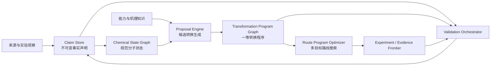

# 通用逆合成创新架构（GRIA）

状态：**目标架构设计，尚未完整实现。** 它替代“先生成文献路线、再附加创新标签”的后处理
模式；当前生产运行仍是 Canonical V4，只有部分创新发现与验证门以兼容层存在。逐项实现状态见
[CURRENT_ARCHITECTURE_STATUS.md](CURRENT_ARCHITECTURE_STATUS.md)。

本文定义下一代抽象和完成门，不得用其中出现的实体名推断仓库已存在对应生产实现。

## 1. 设计目标

系统的优化对象不应是某篇论文的逐步复刻，而应是从原料边界到目标分子的可执行合成程序。
文献路线、常规化学预测、酶催化、级联反应和机理外推都只是产生候选程序的不同来源。

新架构必须同时满足：

1. 不含目标分子名称或目标专属反应规则；
2. 酶催化可以作为一步真实转换替代任意连续化学区间；
3. 机理推演可以产生文献未报道的新边，但不能借用锚点文献的证据权威；
4. 低证据候选始终可见，但不会误闭合路线；
5. 文献、模型、规则和实验结果进入同一准入链；
6. 搜索同时比较分子转换、操作合并、保护基负担、辅因子和工艺风险；
7. 所有结论可重放、可撤销、可追溯。

## 2. 现有抽象为什么不够

当前 canonical reaction edge 以“产物 + 完整前体集合”定义一个反应连接，这适合去重，但不足以
表达路线创新：

- 把 `biocatalytic_superstep` 附着到已有边，只能说明一种执行选项，无法真实替换多条边；
- 在 selected route 生成后才扫描机会，创新无法参与上游路线搜索与全局排序；
- 路线步数等同于 reaction edge 数，不能表达一锅多转化、酶级联、发酵或保护基回路；
- 文献边天然成为主干，系统只能在主干上局部修补；
- 文本形式的机理说明缺少可执行的反应中心、原子映射和状态约束；
- 单一 proof level 混合结构、来源、机理、执行与实验可信度。

因此，新架构不应继续扩大 `route_innovation` 注释，而应引入一等的“转换程序”。

## 3. 核心原则：事实、候选和执行程序分离



系统只有一个不可变事件/声明存储。Chemical State Graph、Transformation Program Graph、路线
组合、UI 和 frontier 都是从声明存储生成的投影，不能各自拥有科学权威。

## 4. 六类一等实体

### 4.1 `ChemicalState`

不是只有 canonical SMILES，而是一次合成中可区分的物质状态：

- 规范结构、立体化学、质子化/盐型、同位素和互变异构策略；
- 保护状态与可用官能团；
- 混合物、纯度和可分离性声明；
- 来源、库存和物理形态；
- 状态等价规则。

同一 parent molecule 的不同保护状态仍是不同 `ChemicalState`，但通过 parent identity 关联。

### 4.2 `TransformationProgram`

这是新架构的核心。它表示“从一组输入状态到一组输出状态的可执行程序”，而不是文献中的一个
箭头。

必需字段：

```text
program_id
input_state_ids[]
output_state_ids[]
net_atom_mapping
reaction_centres[]
operation_nodes[]
execution_domain = chemical | enzymatic | whole_cell | hybrid
equivalent_reference_span[]
cofactor_and_carrier_ledger
selectivity_constraints
condition_envelope
separation_plan
claims[]
validation_vector
status
```

它可以表示：

- 普通单步化学反应；
- 一锅串联操作；
- 单个酶转化；
- 多酶级联；
- 一个酶步骤替代五个保护—还原—拆保护操作；
- 发酵或 whole-cell biotransformation；
- 文献未报道、由机理推演得到的一跳转换。

酶超步因此是新的 `TransformationProgram`，其输入直接连接被替代区间的起点，输出直接连接区间
终点。原化学区间保留为独立程序，两者由 optimizer 比较，而不是把酶标签附在区间末端反应上。

### 4.3 `OperationNode`

把“化学转换”和“实验操作”分开：

- charge/addition、反应、温控、气氛、淬灭、萃取、纯化、浓缩；
- enzyme expression、whole-cell preparation、cofactor regeneration；
- telescoping 或 one-pot 边界；
- 操作间物料、溶剂和抑制物兼容性。

路线长度至少同时报告：

- molecular transformation count；
- isolated operation count；
- reaction vessel count；
- chemical-equivalent span；
- purification count。

### 4.4 `CapabilityRecord`

能力记录描述催化剂、酶或反应平台“在什么适用域内可能完成什么净转换”。它不是模板命中，也
不是反应证明。

```text
capability_id
actor = enzyme | catalyst | organism | reaction_platform
net_transform_signature
substrate_scope_model
negative_scope_model
selectivity_model
condition_envelope
cofactor_requirements
precedent_claim_ids[]
calibration_metrics
version
```

能力数据来自 EnzymeMap、Rhea、ChemEnzy、反应数据库、论文抽取和实验反馈。静态 SMARTS 只能
作为冷启动索引；长期匹配使用反应中心表示、底物/产物对、EC/序列/结构表示和正负样本校准。

### 4.5 `MechanismProposal`

机理外推不是自然语言备注，而是受约束的转换草案：

```text
anchor_claim_ids[]
input_state_ids[]
predicted_output_structures[]
elementary_events[]
electron_or_bond_edit_trace
stereo_outcome_hypotheses[]
condition_hypotheses[]
competing_pathways[]
falsifiable_predictions[]
applicability_domain
proposal_depth
```

`proposal_depth` 初始固定为 1。只有当前一跳达到配置的验证向量后，scheduler 才能从其产物继续
展开下一跳。这样可以逐步脱离文献，但不会让多步幻想一次性伪装成路线。

### 4.6 `Claim`

任何事实都是 claim，而不是实体上的布尔字段：

- 来源观察 claim；
- 精确结构 claim；
- 条件与收率 claim；
- 原子映射 claim；
- 酶底物接受 claim；
- 反应结果 claim；
- 库存 claim；
- 实验失败或负底物范围 claim。

Claim 绑定产生者、原始 artifact、位置、摘要、authority scope、有效期和生命周期事件。

## 5. 多轴验证，不再使用单一可信等级

每个 `TransformationProgram` 使用正交验证向量：

| 轴 | 典型状态 |
|---|---|
| structure | proposed / materialized / atom-mapped / stereo-checked |
| precedent | none / analogous / exact-substrate / exact-procedure |
| mechanism | narrative / bond-edit-consistent / computed / experimentally-supported |
| execution | conceptual / condition-envelope / replayable-procedure / demonstrated |
| biocatalysis | label-only / retrieved / exact-substrate-screen / preparative |
| process | unknown / operations-defined / mass-balanced / scale-demonstrated |
| procurement | unknown / searched / observed / reserved |
| conflict | clear / unresolved / contradicted |

路线是否“闭合”由 acceptance profile 对各轴分别设门，不能再由一个 L0–L4 数字替代。

低证据程序可进入探索 portfolio，但不能进入 experimental-ready 或 process-ready portfolio。

## 6. 五个生成器，共用一个准入链

### 6.1 Literature Program Extractor

将论文、专利、SI、HTML 和 PDF 转为 `TransformationProgram + Claim`。文献只负责提供观察，不
自动成为推荐路线。

### 6.2 Chemical Retrosynthesis Generator

ChemEnzy、模板、规则和模型生成普通化学程序。所有输出先物化结构和反应中心，再进入统一准入。

### 6.3 Biocatalytic Program Generator

对任意候选路线的连续区间计算：

- 起点到终点的净反应中心；
- 被保护/恢复的官能团；
- 中途引入又删除的原子和保护基；
- 选择性与氧化态目标；
- 操作、分离和危险负担。

随后查询 `CapabilityRecord`，直接生成区间起点到终点的新程序。它既可提出单酶转化，也可提出
多酶/whole-cell 级联；不能只根据 EC 标签创建 validated edge。

### 6.4 Mechanism Program Generator

在以下 frontier 上生成一跳 proposal：

- 文献路线中的高代价或低选择性边；
- 保护基回路；
- 高危、极端温度或超长时间操作；
- 无精确先例但有明确反应中心的断点；
- 酶程序的前后兼容性缺口。

Generator 可以由规则、量化计算、反应模型或 Codex 驱动，但输出必须是结构化
`MechanismProposal`，并经过同一 host admission。

### 6.5 Route Recombination Generator

从不同文献、化学规划、酶法和机理程序中识别相同 `ChemicalState` 或可接受状态转换，构建混合
路线。它不复制来源权威；每个程序保留自己的 claim 集合。

## 7. 统一准入链

所有 generator 的输出依次经过：

1. 结构规范化与 identity；
2. 质量、元素、电荷与原子来源检查；
3. 反应中心和 atom-map materialization；
4. 环、立体和官能团变化预算；
5. capability applicability-domain 审计；
6. 机理深度与 anchor 审计；
7. 重复、循环和祖先状态检查；
8. claim authority 分离；
9. 风险与验证缺口生成；
10. 写入 Proposal Event Log。

准入只表示候选结构完整，永远不表示反应已被证明。

## 8. Route Program Optimizer

Optimizer 在 `TransformationProgram Graph` 上搜索，而不是在文献 edge 上搜索。目标函数至少包含：

```text
expected_success_probability
isolated_operation_count
purification_count
longest_linear_sequence
convergence
selectivity_risk
protecting_group_burden
hazard_and_extreme_condition_burden
enzyme_substrate_scope_risk
cofactor_and_carrier_cost
feedstock_and_procurement_cost
source_and_validation_deficit
process_mass_intensity
```

输出不是单一“最佳路线”，而是 Pareto portfolio：

- evidence-strong；
- shortest-executable；
- biocatalysis-compressed；
- mechanism-novel；
- low-cost/available-feedstock；
- fallback。

文献路线和创新路线在同一目标函数下竞争。

## 9. 保护基回路与超步发现

通用超步发现不能只比较首尾 fingerprint。应构建 interval analysis：

1. 对路线每个状态计算 atom lineage 和 functional-state vector；
2. 对连续区间计算净变化与瞬态变化；
3. 找出区间内“引入后删除”的原子、保护基和官能团；
4. 识别为了化学选择性而添加的绕行；
5. 将净变化转换为 capability query；
6. 为直接转换和多酶级联分别生成程序；
7. 保留原区间作为 fallback program。

这使任何分子的保护—转换—脱保护、氧化—重排—还原或分步立体控制区间都能被发现，而不是为
某个甾体写规则。

## 10. 机理搜索策略

机理搜索使用分层、受预算控制的 beam：

### Tier A：确定性变换

已知 elementary operator、守恒合法、单中心或受支持的 tandem edit。

### Tier B：能力/先例类比

反应中心相同，底物域相近，但精确底物未验证。

### Tier C：模型机理提议

由 Codex 或反应模型提出 elementary events、竞争路径和实验判别条件。

每层均只生成一跳。扩展优先级为：

```text
route_value_gain
× structural_validity
× applicability_probability
× falsifiability
÷ validation_cost
```

无法给出结构产物、反应中心或可证伪预测的自然语言想法不进入图。

## 11. 验证与实验闭环

每个未验证程序自动产生 `ValidationPlan`：

- 需要哪些底物；
- 建议的酶/催化剂面板；
- 辅因子再生；
- 分析方法；
- 关键选择性指标；
- 失败判据；
- 预期信息增益；
- 成本和时间。

Scheduler 优先选择“能同时区分多个路线假设”的实验。成功和失败都写回 claim store，更新
CapabilityRecord 的正负底物范围。失败不是丢弃日志，而是减少相邻底物的 applicability probability。

## 12. 调度架构

事件驱动触发，而不是每个目标无条件运行所有模块：

| 事件 | 触发任务 |
|---|---|
| 新来源路线物化 | interval analysis、路线重组 |
| 路线首次从边界闭合 | 全路线酶超步扫描、Pareto 重排 |
| 出现保护基/高危/长耗时负担 | capability query、机理一跳生成 |
| 新酶先例进入能力库 | 只重算受 applicability domain 影响的区间 |
| 实验成功/失败 | capability 校准、受影响路线重排 |
| 新机理边达到扩展门 | 允许从该产物继续下一跳 |

任务预算由预期路线价值增益和信息增益分配。视觉、模型、ChemEnzy 和 Codex 都是 worker，不拥有
独立真相存储。

## 13. 插件边界

新架构需要以下稳定接口：

```text
SourceExtractor.extract(artifact) -> Claim[]
TransformationGenerator.propose(context) -> ProgramDraft[]
CapabilityProvider.query(net_transform, substrate_domain) -> CapabilityRecord[]
MechanismProposer.propose(frontier) -> MechanismProposal[]
HostAdmission.admit(draft, claims) -> AdmissionReceipt
Validator.validate(program, plan) -> Claim[]
RouteOptimizer.optimize(program_graph, profile) -> RoutePortfolio
```

新增模型或数据库只需实现接口，不能直接修改 canonical graph。

## 14. 存储与投影

建议使用三种持久化对象：

1. append-only `claim_event_log`；
2. content-addressed artifact store；
3. 可重建的 typed graph projections。

主要投影：

- Chemical State Graph；
- Transformation Program Graph；
- Capability Graph；
- Route Portfolio；
- Evidence/Conflict Graph；
- Validation Frontier；
- Workbench read model。

投影必须携带 source revision 和 content digest。任何投影损坏都能从 claim log 重建。

## 15. Workbench 设计

Workbench 不再只画“分子—反应”长链，而提供三层视图：

1. `Route comparison`：文献、化学、酶压缩和机理路线并排；
2. `Program view`：展开某个超步内部的 operation、辅因子和被替代区间；
3. `Evidence view`：逐轴显示 claim、冲突、失败数据和下一验证任务。

颜色表示来源/执行域，边框和警示表示验证轴，不能用一种颜色同时表示来源和可信度。

## 16. 禁止的设计

- `if target_name == ...`；
- 在展示脚本中拥有化学匹配逻辑；
- 把酶名、EC、模型分数或 atom map 当成酶验证；
- 把多步压缩记录附着到区间末端单边；
- 一次写入多跳机理路线；
- 用文献锚点给外推边授予 exact-source 权威；
- 删除低证据候选或失败实验；
- 让 worker、UI 或缓存直接提升 proof；
- 只以 edge count 作为路线步数。

## 17. 从现有 V4 的迁移顺序

### Phase 0：冻结错误扩展方向

停止继续增加目标专属 innovation review 和 edge annotation 语义。现有结果只保留为回归夹具。

### Phase 1：引入 `TransformationProgram`

保留 canonical molecule identity、claim/evidence、worker replay 和 lifecycle；新增 program store，先将
现有 reaction edge 一对一投影为单 operation program。

### Phase 2：路线和证明切换到 program

Route candidate 改为 `program_ids[]`。步数、条件、辅因子和 proof vector 从 program 计算；旧
`edge_ids[]` 仅作兼容投影。

### Phase 3：超步成为真实 program

只读 Program draft 已实现 interval analysis 和 CapabilityProvider，把多步替代生成为起点到终点的
新 program，并显式保留旧逐边 program 作为 fallback；专项验证与物理/化学步数非等价 oracle 也已
进入审查路径。专项验证通过的候选现可写入独立、append-only、六 CAS 绑定的 shadow store；未验证
候选会生成不授予权威的实验计划。已有 current canonical 6→1 阳性 proposal，但精确底物验证仍缺失。
生产路线权威仍未切换：下一步是验证该真实阳性、把更多 Program 来源接入现有只读 optimizer，
再完成 Phase 2 路线语义接管。

### Phase 4：机理 proposal 一跳搜索

引入结构化 MechanismProposal、host admission、竞争路径 critic 和验证 frontier。Codex 只能通过
该接口提议。

当前过渡实现已具备一跳 host admission、精确边界重拼、严格验证结果契约、验证 frontier 和正/负/
不确定反馈。有效成功可进入只读 shadow，但 `net_transform_observed` 与“所提机理被证实”分开表示；
锚点来源不能为外推反应背书。仍缺一等 bond-edit trace、竞争路径 critic、实验 producer 和持久准入。

### Phase 5：全局 program optimizer

第一段只读影子实现已落地：baseline 化学路线与酶 Program 替代先被规范为同一候选契约，再按证明、
物理操作数、反应/条件/酶/采购/工艺/来源缺口、辅因子负担和风险进行确定性 Pareto 分层。系统分别
输出 exploration、shadow optimizer、experimental-ready、process-ready 四个资格域的全部层，不用
标量权重伪造单一“最佳路线”，来源类别和目标名称都不是目标函数。未建模的成功率、纯化、成本与
PMI 被显式列出而非补零。当前 adapter 覆盖 baseline、biocatalytic、whole-cell、hybrid、摘要绑定的
reported Candidate Program 完整路线和已重拼的 mechanism one-hop：有来源绑定的 reported 候选标为
literature，无来源绑定的候选保留为 chemical 并显示警示；机理候选单独标为 mechanism。whole-cell/
hybrid 由数据能力记录声明 actors、顺序 operation、辅因子/载体和验证计划，使用同一连续区间重拼器，
未验证或失败候选保留在 exploration；execution 或 mechanism 的精确绑定且全部检查通过的成功结果只
允许候选进入 read-only shadow，仍没有相应 store admission。Workbench 三层主读和生产路线接管尚未实现。
机理一跳只有在结构前体/产物精确对应同一路线的上游/下游状态、被跨越边为连续可替换区间时才被
物化为完整 Program candidate；否则继续留在 discovery。重拼只证明拓扑完整，不证明反应成立：该类
候选初始为 exploration-only、最低 proof 0，并保留原逐边 fallback。通过精确净转化实验后可进入只读
shadow，但 proof 仍为 0，且不能把净转化解释为基元机理已证实。这避免用“新颖一步”伪造整条路线
闭合或冒用锚点文献权威。

执行能力与酶能力共用执行域中立的结构匹配层，但不复用权威语义。whole-cell 必须有 organism 与
preparation，hybrid 必须同时具有化学和生物 transform；缺 actor、缺操作序列或伪 hybrid 在匹配前
失败关闭。培养、后处理、分离按物理操作计数，净节省可以为负且仍保留在 exploration。合法但不适用
能力产生 oracle 通过的空结果，避免把“没有适用能力”误写成运行失败。

### Phase 6：实验反馈校准

确定性 ValidationPlan 已能从未验证 Program 边界生成。whole-cell/hybrid 与 mechanism 现在都可消费
各自的严格结果记录，将成功、失败和不确定结果投影为 `exact_boundary_only` 反馈；失败不会被删，也
不会全局禁用能力，成功只有在全部领域检查闭合时才开放只读 shadow。机理反馈还分开记录净转化、
机理一致和机理判别三种解释强度。

当前过渡实现已把生物催化、execution、mechanism 三域结果统一为精确边界 Claim set，并提供默认关闭的
append-only Claim store。成功、失败和不确定观察都可持久化；重放从 graph、route、Program projection、
discovery 和 validation pack 重新生成领域 bundle/feedback/oracle，不能靠已存结论自证。精确边界
applicability calibration 已区分 positive、negative、conflicting、inconclusive-only，并产生
created/changed/removed dirty-domain 提示，但不会修改能力目录。当前已增加绑定唯一 canonical frontier 的
只读实验工作投影，以及执行器中立 request/result、原始工件摘要和 current-frontier 审计；dirty hint
按 domain + subject + exact boundary 映射到子任务。配置驱动的 host-trusted executor catalog、无网络人工
handoff provider、RunKernel validation-task dispatch/recovery/settlement 已接入；request、selection、handoff、
result 与 review 全部内容寻址，pointer 只作恢复投影，因此没有发布第二队列。该层仍不是真实设备 producer。
尚未实现的是受控真实设备/网络 provider、外部 job 超时/取消/操作者身份、跨相似边界的泛化
applicability model 和信息增益调度。

## 18. 首个通用验收集

验收不能只使用一个目标。至少应包含：

- 甾体长路线：测试选择性氧化还原和保护基回路压缩；
- statin：测试 whole-cell/酰化酶与化学侧链汇合；
- 多肽或核苷：测试保护基密集路线；
- 生物碱：测试机理新边和立体选择性；
- 无适用酶的负对照：确保系统不会强行酶化；
- 文献路线已经近优的对照：确保 optimizer 可以保留原路线。

通过标准不是“产生了酶候选”，而是：

1. 同一代码对全部目标运行；
2. 无目标名称进入匹配或评分；
3. 超步在图上真实替换区间；
4. 文献和创新程序公平进入 Pareto portfolio；
5. 低证据候选可见但不闭合；
6. 负实验能够降低相似候选排序；
7. 每条路线可以从 claim log 完整重放。

## 19. 最小可行实现边界

第一版不需要解决所有酶工程和量化计算问题，但必须一次做对抽象：

1. `ChemicalState` 与 `TransformationProgram` schema；
2. reaction edge → single-operation program 兼容投影；
3. route 改用 `program_ids`；
4. interval analysis 产生真实 superstep program；
5. CapabilityProvider 接入静态先例和动态 enzyme precedent；
6. MechanismProposal 的一跳 host admission；
7. 多轴验证向量；
8. 至少五类目标的无硬编码验收。

在这些完成前，不应继续用更多目标脚本掩盖核心抽象缺失。
