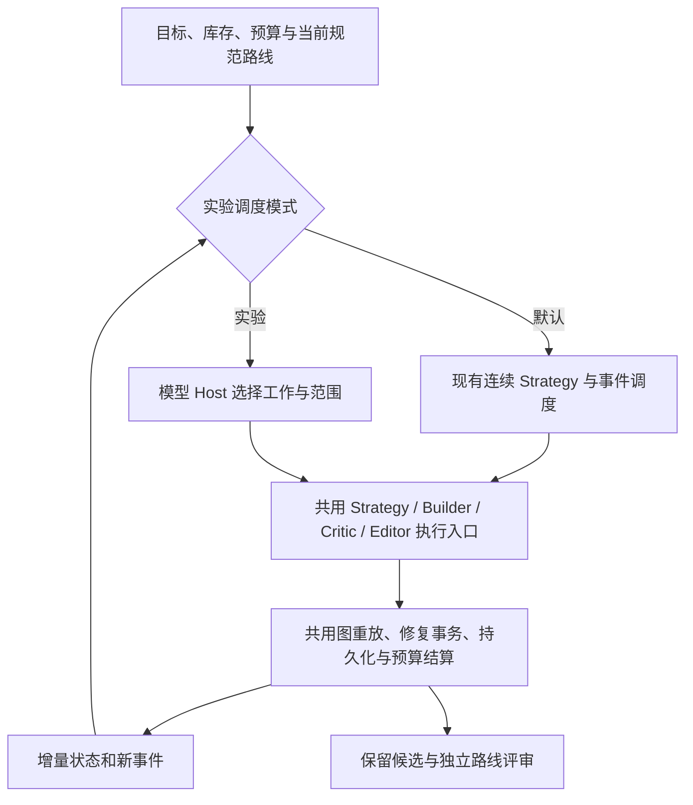

# 全局模型 Host：独立调度实验

2026-09-07。状态：设计尝试，尚未接入默认运行入口。当前默认仍为 `SequentialStrategyDirectorRunner`；先完成其可靠性修复，再评价调度策略是否值得替换。

## 要验证的假设

连续 Strategy 和稀疏 checkpoint 已允许模型更新战略，但当前 Host 大多按固定事件调用 Critic，并主要在化学 blocker 出现后启动 Editor。它对“当前可行但明显绕路”“新前体改变了旧步骤的适用前提”“应该提前停止局部重试”的判断仍有限。

实验问题是：**让一个掌握全路线现状的模型选择下一段工作，能否在相同总预算内减少无效扩展并提高独立评审认可的路线质量？** 不能把新增加的控制调用本身当成创新效果，也不预设模型调度一定优于现有事件调度。

## 权责和接入位置

模型 Host 在实验组拥有“接下来做什么”的调度权：扩展哪个前体、检查哪个关键步骤、让 Editor 改哪个范围、更新哪张 Strategy、何时结束当前搜索。它不能直接重写规范图、把超时当成通过、删除真实 Critic 反对意见或增加预算。

如果 Host 不同意 Critic，可以要求针对明确争议和当前版本进行独立复审。新的有效判断与旧判断都保留；裁决不能依靠 Host 自己宣布原判断无效。结构与立体身份仍由现有分子/图实现负责；实验可行性不能由图检查或调度模型授予。

调度接入应替换现有一处动作选择策略，并共用执行器。不要在现有 Director 外再加一个持续发号施令的 Director，也不要复制路线、依赖、评审历史或预算账本。配置名和具体接口在实施时确定，目前没有可启用的 `llm_host` 运行参数。

## 模型操作的工作单元

| 决策 | 必要输入 | 预期结果 |
| --- | --- | --- |
| 继续 Builder | 选中前体 occurrence、当前 Strategy、工作上限 | 一小段可重放的扩展 |
| 请求 Critic | 当前步骤或依赖范围、具体疑问 | 对该范围的独立判断 |
| 请求 Editor | 需要改变的反应 occurrence、修复/缩短目标 | 已有事务接口中的范围选择与重建 |
| 回退或扩大范围 | 当前失败原因、原先承诺、已尝试的修复 | 复用现有 recovery 与图切口机制 |
| 更新 Strategy | 新前体状态、已完成 checkpoint、未解决前提 | 下一阶段的战略假设 |
| 结束当前搜索 | 已有候选、未完成义务、剩余预算 | 保留当前结果，并如实记录缺评审或未闭合状态 |

“缩短一条可行路线”需要单独实现效率编辑目标，目前 Editor 的 blocker 入口不能直接承担这个任务。应比较真实反应操作数、最长线性序列、前体可获取性与风险；展示折叠不算缩短。

调度输入使用当前图派生的简短投影：选中路线、开放前体、最近实际变化、当前有效评审与缺评审范围、失败尝试、剩余预算和候选动作。需要时按步骤索引读取详情，不把全部历史 IO 重复发送。

一次决定可以安排有上限的小批工作。完成关键构建、出现新的跨步前提冲突、结构重放失败、工作上限耗尽等事件才返回调度器。第一版不在每个普通 Builder 步骤后增加一次 Host 大调用。最终评审继续使用独立模型与既有评审范围。

## 验证顺序和退出条件

1. 先用保存轨迹离线检查模型建议是否能映射到现有执行动作，以及它是否经常忽略有效反对意见。离线建议不能证明后续路线会改善。
2. 小规模主动对照中，以修好可靠性的原流程为基线。保持目标、模型、推理档位、库存、工具权限、输入与总预算一致；Host 自己的输入、输出和墙钟时间全部计入实验组预算。
3. 独立评审只看匿名目标、实际路线与证据，不看调度模式、原 Critic 结论和内部过程。记录关键化学错误、序列/立体依赖问题、前体难度、真实长度和每目标有价值路线数，后续由专家复核。

先以失败成本和评审覆盖率检验调度是否有效，再看化学质量。不能只报告“少调用 Critic”或“更短的展示路线”。若同预算下候选质量未改善、漏检增多，或 Host 消耗挤占了构建与评审预算，则保留为负结果，默认流程继续使用现有调度。

本设计不需要强化学习训练，不新增反应数据库或化学知识能力，也不替代关键转化的外部文献证据和实验验证。
