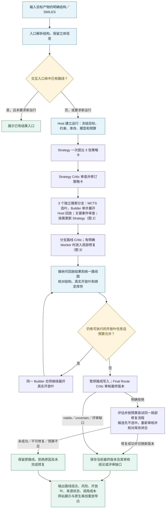
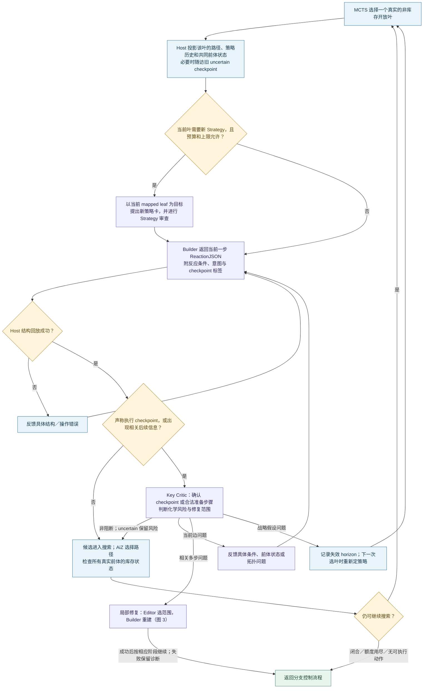
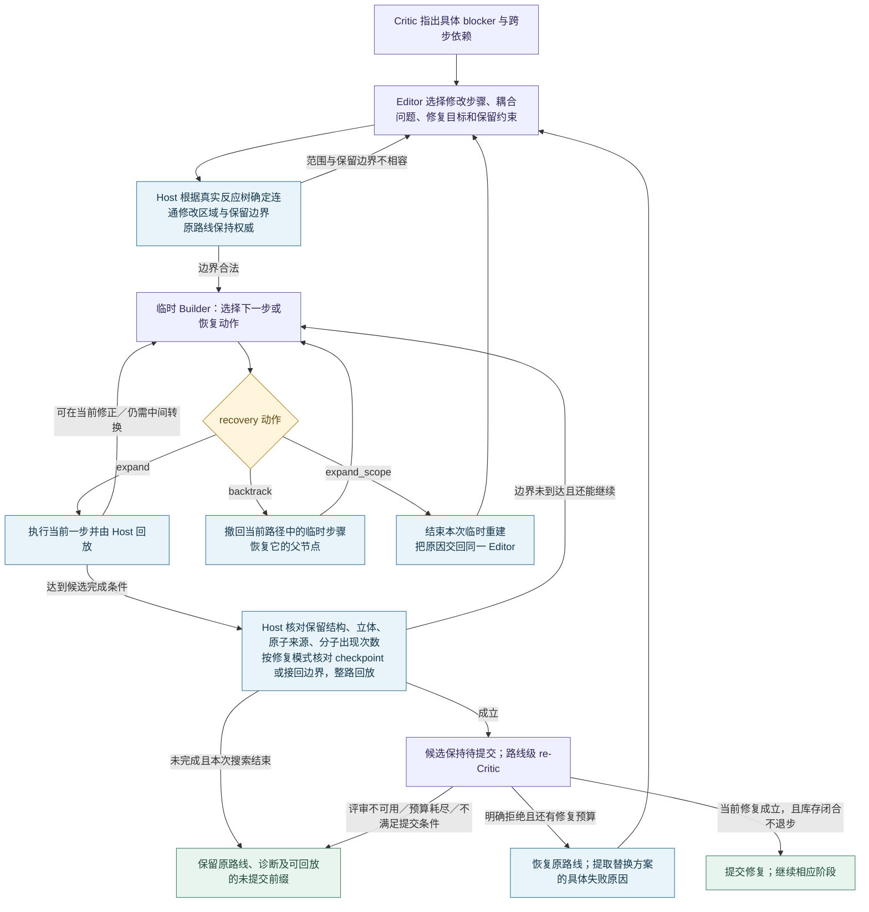

# 给定一个目标产物后，AutoPlanner 如何处理

源码核对日期：2026-09-06。本文说明当前仓库中网站默认的 `self_correcting_sequential` 流程；不代表此前已启动的常驻进程自动加载了最新修改。

**核心过程是：围绕真实中间体逐步提出反应，用结构回放确定实际发生了什么，在关键化学假设处审查，失败时选择合适的修改范围，再对最终路线单独审核。** Strategy 会随已经走出的路线更新；模型生成的结构操作、化学判断与 Host 保存的路线事实各有明确边界。

三张图分别回答“整体怎么走”“每一步怎么选、何时换策略”“失败后怎么修”。可直接打开[离线图文版](TARGET_TO_ROUTE_FLOW_20260906.html)，或使用[整体流程 SVG](../assets/target-to-route-20260906/overview.svg)、[单步搜索 SVG](../assets/target-to-route-20260906/search.svg)、[局部修复 SVG](../assets/target-to-route-20260906/repair.svg)。

## 1. 整体流程

图中循环都受本次运行预算、取消信号和可执行任务状态约束。搜索结束可以只留下部分路线；Final Critic 不可用也会作为缺口记录，不能从图中理解为每个框必然成功。

### 1.1 先确定我们究竟在求哪个结构

网站接收 SMILES，检查能否解析，规范化结构并保留已指定的立体信息。目标名称用于显示，当前网站请求关闭名称反查；系统不靠天然产物名字猜测目标。

对于此前绝对构型未定的目标，应分别给定两个明确的候选结构，建立两个运行并比较。**未指定手性的输入不会自动变成 R/S 双运行，也不会由搜索结果确定天然产物的绝对构型。** 某条候选构型路线更容易规划，只能说明规划结果，不能作为结构鉴定证据。

交互入口还会查已有路线；命中且没有 `force_new_run` 时，先返回已有结果入口。这与新一次模型搜索是不同的操作。

### 1.2 Host 建立运行与共同约束

Host 指负责执行、回放和保存事实的确定性程序。它解析目标、禁用试剂、步数约束、库存边界、模型及 reasoning 配置、调用次数、输入输出 token、时间等参数。

所有组件共享这次运行的预算和记录。初始搜索、Strategy 更新、Critic、Editor、修复 Builder 都会花费预算，不能各自重新获得一份完整预算。必需的后续评审有预算预留，但预留不保证模型调用成功。

`benchmark_search` 默认绑定冻结的 ZINC + eMolecules 索引，搜索器与 Host 使用同一 full-InChIKey 库存判定。**命中该集合不等于今天实际可采购；未命中也不等于现实中买不到。** 实际采购需要独立的供应商证据。

### 1.3 Strategy 先提出三条战略方向，随后进行策略审查

当前增强配置先用一次 Strategy 调用生成三张卡。每张卡至少说明：

| 字段 | 化学上要说清楚的事 |
| --- | --- |
| `strategy_query` | 这段逆合成准备采用什么关键拆解方向？ |
| `critical_assumption` | 这个方向依赖哪项最脆弱的化学假设？ |
| `critic_checkpoint` | 做到哪个实际图变换时，可以开始检查这项假设？ |

随后 Strategy Critic 读取目标结构与三张卡，检查假设、拓扑和战略差异，输出同一格式的修订策略卡。这是一次初始审查与修订边界；并没有独立的策略证明器，也不是无限循环的策略优化。

Strategy 此时不输出整条路线、前体结构或库存结论。三张卡表示三个搜索方向，**不承诺最终有三条有效路线**。Strategy review 无效时不会把原卡删除；provider 故障则进入相应运行恢复路径。

### 1.4 每张策略卡驱动一个独立搜索分支

每个分支有自己的 AiZynthFinder MCTS 搜索状态，可以并发推进。MCTS 决定接下来探索哪个开放叶；LLM Builder 为选中的那个真实分子提出下一步反应操作。

这里有两个不同的“分支”：初始三张卡对应三个战略搜索分支；一条路线内部又可以拆成多个共同前体。后者都需要解决，不能只完成看起来像“主链”的那一支。

用不对应任何具体化学反应的符号表示：逆合成得到 `T ⇐ A + B`，那么 A 和 B 是 AND 关系，必须共同满足；如果另有 `T ⇐ C`，它与前一种拆解是 OR 关系，可作为替代。实际正向合成关系是 `A + B → T`。路线最终在统一的 AND/OR 反应图中表达，并非只有一个步骤数组。

## 2. 单步搜索、关键审查与连续 Strategy

运行故障与取消是图外的全局中断通路；调用失败不沿图中的“化学拒绝”箭头处理。旧 checkpoint 的随访如产生明确拒绝，也按其实际影响范围处理当前路径。

### 2.1 Builder 在真实中间体上操作

Builder 得到当前 mapped 分子、与它连接的已回放反应、适用策略、共同前体状态及必要失败反馈。Host 给出的 atom map 是追踪原子身份的编号，模型必须基于这份真实结构工作。

Builder 可以进行路线级推演，但当前输出只是一项单步 ReactionJSON 提议：例如对哪些映射原子断键、改键、添加片段或设置立体状态，以及这一步的条件与简洁意图。Host 执行操作后才派生前体；Builder 不能凭自己写出的 precursor 或 `solved=true` 接管事实。

ReactionJSON 在这里承担“可执行动作”的职责，RouteJSON 承担“可回放路线表示”的职责。我们已经把策略意图、checkpoint、路径上下文和修复目标从整条 JSON 重写中分离出来；底层仍使用这两个结构合同，没有另造一个尚未接通的新路线语言。

### 2.2 Host 回放确定结构事实

Host 对操作做 schema、价态、原子映射、连接关系、立体状态和来源一致性检查，并把实际前体写入候选步骤。非法操作返回具体错误，成功回放才有资格进入后续审查与搜索。

这一步能发现“编辑的原子不存在”“边界接错”“原子来源冲突”“实际产物立体不符”等问题，**不能证明实验反应会发生、区域选择性足够好或收率可接受**。

配体改变可能使 CIP 排序改变，因此 R/S 字母改变不一定表示物理翻转。当前操作合同区分邻接序立体翻转和最终绝对立体设定，再由回放核对最终结构。具体反应是否具有所声称的保留、反转或选择性，仍属于化学审查问题。

### 2.3 Critic 在什么时刻出现

| 审查位置 | 看什么 | 主要决定 |
| --- | --- | --- |
| Strategy Critic | 初始目标与策略组合；后续为当前叶及策略上下文 | 关键假设和 checkpoint 是否合理，是否需要修订策略卡 |
| Key Critic | Host 已回放的关键候选反应、相关路径、策略假设 | 是否真执行了 checkpoint；有何化学问题；只改当前边、修改一段路线，还是换战略 |
| 分支 Route Critic | 当前可回放的分支路线、条件、策略与依赖 | 全路线与跨步依赖是否有 blocker，是否进入 Editor |
| Final Route Critic | 最终 canonical 路线的具体版本 | 最终实际交付版本的整体和逐步化学判断 |

后两行是路线审查角色在两个时点的使用，不意味着又添加两套独立路线权威。

关键审查不是每隔固定 N 步启动。Builder 用 `preparatory` 或 `executes_checkpoint` 标记意图，Host 先回放，Key Critic 再返回 `checkpoint_match`。一个普通保护或官能团转换被误标为 checkpoint 时，如果没有破坏策略所需结构，可以保留为准备步骤；不能因此宣布战略完成。

`checkpoint_match=true` 且不存在阻断的 `pass/uncertain` 判断，只有在该步骤进入当前实际选中路径后，才可用于推进战略。`uncertain` 允许带着风险继续探索，并不升级为可信通过。后续前体展开如果改变了相关审查依据，可以再次审查原 uncertain 关键事件；这里的“新信息”可以来自 Host 回放的路线，不必然来自外部文献。

当前触发仍依赖标签、已记录的审查义务和实际路径信息，不能保证自动发现所有未标记的关键反应。模型审查也可能误判。

### 2.4 连续 Strategy 到底怎样连续

当原 checkpoint 已在当前路径中执行，或者 Critic 明确判定该 horizon 的假设需要更换时，系统可针对下一真实开放叶生成新策略。当前叶没有适用的后续卡、而根策略已完成或失效时，也走这一路径。

新 Strategy 读取的是这个叶的目标侧连接路径、已执行 milestones 和 sibling 状态。它不会把另一共同前体的最近几步当作当前叶历史，也不会把“已经提出某策略”当作“已经执行它”。

因此，一次运行可以经历“先解决骨架层面的关键拆解，再面对真实前体重新决定下一段怎么拆”。更新由状态和化学反馈触发，受配置上限与剩余预算限制；不是每走一步就重新规划整条路线。

### 2.5 化学失败的范围决定下一步动作

Key Critic 需要区分以下情况；Host 根据明确范围执行，不能简单累计几次失败就认定化学不可能。

| 问题位于哪里 | 合理动作 |
| --- | --- |
| 本次图编辑写错，当前中间体仍可用 | 反馈具体错误，在当前叶纠正操作 |
| 当前单步的实施方式不合适 | 重试当前反应；根据问题改变条件、共价前体状态或拓扑 |
| 下游失败由较早制备步骤造成 | Editor 选择包含制备与消费步骤的相关区域，局部重建 |
| 战略关键假设本身有明确矛盾 | 记录被拒绝的 horizon，允许生成替代 Strategy |
| 信息不足、机理或选择性尚未证实 | 保留 uncertain 与风险，按需继续展开或补评审 |
| 超时、provider 不可用、返回合同无效 | 记录运行或评审缺口，不当作化学否定 |

## 3. Editor 如何修复，以及何时回退

这是共享修复机制的概念图。普通重试、backtrack 和 scope 扩大是否还能执行，由剩余预算与实际事务状态决定；图中没有额外的无限重试池。

### 3.1 Editor 选问题范围，Builder 写实际反应

Editor 读完整路线、Critic 注释和 `chemical_dependencies`，选择 `change_step_ids`，可加入确实耦合的 blocker，说明 `repair_goal`、`active_constraints` 与 `preserved_suffix_compatible`。

Host 在实际反应 occurrence tree 中计算连接这些步骤的最小区域。数组中相邻但化学上无关的 sibling 不应随之删除；同一分子在不同位置出现也要分别处理。这是**确定模型所选步骤的最小拓扑连接范围**，不是自动求得全局最优、化学上最充分的修改区域。

Builder 随后在临时事务中逐步重建。Editor 不同时负责 ReactionJSON 编写和 atom map 传播；Builder 也不被迫在每一步重读整份 Final Critic 原文，接收的是局部修复合同与必要路径上下文。

### 3.2 当前重试、较早回退、扩大范围有不同权限

| Builder 恢复动作 | 改动范围 | Host 如何处理 |
| --- | --- | --- |
| `expand` | 当前叶的一步 | 继续转换或纠正当前操作；附带参考 ID 不赋予修改旧步骤的权限 |
| `backtrack` | 当前临时重建路径 | 只能撤回允许的临时步骤，复用搜索树的父节点恢复；不能撤回保留的原路线或无关节点 |
| `expand_scope` | 现有局部边界已不足 | 交回同一 Editor 重新选择原路线的修改区域，并带上失败原因 |

这是无需训练模型的恢复协议。选择理由由模型提出，权限与结构操作由 Host 执行；没有引入 RL 训练或另一个图编辑学习器。

### 3.3 “错误接回”和“合法中间转换”必须分开

假设保留路线要求在边界接到中间体 A，但重建暂时得到同骨架、不同立体的 A′：

- 不能把 A′ 重命名成 A 后直接接回。
- 可以继续提出显式反应，把 A′ 转换到满足边界的 A；Host 检查结构，Critic 判断该转化是否可信。
- 若必须改变保留区域才能解决，则扩大修复范围。

最终接回需满足完整分子的连接与立体等价、共有原子 map 来源一致、共同前体及重复出现次数完整，并通过整路回放。错误最终构型、丢失共同前体或冲突原子身份，不能用“看起来差不多”放行。

当前有两种修复完成模式，不能混为一谈：

| 模式 | 完成目标 |
| --- | --- |
| `cut_frontier`：已有路线局部替换 | 到达 Host 给出的完整切口边界，接回保留部分，并恢复原路线的最终开放前体 multiset |
| `strategy_checkpoint`：在线关键事件修复 | 保留给定战略，在合法保留结构上执行被 Key Critic 确认的 checkpoint，解决相关问题并通过路线复审；不把尚未完成的路线强行要求成旧终点集 |

两种模式都需要真实结构回放和相应复审；Builder 的“完成”标签没有提交权限。

### 3.4 修复结构成立以后，还需要复审才能提交

结构重建完成的候选先进入待复审状态。若重建区域仍被拒绝，或引入新 blocker，恢复原路线并把具体发现反馈给下一次 Editor。未到达边界但已经可回放的临时前缀可留作诊断，不能替代权威路线。

分支内可以按 component 逐个修复：当前区域解决、剩余 blocker 全是预先登记的其他区域时，可以提交当前区域再继续处理，但不能据此宣布整条路线通过。最终 canonical 路线的替换则要求新版本复审完成且为 `viable/uncertain`，并且库存闭合状态不低于原路线。uncertain 提交仍保留不确定风险。

## 4. 从候选路线到最终交付

### 4.1 收敛到一个事实图，再处理真实缺口

分支结果经统一 ingestion 进入 canonical AND/OR 图，Host 重新核对目标根连接、步骤、真实叶和库存。`DeficitFrontier` 从当前版本派生可执行任务，由同一个 Action runtime 调度。

仍未闭合的真实开放叶可以继续用同一 Builder 单步合同展开；没有第二套“末端专用逆合成器”。增强默认配置关闭 campaign 级全局 replan；连续 Strategy 属于现有分支内的策略更新，不能把两者当成同一个开关。

搜索历史中的草稿、被拒绝候选、修复中间版本与最终选择路线分别保存。三个策略分支、十几个历史版本、三条最终候选，是不同的计数；不能相加来宣称可用路线数量。

### 4.2 最终审核必须绑定实际交付版本

在各类路线写入停止后，Final Route Critic 读取最终 canonical 路线。Host 分配 `review_slot` 并把返回评价绑定真实步骤与路线摘要；结论只对该版本有效。

最终阶段的明确 reject 可以触发同一修复流程，新候选先不选中，经过复审和库存核对才切换。相同版本恢复时可以复用适用的审核记录；实际路线改变后不能沿用旧判断冒充新版本已审。

评审失败不会构成新的有效化学结论。先前仍适用的有效判断保留，新增信息尚未成功审查的部分仍显示缺口；不能用旧判断代理审核新证据。

### 4.3 输出多个独立状态

| 输出项 | 回答的问题 | 不能替代什么 |
| --- | --- | --- |
| 结构与回放 | 路线是否从目标真实连接，编辑能否执行？ | 实验可行性 |
| 库存闭合 | 每个终端前体是否命中绑定库存？ | 实时采购、反应正确性 |
| 路线化学评审 | 是否有明确 blocker、哪些地方 uncertain？ | 独立文献证据、专家或实验结论 |
| 来源与条件 | 哪一步有何来源，条件由谁提出，哪些未核实？ | 模型意见不能自动成为已报道先例 |
| 路线与搜索规模 | 最终候选、总反应数、最长线性步数、开放叶分别是多少？ | 三张策略卡不等于三条可用路线 |
| 运行成本与状态 | 各角色用了多少调用、token、时间；为何结束？ | 超时不等于化学失败 |

网站与原生导出从这些事实和实际 I/O 投影生成。需要保留过程时使用原生 interaction/replay 导出，而非仅静态路线图；可看到策略、Builder、Critic、Editor 的实际记录及历史版本。导出本身不重新生成化学判断。

独立匿名模型评审是我们的对照评估流程，**不是每一次目标求解都自动再执行的阶段**；专家评审与实验也不在自动主流程中。

## 5. 当前默认配置及实际能力边界

| 能力 | 网站当前默认配置的状态 |
| --- | --- |
| 初始策略组合 | 3 张卡，一次组合生成；随后 Strategy Critic |
| 分支搜索 | 3 个独立 AiZ MCTS 状态，配置允许并发推进 |
| 单步候选 | 每次 Builder 默认 1 个 ReactionJSON 候选；不是全分子自动穷举 |
| 初始 Builder 搜索上限 | 每分支最多 25 次 policy calls，可在测试请求中显式降低；不是保证得到 25 步 |
| 连续 Strategy | 每分支初始卡加后续更新的配置上限为 4，实际按触发条件与预算执行 |
| Critic / Editor 修复 | 局部修复轮数配置上限 6，修复 Builder 使用同一配置化扩展上限并计入共享账本 |
| 结构、映射、立体、边界回放 | 启用；具体检查不等于化学机理证明 |
| 内置自动网页文献搜索、专利证据任务 | 在该默认增强 profile 中关闭 |
| 自动条件补全、酶预测、Program / 实验 claim 流程 | 在该 profile 中关闭；Builder 自己提出的条件仍保留并进入审查 |
| Reaxys / SciFinder 正式自动证据接入 | 当前流程没有完成此类接入 |
| 独立匿名评审、专家复核、实验 | 另行执行，不隐含在一次搜索成功状态中 |

API 不指定 `execution_profile` 时请求编译默认仍为 `standard`；网站显式提交 `self_correcting_sequential`。`paper_matched_reach` 用于冻结的对照配置，不能把本文增强机制全部算入它；`standard/proof` 的通用证据任务也不能倒推成网站默认已启用。

这些机制已经接入当前源码，解决的是“在什么事实基础上继续、何时检查、失败后改哪里、如何避免破坏有效路线”的控制问题。**目前对照实验尚未证明连续 Strategy、checkpoint 和依赖反馈必然提高完整路线质量或节省 token。** 图中描述实际工作方式；质量增益仍以同输入、同预算、独立评审的结果为准。

## 6. 代码入口与进一步阅读

| 流程 | 主要入口或函数 |
| --- | --- |
| 网站默认配置、输入与已有路线查找 | [live_synthesis.html](../../cascade_planner/web/static/live_synthesis.html)、[v4_target_routes.py](../../cascade_planner/web/v4_target_routes.py)：`start_target_job` |
| 请求、约束、预算与 profile | [target_solve_request.py](../../cascade_planner/interfaces/target_solve_request.py)：`solve_target_request`；[target_solver.py](../../cascade_planner/interfaces/target_solver.py)：`_resolve_execution_config`、`solve_target` |
| 默认上限 | [target_runtime_dependencies.py](../../cascade_planner/interfaces/target_runtime_dependencies.py)：`SYNTHEX_MATCHED_PROFILE_DEFAULTS` |
| 三策略、MCTS、Builder、连续策略 | [sequential_strategy_director.py](../../cascade_planner/orchestration/sequential_strategy_director.py)：`_initial_branches`、`_expand_seeded_branches_aizynthfinder`、`_strategy_horizon_for_leaf`、`_generate_upstream_strategy_milestone` |
| 结构与立体操作 | [routejson_compiler.py](../../cascade_planner/application/routejson_compiler.py)、[reactionjson_replay.py](../../cascade_planner/application/reactionjson_replay.py)、[reactionjson_primitives.py](../../cascade_planner/application/reactionjson_primitives.py)、[stereochemistry.py](../../cascade_planner/application/stereochemistry.py) |
| 关键事件判断与历史适用性 | [key_event_review.py](../../cascade_planner/orchestration/key_event_review.py) |
| Editor 范围、恢复、接回 | [repair_scope.py](../../cascade_planner/orchestration/repair_scope.py)、[repair_recovery.py](../../cascade_planner/orchestration/repair_recovery.py)、[path_repair_boundary.py](../../cascade_planner/orchestration/path_repair_boundary.py)；Director 的 `_repair_branch_transactionally`、`_repair_branch_once` |
| 缺口调度与统一事实图 | [deficit_frontier.py](../../cascade_planner/application/deficit_frontier.py)、[unified_campaign_runtime.py](../../cascade_planner/orchestration/unified_campaign_runtime.py)、[canonical_hypergraph.py](../../cascade_planner/application/canonical_hypergraph.py) |
| 最终版本审核与提交 | `target_solver.py`：`_run_revision_bound_route_critics`、`_run_revision_bound_route_review_loop`、`_switch_final_route_selection` |
| 原生离线重放导出 | [v4_showcase_export.py](../../cascade_planner/web/v4_showcase_export.py)：`build_run_export_bundle` |
| 按调用分析 token | [worker_usage.py](../../cascade_planner/agent/worker_usage.py)、[report_worker_usage.py](../../scripts/report_worker_usage.py) |

详细合同见 [SYNTHEX_COMPONENT_CONTRACT.md](SYNTHEX_COMPONENT_CONTRACT.md)；实际机制对照结果见 [CHEMICAL_INTENT_CONTROL_AND_ABLATION_20260906.md](../evaluation/CHEMICAL_INTENT_CONTROL_AND_ABLATION_20260906.md)。
